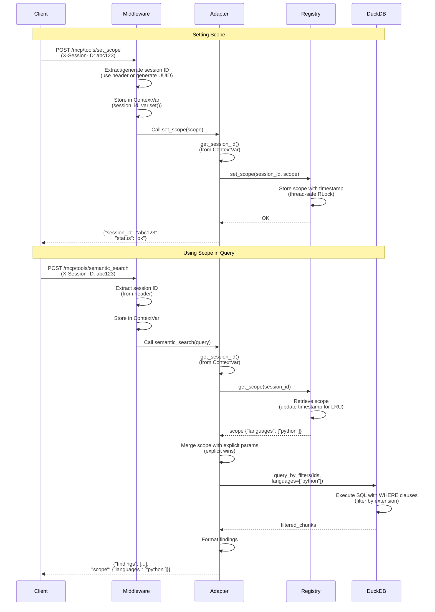
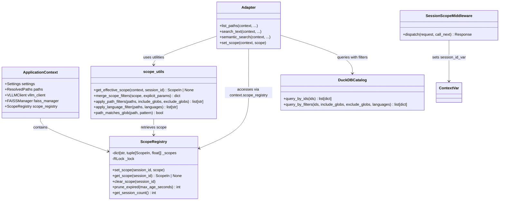
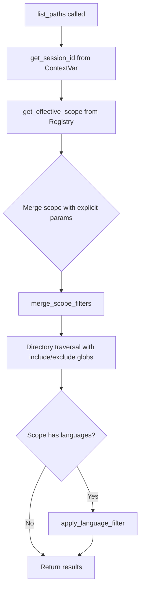
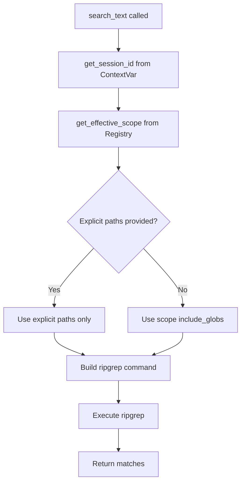
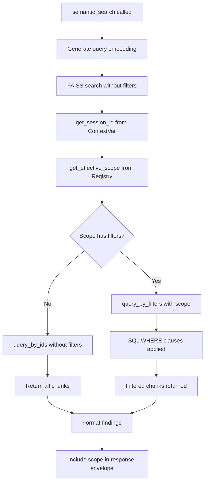
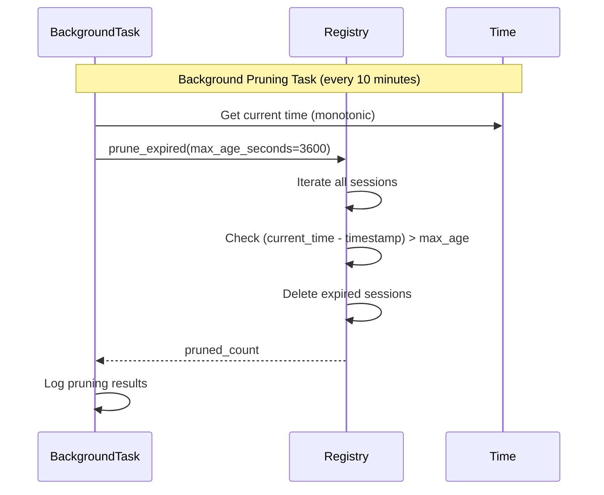
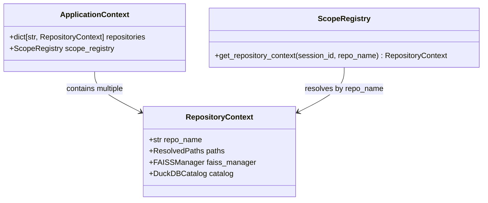

# Scope Management Architecture

This document describes the architecture and data flow for session-scoped scope management in the CodeIntel MCP server.

## Overview

Scope management allows clients to set query constraints (path patterns, languages, repositories) that persist across multiple requests within a session. Instead of passing scope parameters with every query, clients call `set_scope` once and subsequent queries automatically apply those constraints.

**Key Components**:
- **SessionScopeMiddleware**: Extracts or generates session IDs from requests
- **ScopeRegistry**: Thread-safe in-memory storage for per-session scopes
- **Scope Utilities**: Helper functions for merging and filtering scopes
- **Adapter Integration**: All search/file adapters apply scope filters

## Sequence Diagram: Scope Lifecycle

The following sequence diagram illustrates how scope is set and applied across multiple requests:



## Sequence Diagram Explanation

### Setting Scope (First Request)

1. **Client Request**: Client sends `set_scope` request with optional `X-Session-ID` header
2. **Middleware Processing**: 
   - Extracts `X-Session-ID` header if present
   - Generates UUID v4 if header absent
   - Stores session ID in `ContextVar` for thread-local access
3. **Adapter Execution**: 
   - Retrieves session ID from `ContextVar` via `get_session_id()`
   - Calls `scope_registry.set_scope(session_id, scope)`
4. **Registry Storage**: 
   - Stores scope dictionary with current timestamp
   - Uses `threading.RLock` for thread-safe access
   - Returns confirmation
5. **Response**: Returns session ID and effective scope to client

### Using Scope (Subsequent Requests)

1. **Client Request**: Client sends query request with same `X-Session-ID` header
2. **Middleware Processing**: Same session ID extraction and ContextVar storage
3. **Adapter Execution**: 
   - Retrieves session ID from `ContextVar`
   - Calls `scope_registry.get_scope(session_id)` to retrieve stored scope
   - Merges scope with explicit parameters (explicit parameters override scope)
4. **Registry Retrieval**: 
   - Returns stored scope dictionary
   - Updates last-accessed timestamp (LRU behavior)
5. **DuckDB Filtering**: 
   - Applies scope filters via SQL `WHERE` clauses
   - Filters by path globs (SQL `LIKE` patterns) and language extensions
6. **Response**: Returns filtered results with applied scope in response envelope

## Data Flow

The scope management system follows this data flow:

```
Request (X-Session-ID header)
    ↓
SessionScopeMiddleware
    ├─ Extract/generate session ID
    ├─ Store in request.state.session_id
    └─ Store in ContextVar (session_id_var)
        ↓
MCP Tool Handler (@mcp.tool())
    ├─ Extract ApplicationContext from app.state
    └─ Call adapter function
        ↓
Adapter Function
    ├─ get_session_id() → retrieve from ContextVar
    ├─ get_effective_scope(context, session_id) → retrieve from ScopeRegistry
    ├─ merge_scope_filters(scope, explicit_params) → merge with explicit parameters
    └─ Apply filters:
        ├─ list_paths → apply_path_filters() + apply_language_filter()
        ├─ search_text → pass paths to ripgrep
        └─ semantic_search → query_by_filters() in DuckDB
            ↓
ScopeRegistry
    ├─ get_scope(session_id) → retrieve stored scope
    └─ Update timestamp (LRU tracking)
        ↓
DuckDBCatalog (for semantic_search)
    ├─ query_by_filters(ids, include_globs, exclude_globs, languages)
    ├─ Generate SQL WHERE clauses
    └─ Execute filtered query
        ↓
Response
    └─ Include scope in envelope (for semantic_search)
```

## Component Relationships

The following class diagram shows the relationships between components:



### Relationship Descriptions

- **ApplicationContext → ScopeRegistry**: The application context contains a single `ScopeRegistry` instance initialized during FastAPI startup. All adapters access the registry via `context.scope_registry`.

- **SessionScopeMiddleware → ContextVar**: The middleware sets a thread-local `ContextVar` (`session_id_var`) that adapters read via `get_session_id()`. This enables session ID access without passing `Request` objects to adapters.

- **Adapter → scope_utils**: Adapters use utility functions from `scope_utils` to:
  - Retrieve effective scope (`get_effective_scope`)
  - Merge scope with explicit parameters (`merge_scope_filters`)
  - Apply path and language filters (`apply_path_filters`, `apply_language_filter`)

- **Adapter → ScopeRegistry**: Adapters access the registry through `ApplicationContext.scope_registry` to store and retrieve session scopes.

- **Adapter → DuckDBCatalog**: For semantic search, adapters call `query_by_filters` instead of `query_by_ids` when scope filters are present, enabling SQL-side filtering for performance.

## Threading Model

### ContextVar for Thread-Local Storage

The system uses Python's `contextvars.ContextVar` for thread-local session ID storage:

```python
# Defined in middleware.py
session_id_var: ContextVar[str | None] = ContextVar("session_id", default=None)

# Set by middleware
session_id_var.set(session_id)

# Retrieved by adapters
session_id = session_id_var.get()
```

**Why ContextVar?**
- FastMCP doesn't expose `Request` objects in `@mcp.tool()` decorated functions
- `ContextVar` provides thread-local storage that automatically propagates to child tasks in asyncio
- Ensures session IDs don't leak across concurrent requests

**Thread Safety**:
- Each request runs in its own thread (FastAPI threadpool)
- `ContextVar` provides isolation: thread A's session ID is invisible to thread B
- No global state: session IDs are stored per-request context

### ScopeRegistry Thread Safety

The `ScopeRegistry` uses `threading.RLock` (reentrant lock) for concurrent access:

```python
class ScopeRegistry:
    def __init__(self):
        self._scopes: dict[str, tuple[ScopeIn, float]] = {}
        self._lock = RLock()  # Reentrant lock
    
    def get_scope(self, session_id: str) -> ScopeIn | None:
        with self._lock:  # Acquire lock
            entry = self._scopes.get(session_id)
            # ... retrieve and update timestamp
```

**Lock Behavior**:
- All public methods (`set_scope`, `get_scope`, `clear_scope`, `prune_expired`) acquire `_lock` before accessing `_scopes`
- `RLock` allows the same thread to acquire the lock multiple times (prevents deadlocks if methods call each other)
- Concurrent requests from different threads are serialized at the registry level

**Performance Characteristics**:
- Lock contention is minimal: most operations are O(1) dict lookups
- Pruning runs in background task (not on request path)
- Typical lock hold time: <1μs per operation

## Scope Application Flow

### list_paths Adapter



### search_text Adapter



### semantic_search Adapter



## Session Expiration

Sessions expire after a configurable period of inactivity (default: 1 hour):



**Pruning Strategy**:
- Background task runs every 10 minutes (configurable)
- Removes sessions inactive for >1 hour (configurable via `SESSION_MAX_AGE_SECONDS`)
- Updates last-accessed timestamp on `get_scope` calls (LRU behavior)
- Prevents memory leaks from abandoned sessions

## Multi-Repository Readiness (Future Phase 3)

The current architecture is designed to support multi-repository deployments in Phase 3:



**Current State** (Phase 2):
- Single repository per server instance
- `ScopeIn.repos` field is ignored (reserved for Phase 3)
- All queries use the single `ApplicationContext` instance

**Future State** (Phase 3):
- Multiple repositories indexed in single server
- `ScopeIn.repos` selects which repositories to query
- `ScopeRegistry` resolves `RepositoryContext` based on scope
- Cross-repository queries merge results from multiple indexes

## Error Handling

### Missing Session ID

If `get_session_id()` is called outside a request context:

```python
RuntimeError: Session ID not initialized in request context.
Ensure SessionScopeMiddleware is registered in FastAPI app.
```

**Mitigation**: Always register `SessionScopeMiddleware` before other middleware.

### Missing Scope

If `get_scope()` is called for a session without scope:

```python
scope = registry.get_scope(session_id)  # Returns None
if scope:
    # Apply filters
else:
    # No filters (search everything)
```

**Mitigation**: Adapters gracefully handle `None` scope (no filters applied).

### Expired Session

If a session expires between requests:

```python
scope = registry.get_scope(session_id)  # Returns None (expired)
# Adapter falls back to no filters
```

**Mitigation**: Clients should re-set scope if session expires, or use explicit parameters.

## Performance Considerations

### Scope Filtering Overhead

- **Path filtering**: O(n * m) where n = paths, m = glob patterns (typically <10ms for 1000 paths)
- **Language filtering**: O(n) where n = paths (typically <1ms for 1000 paths)
- **DuckDB SQL filtering**: Indexed `uri` column enables fast `LIKE` queries (<5ms for 100K chunks)

### Registry Operations

- **set_scope**: O(1) with lock acquisition (~1μs)
- **get_scope**: O(1) with lock acquisition + dict copy (~2μs)
- **prune_expired**: O(n) where n = active sessions (runs in background, not on request path)

### Memory Usage

- **Per session**: ~1KB (scope dict + timestamp)
- **1000 active sessions**: ~1MB
- **10,000 active sessions**: ~10MB (health check threshold)

## See Also

- [Scope Management README](../../README.md#scope-management) - User-facing documentation
- [Scope Registry API](../../app/scope_registry.py) - Implementation details
- [Scope Utilities](../../mcp_server/scope_utils.py) - Helper functions
- [Middleware Implementation](../../app/middleware.py) - Session ID extraction

