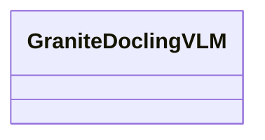

# docling.vlm

Vision-language tagging helpers for docling

## Sections

- **Public API**

## Contents

### docling.vlm.GraniteDoclingVLM

::: docling.vlm.GraniteDoclingVLM

## Relationships

**Imports:** `__future__.annotations`, `kgfoundry_common.navmap_loader.load_nav_metadata`

## Autorefs Examples

- [docling.vlm.GraniteDoclingVLM][]

## Inheritance



## Neighborhood

```d2
direction: right
"docling.vlm": "docling.vlm" { link: "vlm.md" }
"__future__.annotations": "__future__.annotations"
"docling.vlm" -> "__future__.annotations"
"kgfoundry_common.navmap_loader.load_nav_metadata": "kgfoundry_common.navmap_loader.load_nav_metadata"
"docling.vlm" -> "kgfoundry_common.navmap_loader.load_nav_metadata"
```

