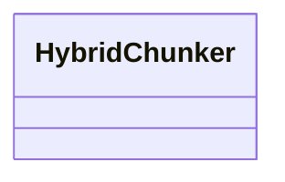

# docling_kg.hybrid

Hybrid docling_kg pipeline combining layout and text cues

[View source on GitHub](https://github.com/kgfoundry/kgfoundry/blob/main/src/docling_kg/hybrid.py)

## Sections

- **Public API**

## Contents

### docling_kg.hybrid.HybridChunker

::: docling_kg.hybrid.HybridChunker

## Relationships

**Imports:** `__future__.annotations`, `kgfoundry_common.navmap_loader.load_nav_metadata`

## Autorefs Examples

- [docling_kg.hybrid.HybridChunker][]

## Inheritance



## Neighborhood

```d2
direction: right
"docling_kg.hybrid": "docling_kg.hybrid" { link: "./docling_kg/hybrid.md" }
"__future__.annotations": "__future__.annotations"
"docling_kg.hybrid" -> "__future__.annotations"
"kgfoundry_common.navmap_loader.load_nav_metadata": "kgfoundry_common.navmap_loader.load_nav_metadata"
"docling_kg.hybrid" -> "kgfoundry_common.navmap_loader.load_nav_metadata"
"docling_kg.hybrid_code": "docling_kg.hybrid code" { link: "https://github.com/kgfoundry/kgfoundry/blob/main/src/docling_kg/hybrid.py" }
"docling_kg.hybrid" -> "docling_kg.hybrid_code" { style: dashed }
```

