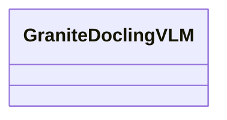

# docling_kg.vlm

Vision-language tagging helpers for docling_kg

[View source on GitHub](https://github.com/paul-heyse/kgfoundry/blob/main/src/docling_kg/vlm.py)

## Hierarchy

- **Parent:** [docling_kg](../docling_kg.md)

## Sections

- **Public API**

## Contents

### docling_kg.vlm.GraniteDoclingVLM

::: docling_kg.vlm.GraniteDoclingVLM

## Relationships

**Imports:** `__future__.annotations`, `kgfoundry_common.navmap_loader.load_nav_metadata`

## Autorefs Examples

- [docling_kg.vlm.GraniteDoclingVLM][]

## Inheritance



## Neighborhood

```d2
direction: right
"docling_kg.vlm": "docling_kg.vlm" { link: "https://github.com/paul-heyse/kgfoundry/blob/main/src/docling_kg/vlm.py" }
"__future__.annotations": "__future__.annotations"
"docling_kg.vlm" -> "__future__.annotations"
"kgfoundry_common.navmap_loader.load_nav_metadata": "kgfoundry_common.navmap_loader.load_nav_metadata"
"docling_kg.vlm" -> "kgfoundry_common.navmap_loader.load_nav_metadata"
"docling_kg": "docling_kg" { link: "https://github.com/paul-heyse/kgfoundry/blob/main/src/docling_kg/__init__.py" }
"docling_kg" -> "docling_kg.vlm" { style: dashed }
```

