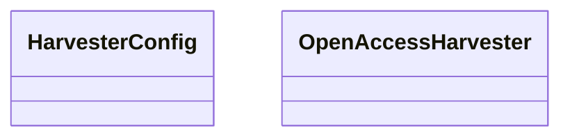

# download.harvester

Downloader command suite that sources external corpora (currently OpenAlex) using the shared
CLI tooling contracts. Emits structured envelopes and metadata so downstream tooling (OpenAPI,
diagrams, documentation) remains in sync without bespoke glue.

[View source on GitHub](https://github.com/paul-heyse/kgfoundry/blob/main/src/download/harvester.py)

## Hierarchy

- **Parent:** [download](../download.md)

## Sections

- **Public API**

## Contents

### download.harvester.HarvesterConfig

::: download.harvester.HarvesterConfig

### download.harvester.OpenAccessHarvester

::: download.harvester.OpenAccessHarvester

## Relationships

**Imports:** `__future__.annotations`, `collections.abc.Mapping`, `collections.abc.Sequence`, `dataclasses.dataclass`, `kgfoundry_common.errors.DownloadError`, `kgfoundry_common.errors.UnsupportedMIMEError`, `kgfoundry_common.models.Doc`, `kgfoundry_common.navmap_loader.load_nav_metadata`, `pathlib.Path`, `requests`, `time`, `typing.cast`

## Autorefs Examples

- [download.harvester.HarvesterConfig][]
- [download.harvester.OpenAccessHarvester][]

## Inheritance



## Neighborhood

```d2
direction: right
"download.harvester": "download.harvester" { link: "https://github.com/paul-heyse/kgfoundry/blob/main/src/download/harvester.py" }
"__future__.annotations": "__future__.annotations"
"download.harvester" -> "__future__.annotations"
"collections.abc.Mapping": "collections.abc.Mapping"
"download.harvester" -> "collections.abc.Mapping"
"collections.abc.Sequence": "collections.abc.Sequence"
"download.harvester" -> "collections.abc.Sequence"
"dataclasses.dataclass": "dataclasses.dataclass"
"download.harvester" -> "dataclasses.dataclass"
"kgfoundry_common.errors.DownloadError": "kgfoundry_common.errors.DownloadError"
"download.harvester" -> "kgfoundry_common.errors.DownloadError"
"kgfoundry_common.errors.UnsupportedMIMEError": "kgfoundry_common.errors.UnsupportedMIMEError"
"download.harvester" -> "kgfoundry_common.errors.UnsupportedMIMEError"
"kgfoundry_common.models.Doc": "kgfoundry_common.models.Doc"
"download.harvester" -> "kgfoundry_common.models.Doc"
"kgfoundry_common.navmap_loader.load_nav_metadata": "kgfoundry_common.navmap_loader.load_nav_metadata"
"download.harvester" -> "kgfoundry_common.navmap_loader.load_nav_metadata"
"pathlib.Path": "pathlib.Path"
"download.harvester" -> "pathlib.Path"
"requests": "requests"
"download.harvester" -> "requests"
"time": "time"
"download.harvester" -> "time"
"typing.cast": "typing.cast"
"download.harvester" -> "typing.cast"
"download": "download" { link: "https://github.com/paul-heyse/kgfoundry/blob/main/src/download/__init__.py" }
"download" -> "download.harvester" { style: dashed }
```

