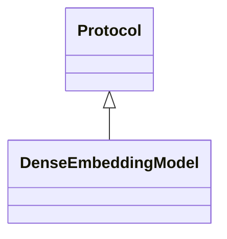

# embeddings_dense.base

Protocols describing dense embedding providers

[View source on GitHub](https://github.com/paul-heyse/kgfoundry/blob/main/src/embeddings_dense/base.py)

## Hierarchy

- **Parent:** [embeddings_dense](../embeddings_dense.md)

## Sections

- **Public API**

## Contents

### embeddings_dense.base.DenseEmbeddingModel

::: embeddings_dense.base.DenseEmbeddingModel

*Bases:* Protocol

## Relationships

**Imports:** `__future__.annotations`, `collections.abc.Sequence`, `kgfoundry_common.navmap_loader.load_nav_metadata`, `numpy`, `numpy.typing.NDArray`, `typing.Protocol`, `typing.TYPE_CHECKING`

## Autorefs Examples

- [embeddings_dense.base.DenseEmbeddingModel][]

## Inheritance



## Neighborhood

```d2
direction: right
"embeddings_dense.base": "embeddings_dense.base" { link: "https://github.com/paul-heyse/kgfoundry/blob/main/src/embeddings_dense/base.py" }
"__future__.annotations": "__future__.annotations"
"embeddings_dense.base" -> "__future__.annotations"
"collections.abc.Sequence": "collections.abc.Sequence"
"embeddings_dense.base" -> "collections.abc.Sequence"
"kgfoundry_common.navmap_loader.load_nav_metadata": "kgfoundry_common.navmap_loader.load_nav_metadata"
"embeddings_dense.base" -> "kgfoundry_common.navmap_loader.load_nav_metadata"
"numpy": "numpy"
"embeddings_dense.base" -> "numpy"
"numpy.typing.NDArray": "numpy.typing.NDArray"
"embeddings_dense.base" -> "numpy.typing.NDArray"
"typing.Protocol": "typing.Protocol"
"embeddings_dense.base" -> "typing.Protocol"
"typing.TYPE_CHECKING": "typing.TYPE_CHECKING"
"embeddings_dense.base" -> "typing.TYPE_CHECKING"
"embeddings_dense": "embeddings_dense" { link: "https://github.com/paul-heyse/kgfoundry/blob/main/src/embeddings_dense/__init__.py" }
"embeddings_dense" -> "embeddings_dense.base" { style: dashed }
```

