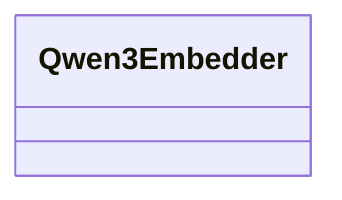

# embeddings_dense.qwen3

Qwen-3 dense embedding adapter

## Sections

- **Public API**

## Contents

### embeddings_dense.qwen3.Qwen3Embedder

::: embeddings_dense.qwen3.Qwen3Embedder

## Relationships

**Imports:** `__future__.annotations`, `kgfoundry_common.navmap_loader.load_nav_metadata`

## Autorefs Examples

- [embeddings_dense.qwen3.Qwen3Embedder][]

## Inheritance



## Neighborhood

```d2
direction: right
"embeddings_dense.qwen3": "embeddings_dense.qwen3" { link: "qwen3.md" }
"__future__.annotations": "__future__.annotations"
"embeddings_dense.qwen3" -> "__future__.annotations"
"kgfoundry_common.navmap_loader.load_nav_metadata": "kgfoundry_common.navmap_loader.load_nav_metadata"
"embeddings_dense.qwen3" -> "kgfoundry_common.navmap_loader.load_nav_metadata"
```

