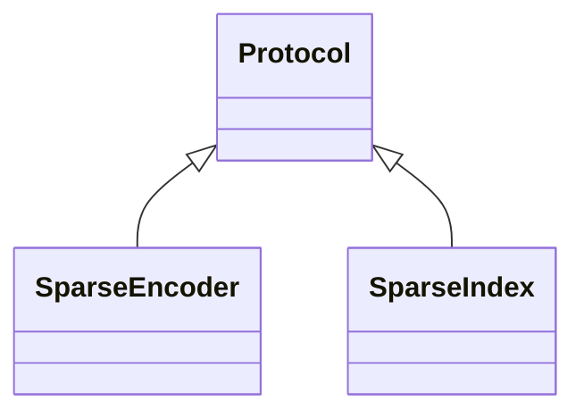

# embeddings_sparse.base

Protocols for sparse embedding encoders and indices

## Sections

- **Public API**

## Contents

### embeddings_sparse.base.SparseEncoder

::: embeddings_sparse.base.SparseEncoder

*Bases:* Protocol

### embeddings_sparse.base.SparseIndex

::: embeddings_sparse.base.SparseIndex

*Bases:* Protocol

## Relationships

**Imports:** `__future__.annotations`, `collections.abc.Iterable`, `collections.abc.Mapping`, `kgfoundry_common.navmap_loader.load_nav_metadata`, `typing.Protocol`, `typing.TYPE_CHECKING`

## Autorefs Examples

- [embeddings_sparse.base.SparseEncoder][]
- [embeddings_sparse.base.SparseIndex][]

## Inheritance



## Neighborhood

```d2
direction: right
"embeddings_sparse.base": "embeddings_sparse.base" { link: "base.md" }
"__future__.annotations": "__future__.annotations"
"embeddings_sparse.base" -> "__future__.annotations"
"collections.abc.Iterable": "collections.abc.Iterable"
"embeddings_sparse.base" -> "collections.abc.Iterable"
"collections.abc.Mapping": "collections.abc.Mapping"
"embeddings_sparse.base" -> "collections.abc.Mapping"
"kgfoundry_common.navmap_loader.load_nav_metadata": "kgfoundry_common.navmap_loader.load_nav_metadata"
"embeddings_sparse.base" -> "kgfoundry_common.navmap_loader.load_nav_metadata"
"typing.Protocol": "typing.Protocol"
"embeddings_sparse.base" -> "typing.Protocol"
"typing.TYPE_CHECKING": "typing.TYPE_CHECKING"
"embeddings_sparse.base" -> "typing.TYPE_CHECKING"
```

