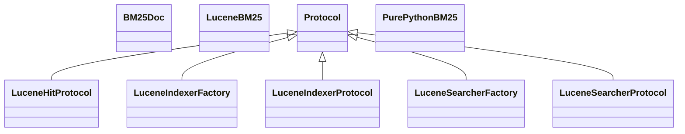

# embeddings_sparse.bm25

Pure Python and Lucene-backed BM25 adapters for sparse retrieval

[View source on GitHub](https://github.com/kgfoundry/kgfoundry/blob/main/src/embeddings_sparse/bm25.py)

## Sections

- **Public API**

## Contents

### embeddings_sparse.bm25.BM25Doc

::: embeddings_sparse.bm25.BM25Doc

### embeddings_sparse.bm25.LuceneBM25

::: embeddings_sparse.bm25.LuceneBM25

### embeddings_sparse.bm25.LuceneHitProtocol

::: embeddings_sparse.bm25.LuceneHitProtocol

*Bases:* Protocol

### embeddings_sparse.bm25.LuceneIndexerFactory

::: embeddings_sparse.bm25.LuceneIndexerFactory

*Bases:* Protocol

### embeddings_sparse.bm25.LuceneIndexerProtocol

::: embeddings_sparse.bm25.LuceneIndexerProtocol

*Bases:* Protocol

### embeddings_sparse.bm25.LuceneSearcherFactory

::: embeddings_sparse.bm25.LuceneSearcherFactory

*Bases:* Protocol

### embeddings_sparse.bm25.LuceneSearcherProtocol

::: embeddings_sparse.bm25.LuceneSearcherProtocol

*Bases:* Protocol

### embeddings_sparse.bm25.PurePythonBM25

::: embeddings_sparse.bm25.PurePythonBM25

### embeddings_sparse.bm25._default_int_dict

::: embeddings_sparse.bm25._default_int_dict

### embeddings_sparse.bm25._load_json_metadata

::: embeddings_sparse.bm25._load_json_metadata

### embeddings_sparse.bm25._load_lucene_indexer_factory

::: embeddings_sparse.bm25._load_lucene_indexer_factory

### embeddings_sparse.bm25._load_lucene_searcher_factory

::: embeddings_sparse.bm25._load_lucene_searcher_factory

### embeddings_sparse.bm25._normalize_field_boosts

::: embeddings_sparse.bm25._normalize_field_boosts

### embeddings_sparse.bm25._score_value

::: embeddings_sparse.bm25._score_value

### embeddings_sparse.bm25.get_bm25

::: embeddings_sparse.bm25.get_bm25

## Relationships

**Imports:** `__future__.annotations`, `collections.abc.Iterable`, `collections.abc.Mapping`, `collections.abc.Sequence`, `collections.defaultdict`, `dataclasses.dataclass`, `dataclasses.field`, `importlib.import_module`, `kgfoundry_common.errors.DeserializationError`, `kgfoundry_common.navmap_loader.load_nav_metadata`, `kgfoundry_common.problem_details.JsonValue`, `kgfoundry_common.safe_pickle_v2.UnsafeSerializationError`, `kgfoundry_common.safe_pickle_v2.load_unsigned_legacy`, `kgfoundry_common.serialization.deserialize_json`, `kgfoundry_common.serialization.serialize_json`, `logging`, `math`, `pathlib.Path`, `re`, `re.Pattern`, `typing.Final`, `typing.Protocol`, `typing.TYPE_CHECKING`, `typing.cast`

## Autorefs Examples

- [embeddings_sparse.bm25.BM25Doc][]
- [embeddings_sparse.bm25.LuceneBM25][]
- [embeddings_sparse.bm25.LuceneHitProtocol][]
- [embeddings_sparse.bm25._default_int_dict][]
- [embeddings_sparse.bm25._load_json_metadata][]
- [embeddings_sparse.bm25._load_lucene_indexer_factory][]

## Inheritance



## Neighborhood

```d2
direction: right
"embeddings_sparse.bm25": "embeddings_sparse.bm25" { link: "./embeddings_sparse/bm25.md" }
"__future__.annotations": "__future__.annotations"
"embeddings_sparse.bm25" -> "__future__.annotations"
"collections.abc.Iterable": "collections.abc.Iterable"
"embeddings_sparse.bm25" -> "collections.abc.Iterable"
"collections.abc.Mapping": "collections.abc.Mapping"
"embeddings_sparse.bm25" -> "collections.abc.Mapping"
"collections.abc.Sequence": "collections.abc.Sequence"
"embeddings_sparse.bm25" -> "collections.abc.Sequence"
"collections.defaultdict": "collections.defaultdict"
"embeddings_sparse.bm25" -> "collections.defaultdict"
"dataclasses.dataclass": "dataclasses.dataclass"
"embeddings_sparse.bm25" -> "dataclasses.dataclass"
"dataclasses.field": "dataclasses.field"
"embeddings_sparse.bm25" -> "dataclasses.field"
"importlib.import_module": "importlib.import_module"
"embeddings_sparse.bm25" -> "importlib.import_module"
"kgfoundry_common.errors.DeserializationError": "kgfoundry_common.errors.DeserializationError"
"embeddings_sparse.bm25" -> "kgfoundry_common.errors.DeserializationError"
"kgfoundry_common.navmap_loader.load_nav_metadata": "kgfoundry_common.navmap_loader.load_nav_metadata"
"embeddings_sparse.bm25" -> "kgfoundry_common.navmap_loader.load_nav_metadata"
"kgfoundry_common.problem_details.JsonValue": "kgfoundry_common.problem_details.JsonValue"
"embeddings_sparse.bm25" -> "kgfoundry_common.problem_details.JsonValue"
"kgfoundry_common.safe_pickle_v2.UnsafeSerializationError": "kgfoundry_common.safe_pickle_v2.UnsafeSerializationError"
"embeddings_sparse.bm25" -> "kgfoundry_common.safe_pickle_v2.UnsafeSerializationError"
"kgfoundry_common.safe_pickle_v2.load_unsigned_legacy": "kgfoundry_common.safe_pickle_v2.load_unsigned_legacy"
"embeddings_sparse.bm25" -> "kgfoundry_common.safe_pickle_v2.load_unsigned_legacy"
"kgfoundry_common.serialization.deserialize_json": "kgfoundry_common.serialization.deserialize_json"
"embeddings_sparse.bm25" -> "kgfoundry_common.serialization.deserialize_json"
"kgfoundry_common.serialization.serialize_json": "kgfoundry_common.serialization.serialize_json"
"embeddings_sparse.bm25" -> "kgfoundry_common.serialization.serialize_json"
"logging": "logging"
"embeddings_sparse.bm25" -> "logging"
"math": "math"
"embeddings_sparse.bm25" -> "math"
"pathlib.Path": "pathlib.Path"
"embeddings_sparse.bm25" -> "pathlib.Path"
"re": "re"
"embeddings_sparse.bm25" -> "re"
"re.Pattern": "re.Pattern"
"embeddings_sparse.bm25" -> "re.Pattern"
"typing.Final": "typing.Final"
"embeddings_sparse.bm25" -> "typing.Final"
"typing.Protocol": "typing.Protocol"
"embeddings_sparse.bm25" -> "typing.Protocol"
"typing.TYPE_CHECKING": "typing.TYPE_CHECKING"
"embeddings_sparse.bm25" -> "typing.TYPE_CHECKING"
"typing.cast": "typing.cast"
"embeddings_sparse.bm25" -> "typing.cast"
"embeddings_sparse.bm25_code": "embeddings_sparse.bm25 code" { link: "https://github.com/kgfoundry/kgfoundry/blob/main/src/embeddings_sparse/bm25.py" }
"embeddings_sparse.bm25" -> "embeddings_sparse.bm25_code" { style: dashed }
```

