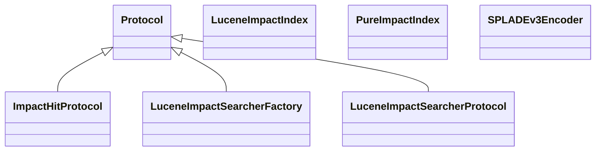

# embeddings_sparse.splade

SPLADE sparse embedding helpers

[View source on GitHub](https://github.com/paul-heyse/kgfoundry/blob/main/src/embeddings_sparse/splade.py)

## Hierarchy

- **Parent:** [embeddings_sparse](../embeddings_sparse.md)

## Sections

- **Public API**

## Contents

### embeddings_sparse.splade.ImpactHitProtocol

::: embeddings_sparse.splade.ImpactHitProtocol

*Bases:* Protocol

### embeddings_sparse.splade.LuceneImpactIndex

::: embeddings_sparse.splade.LuceneImpactIndex

### embeddings_sparse.splade.LuceneImpactSearcherFactory

::: embeddings_sparse.splade.LuceneImpactSearcherFactory

*Bases:* Protocol

### embeddings_sparse.splade.LuceneImpactSearcherProtocol

::: embeddings_sparse.splade.LuceneImpactSearcherProtocol

*Bases:* Protocol

### embeddings_sparse.splade.PureImpactIndex

::: embeddings_sparse.splade.PureImpactIndex

### embeddings_sparse.splade.SPLADEv3Encoder

::: embeddings_sparse.splade.SPLADEv3Encoder

### embeddings_sparse.splade._decode_signing_key

::: embeddings_sparse.splade._decode_signing_key

### embeddings_sparse.splade._default_float_dict

::: embeddings_sparse.splade._default_float_dict

### embeddings_sparse.splade._load_legacy_metadata

::: embeddings_sparse.splade._load_legacy_metadata

### embeddings_sparse.splade._load_unsigned_payload

::: embeddings_sparse.splade._load_unsigned_payload

### embeddings_sparse.splade._score_value

::: embeddings_sparse.splade._score_value

### embeddings_sparse.splade.get_splade

::: embeddings_sparse.splade.get_splade

## Relationships

**Imports:** `__future__.annotations`, `base64`, `binascii`, `collections.Counter`, `collections.abc.Iterable`, `collections.abc.Sequence`, `collections.defaultdict`, `importlib`, `kgfoundry_common.config.load_config`, `kgfoundry_common.errors.DeserializationError`, `kgfoundry_common.navmap_loader.load_nav_metadata`, `kgfoundry_common.problem_details.JsonValue`, `kgfoundry_common.safe_pickle_v2.SignedPickleWrapper`, `kgfoundry_common.safe_pickle_v2.UnsafeSerializationError`, `kgfoundry_common.safe_pickle_v2.load_unsigned_legacy`, `kgfoundry_common.serialization.deserialize_json`, `kgfoundry_common.serialization.serialize_json`, `logging`, `math`, `pathlib.Path`, `re`, `re.Pattern`, `types.ModuleType`, `typing.BinaryIO`, `typing.ClassVar`, `typing.Protocol`, `typing.TYPE_CHECKING`, `typing.cast`

## Autorefs Examples

- [embeddings_sparse.splade.ImpactHitProtocol][]
- [embeddings_sparse.splade.LuceneImpactIndex][]
- [embeddings_sparse.splade.LuceneImpactSearcherFactory][]
- [embeddings_sparse.splade._decode_signing_key][]
- [embeddings_sparse.splade._default_float_dict][]
- [embeddings_sparse.splade._load_legacy_metadata][]

## Inheritance



## Neighborhood

```d2
direction: right
"embeddings_sparse.splade": "embeddings_sparse.splade" { link: "https://github.com/paul-heyse/kgfoundry/blob/main/src/embeddings_sparse/splade.py" }
"__future__.annotations": "__future__.annotations"
"embeddings_sparse.splade" -> "__future__.annotations"
"base64": "base64"
"embeddings_sparse.splade" -> "base64"
"binascii": "binascii"
"embeddings_sparse.splade" -> "binascii"
"collections.Counter": "collections.Counter"
"embeddings_sparse.splade" -> "collections.Counter"
"collections.abc.Iterable": "collections.abc.Iterable"
"embeddings_sparse.splade" -> "collections.abc.Iterable"
"collections.abc.Sequence": "collections.abc.Sequence"
"embeddings_sparse.splade" -> "collections.abc.Sequence"
"collections.defaultdict": "collections.defaultdict"
"embeddings_sparse.splade" -> "collections.defaultdict"
"importlib": "importlib"
"embeddings_sparse.splade" -> "importlib"
"kgfoundry_common.config.load_config": "kgfoundry_common.config.load_config"
"embeddings_sparse.splade" -> "kgfoundry_common.config.load_config"
"kgfoundry_common.errors.DeserializationError": "kgfoundry_common.errors.DeserializationError"
"embeddings_sparse.splade" -> "kgfoundry_common.errors.DeserializationError"
"kgfoundry_common.navmap_loader.load_nav_metadata": "kgfoundry_common.navmap_loader.load_nav_metadata"
"embeddings_sparse.splade" -> "kgfoundry_common.navmap_loader.load_nav_metadata"
"kgfoundry_common.problem_details.JsonValue": "kgfoundry_common.problem_details.JsonValue"
"embeddings_sparse.splade" -> "kgfoundry_common.problem_details.JsonValue"
"kgfoundry_common.safe_pickle_v2.SignedPickleWrapper": "kgfoundry_common.safe_pickle_v2.SignedPickleWrapper"
"embeddings_sparse.splade" -> "kgfoundry_common.safe_pickle_v2.SignedPickleWrapper"
"kgfoundry_common.safe_pickle_v2.UnsafeSerializationError": "kgfoundry_common.safe_pickle_v2.UnsafeSerializationError"
"embeddings_sparse.splade" -> "kgfoundry_common.safe_pickle_v2.UnsafeSerializationError"
"kgfoundry_common.safe_pickle_v2.load_unsigned_legacy": "kgfoundry_common.safe_pickle_v2.load_unsigned_legacy"
"embeddings_sparse.splade" -> "kgfoundry_common.safe_pickle_v2.load_unsigned_legacy"
"kgfoundry_common.serialization.deserialize_json": "kgfoundry_common.serialization.deserialize_json"
"embeddings_sparse.splade" -> "kgfoundry_common.serialization.deserialize_json"
"kgfoundry_common.serialization.serialize_json": "kgfoundry_common.serialization.serialize_json"
"embeddings_sparse.splade" -> "kgfoundry_common.serialization.serialize_json"
"logging": "logging"
"embeddings_sparse.splade" -> "logging"
"math": "math"
"embeddings_sparse.splade" -> "math"
"pathlib.Path": "pathlib.Path"
"embeddings_sparse.splade" -> "pathlib.Path"
"re": "re"
"embeddings_sparse.splade" -> "re"
"re.Pattern": "re.Pattern"
"embeddings_sparse.splade" -> "re.Pattern"
"types.ModuleType": "types.ModuleType"
"embeddings_sparse.splade" -> "types.ModuleType"
"typing.BinaryIO": "typing.BinaryIO"
"embeddings_sparse.splade" -> "typing.BinaryIO"
"typing.ClassVar": "typing.ClassVar"
"embeddings_sparse.splade" -> "typing.ClassVar"
"typing.Protocol": "typing.Protocol"
"embeddings_sparse.splade" -> "typing.Protocol"
"typing.TYPE_CHECKING": "typing.TYPE_CHECKING"
"embeddings_sparse.splade" -> "typing.TYPE_CHECKING"
"typing.cast": "typing.cast"
"embeddings_sparse.splade" -> "typing.cast"
"embeddings_sparse": "embeddings_sparse" { link: "https://github.com/paul-heyse/kgfoundry/blob/main/src/embeddings_sparse/__init__.py" }
"embeddings_sparse" -> "embeddings_sparse.splade" { style: dashed }
```

