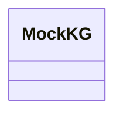

# kg_builder.mock_kg

Helpers for the MockKG in-memory knowledge graph

## Sections

- **Public API**

## Contents

### kg_builder.mock_kg.MockKG

::: kg_builder.mock_kg.MockKG

## Relationships

**Imports:** `__future__.annotations`, `kgfoundry_common.navmap_loader.load_nav_metadata`

## Autorefs Examples

- [kg_builder.mock_kg.MockKG][]

## Inheritance



## Neighborhood

```d2
direction: right
"kg_builder.mock_kg": "kg_builder.mock_kg" { link: "mock_kg.md" }
"__future__.annotations": "__future__.annotations"
"kg_builder.mock_kg" -> "__future__.annotations"
"kgfoundry_common.navmap_loader.load_nav_metadata": "kgfoundry_common.navmap_loader.load_nav_metadata"
"kg_builder.mock_kg" -> "kgfoundry_common.navmap_loader.load_nav_metadata"
```

