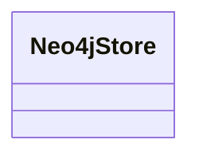

# kg_builder.neo4j_store

Placeholder interface for a Neo4j-backed store

[View source on GitHub](https://github.com/kgfoundry/kgfoundry/blob/main/src/kg_builder/neo4j_store.py)

## Sections

- **Public API**

## Contents

### kg_builder.neo4j_store.Neo4jStore

::: kg_builder.neo4j_store.Neo4jStore

## Relationships

**Imports:** `__future__.annotations`, `kgfoundry_common.navmap_loader.load_nav_metadata`

## Autorefs Examples

- [kg_builder.neo4j_store.Neo4jStore][]

## Inheritance



## Neighborhood

```d2
direction: right
"kg_builder.neo4j_store": "kg_builder.neo4j_store" { link: "./kg_builder/neo4j_store.md" }
"__future__.annotations": "__future__.annotations"
"kg_builder.neo4j_store" -> "__future__.annotations"
"kgfoundry_common.navmap_loader.load_nav_metadata": "kgfoundry_common.navmap_loader.load_nav_metadata"
"kg_builder.neo4j_store" -> "kgfoundry_common.navmap_loader.load_nav_metadata"
"kg_builder.neo4j_store_code": "kg_builder.neo4j_store code" { link: "https://github.com/kgfoundry/kgfoundry/blob/main/src/kg_builder/neo4j_store.py" }
"kg_builder.neo4j_store" -> "kg_builder.neo4j_store_code" { style: dashed }
```

