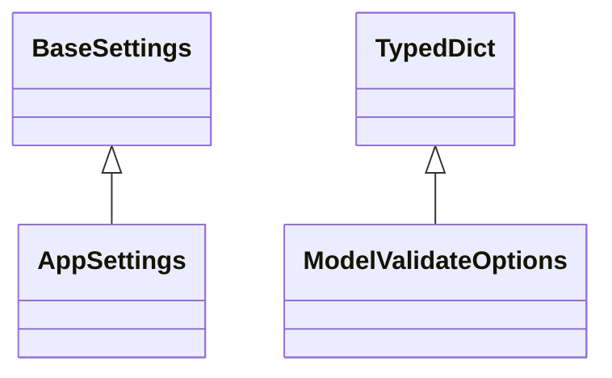

# kgfoundry_common.config

Typed configuration management via pydantic_settings

[View source on GitHub](https://github.com/kgfoundry/kgfoundry/blob/main/src/kgfoundry_common/config.py)

## Sections

- **Public API**

## Contents

### kgfoundry_common.config.AppSettings

::: kgfoundry_common.config.AppSettings

*Bases:* BaseSettings

### kgfoundry_common.config.ModelValidateOptions

::: kgfoundry_common.config.ModelValidateOptions

*Bases:* TypedDict

### kgfoundry_common.config._compose_options

::: kgfoundry_common.config._compose_options

### kgfoundry_common.config._format_validation_error

::: kgfoundry_common.config._format_validation_error

### kgfoundry_common.config._load_config_impl

::: kgfoundry_common.config._load_config_impl

### kgfoundry_common.config.load_config

::: kgfoundry_common.config.load_config

## Relationships

**Imports:** `__future__.annotations`, `base64`, `collections.abc.Mapping`, `collections.abc.Sequence`, `functools`, `functools.lru_cache`, `kgfoundry_common.logging.get_logger`, `kgfoundry_common.navmap_loader.load_nav_metadata`, `kgfoundry_common.types.JsonPrimitive`, `kgfoundry_common.types.JsonValue`, `pydantic.AliasChoices`, `pydantic.Field`, `pydantic.ValidationError`, `pydantic.field_validator`, `pydantic_settings.BaseSettings`, `pydantic_settings.SettingsConfigDict`, `typing.ClassVar`, `typing.Final`, `typing.Literal`, `typing.Self`, `typing.TYPE_CHECKING`, `typing.TypedDict`, `typing.Unpack`, `typing.cast`

## Autorefs Examples

- [kgfoundry_common.config.AppSettings][]
- [kgfoundry_common.config.ModelValidateOptions][]
- [kgfoundry_common.config._compose_options][]
- [kgfoundry_common.config._format_validation_error][]
- [kgfoundry_common.config._load_config_impl][]

## Inheritance



## Neighborhood

```d2
direction: right
"kgfoundry_common.config": "kgfoundry_common.config" { link: "./kgfoundry_common/config.md" }
"__future__.annotations": "__future__.annotations"
"kgfoundry_common.config" -> "__future__.annotations"
"base64": "base64"
"kgfoundry_common.config" -> "base64"
"collections.abc.Mapping": "collections.abc.Mapping"
"kgfoundry_common.config" -> "collections.abc.Mapping"
"collections.abc.Sequence": "collections.abc.Sequence"
"kgfoundry_common.config" -> "collections.abc.Sequence"
"functools": "functools"
"kgfoundry_common.config" -> "functools"
"functools.lru_cache": "functools.lru_cache"
"kgfoundry_common.config" -> "functools.lru_cache"
"kgfoundry_common.logging.get_logger": "kgfoundry_common.logging.get_logger"
"kgfoundry_common.config" -> "kgfoundry_common.logging.get_logger"
"kgfoundry_common.navmap_loader.load_nav_metadata": "kgfoundry_common.navmap_loader.load_nav_metadata"
"kgfoundry_common.config" -> "kgfoundry_common.navmap_loader.load_nav_metadata"
"kgfoundry_common.types.JsonPrimitive": "kgfoundry_common.types.JsonPrimitive"
"kgfoundry_common.config" -> "kgfoundry_common.types.JsonPrimitive"
"kgfoundry_common.types.JsonValue": "kgfoundry_common.types.JsonValue"
"kgfoundry_common.config" -> "kgfoundry_common.types.JsonValue"
"pydantic.AliasChoices": "pydantic.AliasChoices"
"kgfoundry_common.config" -> "pydantic.AliasChoices"
"pydantic.Field": "pydantic.Field"
"kgfoundry_common.config" -> "pydantic.Field"
"pydantic.ValidationError": "pydantic.ValidationError"
"kgfoundry_common.config" -> "pydantic.ValidationError"
"pydantic.field_validator": "pydantic.field_validator"
"kgfoundry_common.config" -> "pydantic.field_validator"
"pydantic_settings.BaseSettings": "pydantic_settings.BaseSettings"
"kgfoundry_common.config" -> "pydantic_settings.BaseSettings"
"pydantic_settings.SettingsConfigDict": "pydantic_settings.SettingsConfigDict"
"kgfoundry_common.config" -> "pydantic_settings.SettingsConfigDict"
"typing.ClassVar": "typing.ClassVar"
"kgfoundry_common.config" -> "typing.ClassVar"
"typing.Final": "typing.Final"
"kgfoundry_common.config" -> "typing.Final"
"typing.Literal": "typing.Literal"
"kgfoundry_common.config" -> "typing.Literal"
"typing.Self": "typing.Self"
"kgfoundry_common.config" -> "typing.Self"
"typing.TYPE_CHECKING": "typing.TYPE_CHECKING"
"kgfoundry_common.config" -> "typing.TYPE_CHECKING"
"typing.TypedDict": "typing.TypedDict"
"kgfoundry_common.config" -> "typing.TypedDict"
"typing.Unpack": "typing.Unpack"
"kgfoundry_common.config" -> "typing.Unpack"
"typing.cast": "typing.cast"
"kgfoundry_common.config" -> "typing.cast"
"kgfoundry_common.config_code": "kgfoundry_common.config code" { link: "https://github.com/kgfoundry/kgfoundry/blob/main/src/kgfoundry_common/config.py" }
"kgfoundry_common.config" -> "kgfoundry_common.config_code" { style: dashed }
```

