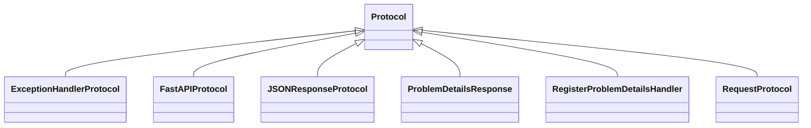

# kgfoundry_common.errors

Exception hierarchy and Problem Details support

[View source on GitHub](https://github.com/paul-heyse/kgfoundry/blob/main/src/kgfoundry_common/errors/__init__.py)

## Hierarchy

- **Parent:** [kgfoundry_common](../kgfoundry_common.md)
- **Children:** [kgfoundry_common.errors.codes](errors/codes.md), [kgfoundry_common.errors.exceptions](errors/exceptions.md), [kgfoundry_common.errors.http](errors/http.md)

## Sections

- **Public API**

## Contents

### kgfoundry_common.errors.ExceptionHandlerProtocol

::: kgfoundry_common.errors.ExceptionHandlerProtocol

*Bases:* Protocol

### kgfoundry_common.errors.FastAPIProtocol

::: kgfoundry_common.errors.FastAPIProtocol

*Bases:* Protocol

### kgfoundry_common.errors.JSONResponseProtocol

::: kgfoundry_common.errors.JSONResponseProtocol

*Bases:* Protocol

### kgfoundry_common.errors.ProblemDetailsResponse

::: kgfoundry_common.errors.ProblemDetailsResponse

*Bases:* Protocol

### kgfoundry_common.errors.RegisterProblemDetailsHandler

::: kgfoundry_common.errors.RegisterProblemDetailsHandler

*Bases:* Protocol

### kgfoundry_common.errors.RequestProtocol

::: kgfoundry_common.errors.RequestProtocol

*Bases:* Protocol

### kgfoundry_common.errors._missing_problem_details_response

::: kgfoundry_common.errors._missing_problem_details_response

### kgfoundry_common.errors._missing_register_problem_details_handler

::: kgfoundry_common.errors._missing_register_problem_details_handler

### kgfoundry_common.errors._protocol_stub

::: kgfoundry_common.errors._protocol_stub

### kgfoundry_common.errors.problem_details_response

::: kgfoundry_common.errors.problem_details_response

### kgfoundry_common.errors.register_problem_details_handler

::: kgfoundry_common.errors.register_problem_details_handler

## Relationships

**Imports:** `__future__.annotations`, `kgfoundry_common.errors.codes.BASE_TYPE_URI`, `kgfoundry_common.errors.codes.ErrorCode`, `kgfoundry_common.errors.codes.get_type_uri`, `kgfoundry_common.errors.exceptions.AgentCatalogSearchError`, `kgfoundry_common.errors.exceptions.ArtifactDependencyError`, `kgfoundry_common.errors.exceptions.ArtifactDeserializationError`, `kgfoundry_common.errors.exceptions.ArtifactModelError`, `kgfoundry_common.errors.exceptions.ArtifactSerializationError`, `kgfoundry_common.errors.exceptions.ArtifactValidationError`, `kgfoundry_common.errors.exceptions.CatalogLoadError`, `kgfoundry_common.errors.exceptions.CatalogSessionError`, `kgfoundry_common.errors.exceptions.ChunkingError`, `kgfoundry_common.errors.exceptions.ConfigurationError`, `kgfoundry_common.errors.exceptions.DeserializationError`, `kgfoundry_common.errors.exceptions.DoclingError`, `kgfoundry_common.errors.exceptions.DownloadError`, `kgfoundry_common.errors.exceptions.EmbeddingError`, `kgfoundry_common.errors.exceptions.IndexBuildError`, `kgfoundry_common.errors.exceptions.KgFoundryError`, `kgfoundry_common.errors.exceptions.LinkerCalibrationError`, `kgfoundry_common.errors.exceptions.Neo4jError`, `kgfoundry_common.errors.exceptions.OCRTimeoutError`, `kgfoundry_common.errors.exceptions.OntologyParseError`, `kgfoundry_common.errors.exceptions.RegistryError`, `kgfoundry_common.errors.exceptions.RetryExhaustedError`, `kgfoundry_common.errors.exceptions.SchemaValidationError`, `kgfoundry_common.errors.exceptions.SerializationError`, `kgfoundry_common.errors.exceptions.SettingsError`, `kgfoundry_common.errors.exceptions.SpladeOOMError`, `kgfoundry_common.errors.exceptions.SymbolAttachmentError`, `kgfoundry_common.errors.exceptions.UnsupportedMIMEError`, `kgfoundry_common.errors.exceptions.VectorSearchError`, `kgfoundry_common.errors.http.problem_details_response`, `kgfoundry_common.errors.http.register_problem_details_handler`, `kgfoundry_common.navmap_loader.load_nav_metadata`, `kgfoundry_common.navmap_types.NavMap`, `typing.NoReturn`, `typing.Protocol`, `typing.cast`

## Autorefs Examples

- [kgfoundry_common.errors.ExceptionHandlerProtocol][]
- [kgfoundry_common.errors.FastAPIProtocol][]
- [kgfoundry_common.errors.JSONResponseProtocol][]
- [kgfoundry_common.errors._missing_problem_details_response][]
- [kgfoundry_common.errors._missing_register_problem_details_handler][]
- [kgfoundry_common.errors._protocol_stub][]

## Inheritance



## Neighborhood

```d2
direction: right
"kgfoundry_common.errors": "kgfoundry_common.errors" { link: "https://github.com/paul-heyse/kgfoundry/blob/main/src/kgfoundry_common/errors/__init__.py" }
"__future__.annotations": "__future__.annotations"
"kgfoundry_common.errors" -> "__future__.annotations"
"kgfoundry_common.errors.codes.BASE_TYPE_URI": "kgfoundry_common.errors.codes.BASE_TYPE_URI"
"kgfoundry_common.errors" -> "kgfoundry_common.errors.codes.BASE_TYPE_URI"
"kgfoundry_common.errors.codes.ErrorCode": "kgfoundry_common.errors.codes.ErrorCode"
"kgfoundry_common.errors" -> "kgfoundry_common.errors.codes.ErrorCode"
"kgfoundry_common.errors.codes.get_type_uri": "kgfoundry_common.errors.codes.get_type_uri"
"kgfoundry_common.errors" -> "kgfoundry_common.errors.codes.get_type_uri"
"kgfoundry_common.errors.exceptions.AgentCatalogSearchError": "kgfoundry_common.errors.exceptions.AgentCatalogSearchError"
"kgfoundry_common.errors" -> "kgfoundry_common.errors.exceptions.AgentCatalogSearchError"
"kgfoundry_common.errors.exceptions.ArtifactDependencyError": "kgfoundry_common.errors.exceptions.ArtifactDependencyError"
"kgfoundry_common.errors" -> "kgfoundry_common.errors.exceptions.ArtifactDependencyError"
"kgfoundry_common.errors.exceptions.ArtifactDeserializationError": "kgfoundry_common.errors.exceptions.ArtifactDeserializationError"
"kgfoundry_common.errors" -> "kgfoundry_common.errors.exceptions.ArtifactDeserializationError"
"kgfoundry_common.errors.exceptions.ArtifactModelError": "kgfoundry_common.errors.exceptions.ArtifactModelError"
"kgfoundry_common.errors" -> "kgfoundry_common.errors.exceptions.ArtifactModelError"
"kgfoundry_common.errors.exceptions.ArtifactSerializationError": "kgfoundry_common.errors.exceptions.ArtifactSerializationError"
"kgfoundry_common.errors" -> "kgfoundry_common.errors.exceptions.ArtifactSerializationError"
"kgfoundry_common.errors.exceptions.ArtifactValidationError": "kgfoundry_common.errors.exceptions.ArtifactValidationError"
"kgfoundry_common.errors" -> "kgfoundry_common.errors.exceptions.ArtifactValidationError"
"kgfoundry_common.errors.exceptions.CatalogLoadError": "kgfoundry_common.errors.exceptions.CatalogLoadError"
"kgfoundry_common.errors" -> "kgfoundry_common.errors.exceptions.CatalogLoadError"
"kgfoundry_common.errors.exceptions.CatalogSessionError": "kgfoundry_common.errors.exceptions.CatalogSessionError"
"kgfoundry_common.errors" -> "kgfoundry_common.errors.exceptions.CatalogSessionError"
"kgfoundry_common.errors.exceptions.ChunkingError": "kgfoundry_common.errors.exceptions.ChunkingError"
"kgfoundry_common.errors" -> "kgfoundry_common.errors.exceptions.ChunkingError"
"kgfoundry_common.errors.exceptions.ConfigurationError": "kgfoundry_common.errors.exceptions.ConfigurationError"
"kgfoundry_common.errors" -> "kgfoundry_common.errors.exceptions.ConfigurationError"
"kgfoundry_common.errors.exceptions.DeserializationError": "kgfoundry_common.errors.exceptions.DeserializationError"
"kgfoundry_common.errors" -> "kgfoundry_common.errors.exceptions.DeserializationError"
"kgfoundry_common.errors.exceptions.DoclingError": "kgfoundry_common.errors.exceptions.DoclingError"
"kgfoundry_common.errors" -> "kgfoundry_common.errors.exceptions.DoclingError"
"kgfoundry_common.errors.exceptions.DownloadError": "kgfoundry_common.errors.exceptions.DownloadError"
"kgfoundry_common.errors" -> "kgfoundry_common.errors.exceptions.DownloadError"
"kgfoundry_common.errors.exceptions.EmbeddingError": "kgfoundry_common.errors.exceptions.EmbeddingError"
"kgfoundry_common.errors" -> "kgfoundry_common.errors.exceptions.EmbeddingError"
"kgfoundry_common.errors.exceptions.IndexBuildError": "kgfoundry_common.errors.exceptions.IndexBuildError"
"kgfoundry_common.errors" -> "kgfoundry_common.errors.exceptions.IndexBuildError"
"kgfoundry_common.errors.exceptions.KgFoundryError": "kgfoundry_common.errors.exceptions.KgFoundryError"
"kgfoundry_common.errors" -> "kgfoundry_common.errors.exceptions.KgFoundryError"
"kgfoundry_common.errors.exceptions.LinkerCalibrationError": "kgfoundry_common.errors.exceptions.LinkerCalibrationError"
"kgfoundry_common.errors" -> "kgfoundry_common.errors.exceptions.LinkerCalibrationError"
"kgfoundry_common.errors.exceptions.Neo4jError": "kgfoundry_common.errors.exceptions.Neo4jError"
"kgfoundry_common.errors" -> "kgfoundry_common.errors.exceptions.Neo4jError"
"kgfoundry_common.errors.exceptions.OCRTimeoutError": "kgfoundry_common.errors.exceptions.OCRTimeoutError"
"kgfoundry_common.errors" -> "kgfoundry_common.errors.exceptions.OCRTimeoutError"
"kgfoundry_common.errors.exceptions.OntologyParseError": "kgfoundry_common.errors.exceptions.OntologyParseError"
"kgfoundry_common.errors" -> "kgfoundry_common.errors.exceptions.OntologyParseError"
"kgfoundry_common.errors.exceptions.RegistryError": "kgfoundry_common.errors.exceptions.RegistryError"
"kgfoundry_common.errors" -> "kgfoundry_common.errors.exceptions.RegistryError"
"kgfoundry_common.errors.exceptions.RetryExhaustedError": "kgfoundry_common.errors.exceptions.RetryExhaustedError"
"kgfoundry_common.errors" -> "kgfoundry_common.errors.exceptions.RetryExhaustedError"
"kgfoundry_common.errors.exceptions.SchemaValidationError": "kgfoundry_common.errors.exceptions.SchemaValidationError"
"kgfoundry_common.errors" -> "kgfoundry_common.errors.exceptions.SchemaValidationError"
"kgfoundry_common.errors.exceptions.SerializationError": "kgfoundry_common.errors.exceptions.SerializationError"
"kgfoundry_common.errors" -> "kgfoundry_common.errors.exceptions.SerializationError"
"kgfoundry_common.errors.exceptions.SettingsError": "kgfoundry_common.errors.exceptions.SettingsError"
"kgfoundry_common.errors" -> "kgfoundry_common.errors.exceptions.SettingsError"
"kgfoundry_common.errors.exceptions.SpladeOOMError": "kgfoundry_common.errors.exceptions.SpladeOOMError"
"kgfoundry_common.errors" -> "kgfoundry_common.errors.exceptions.SpladeOOMError"
"kgfoundry_common.errors.exceptions.SymbolAttachmentError": "kgfoundry_common.errors.exceptions.SymbolAttachmentError"
"kgfoundry_common.errors" -> "kgfoundry_common.errors.exceptions.SymbolAttachmentError"
"kgfoundry_common.errors.exceptions.UnsupportedMIMEError": "kgfoundry_common.errors.exceptions.UnsupportedMIMEError"
"kgfoundry_common.errors" -> "kgfoundry_common.errors.exceptions.UnsupportedMIMEError"
"kgfoundry_common.errors.exceptions.VectorSearchError": "kgfoundry_common.errors.exceptions.VectorSearchError"
"kgfoundry_common.errors" -> "kgfoundry_common.errors.exceptions.VectorSearchError"
"kgfoundry_common.errors.http.problem_details_response": "kgfoundry_common.errors.http.problem_details_response"
"kgfoundry_common.errors" -> "kgfoundry_common.errors.http.problem_details_response"
"kgfoundry_common.errors.http.register_problem_details_handler": "kgfoundry_common.errors.http.register_problem_details_handler"
"kgfoundry_common.errors" -> "kgfoundry_common.errors.http.register_problem_details_handler"
"kgfoundry_common.navmap_loader.load_nav_metadata": "kgfoundry_common.navmap_loader.load_nav_metadata"
"kgfoundry_common.errors" -> "kgfoundry_common.navmap_loader.load_nav_metadata"
"kgfoundry_common.navmap_types.NavMap": "kgfoundry_common.navmap_types.NavMap"
"kgfoundry_common.errors" -> "kgfoundry_common.navmap_types.NavMap"
"typing.NoReturn": "typing.NoReturn"
"kgfoundry_common.errors" -> "typing.NoReturn"
"typing.Protocol": "typing.Protocol"
"kgfoundry_common.errors" -> "typing.Protocol"
"typing.cast": "typing.cast"
"kgfoundry_common.errors" -> "typing.cast"
"kgfoundry_common": "kgfoundry_common" { link: "https://github.com/paul-heyse/kgfoundry/blob/main/src/kgfoundry_common/__init__.py" }
"kgfoundry_common" -> "kgfoundry_common.errors" { style: dashed }
"kgfoundry_common.errors.codes": "kgfoundry_common.errors.codes" { link: "https://github.com/paul-heyse/kgfoundry/blob/main/src/kgfoundry_common/errors/codes.py" }
"kgfoundry_common.errors" -> "kgfoundry_common.errors.codes" { style: dashed }
"kgfoundry_common.errors.exceptions": "kgfoundry_common.errors.exceptions" { link: "https://github.com/paul-heyse/kgfoundry/blob/main/src/kgfoundry_common/errors/exceptions.py" }
"kgfoundry_common.errors" -> "kgfoundry_common.errors.exceptions" { style: dashed }
"kgfoundry_common.errors.http": "kgfoundry_common.errors.http" { link: "https://github.com/paul-heyse/kgfoundry/blob/main/src/kgfoundry_common/errors/http.py" }
"kgfoundry_common.errors" -> "kgfoundry_common.errors.http" { style: dashed }
```

