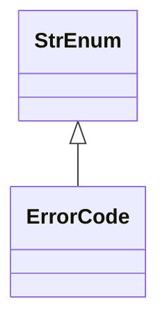

# kgfoundry_common.errors.codes

Error code registry and type URIs for Problem Details.

[View source on GitHub](https://github.com/kgfoundry/kgfoundry/blob/main/src/kgfoundry_common/errors/codes.py)

## Sections

- **Public API**

## Contents

### kgfoundry_common.errors.codes.ErrorCode

::: kgfoundry_common.errors.codes.ErrorCode

*Bases:* StrEnum

### kgfoundry_common.errors.codes.get_type_uri

::: kgfoundry_common.errors.codes.get_type_uri

## Relationships

**Imports:** `__future__.annotations`, `enum.StrEnum`, `kgfoundry_common.navmap_loader.load_nav_metadata`, `typing.Final`

## Autorefs Examples

- [kgfoundry_common.errors.codes.ErrorCode][]
- [kgfoundry_common.errors.codes.get_type_uri][]

## Inheritance



## Neighborhood

```d2
direction: right
"kgfoundry_common.errors.codes": "kgfoundry_common.errors.codes" { link: "./kgfoundry_common/errors/codes.md" }
"__future__.annotations": "__future__.annotations"
"kgfoundry_common.errors.codes" -> "__future__.annotations"
"enum.StrEnum": "enum.StrEnum"
"kgfoundry_common.errors.codes" -> "enum.StrEnum"
"kgfoundry_common.navmap_loader.load_nav_metadata": "kgfoundry_common.navmap_loader.load_nav_metadata"
"kgfoundry_common.errors.codes" -> "kgfoundry_common.navmap_loader.load_nav_metadata"
"typing.Final": "typing.Final"
"kgfoundry_common.errors.codes" -> "typing.Final"
"kgfoundry_common.errors.codes_code": "kgfoundry_common.errors.codes code" { link: "https://github.com/kgfoundry/kgfoundry/blob/main/src/kgfoundry_common/errors/codes.py" }
"kgfoundry_common.errors.codes" -> "kgfoundry_common.errors.codes_code" { style: dashed }
```

