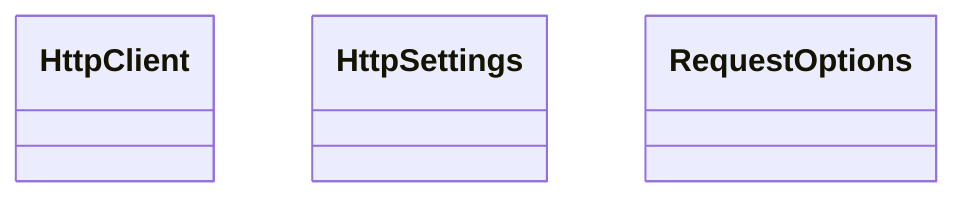

# kgfoundry_common.http.client

HTTP client with retry strategy support.

[View source on GitHub](https://github.com/paul-heyse/kgfoundry/blob/main/src/kgfoundry_common/http/client.py)

## Hierarchy

- **Parent:** [kgfoundry_common.http](../http.md)

## Sections

- **Public API**

## Contents

### kgfoundry_common.http.client.HttpClient

::: kgfoundry_common.http.client.HttpClient

### kgfoundry_common.http.client.HttpSettings

::: kgfoundry_common.http.client.HttpSettings

### kgfoundry_common.http.client.RequestOptions

::: kgfoundry_common.http.client.RequestOptions

## Relationships

**Imports:** `__future__.annotations`, `collections.abc.Callable`, `collections.abc.Mapping`, `dataclasses.dataclass`, `dataclasses.replace`, `kgfoundry_common.http.tenacity_retry.TenacityRetryStrategy`, `kgfoundry_common.http.types.RetryStrategy`

## Autorefs Examples

- [kgfoundry_common.http.client.HttpClient][]
- [kgfoundry_common.http.client.HttpSettings][]
- [kgfoundry_common.http.client.RequestOptions][]

## Inheritance



## Neighborhood

```d2
direction: right
"kgfoundry_common.http.client": "kgfoundry_common.http.client" { link: "https://github.com/paul-heyse/kgfoundry/blob/main/src/kgfoundry_common/http/client.py" }
"__future__.annotations": "__future__.annotations"
"kgfoundry_common.http.client" -> "__future__.annotations"
"collections.abc.Callable": "collections.abc.Callable"
"kgfoundry_common.http.client" -> "collections.abc.Callable"
"collections.abc.Mapping": "collections.abc.Mapping"
"kgfoundry_common.http.client" -> "collections.abc.Mapping"
"dataclasses.dataclass": "dataclasses.dataclass"
"kgfoundry_common.http.client" -> "dataclasses.dataclass"
"dataclasses.replace": "dataclasses.replace"
"kgfoundry_common.http.client" -> "dataclasses.replace"
"kgfoundry_common.http.tenacity_retry.TenacityRetryStrategy": "kgfoundry_common.http.tenacity_retry.TenacityRetryStrategy"
"kgfoundry_common.http.client" -> "kgfoundry_common.http.tenacity_retry.TenacityRetryStrategy"
"kgfoundry_common.http.types.RetryStrategy": "kgfoundry_common.http.types.RetryStrategy"
"kgfoundry_common.http.client" -> "kgfoundry_common.http.types.RetryStrategy"
"kgfoundry_common.http": "kgfoundry_common.http" { link: "https://github.com/paul-heyse/kgfoundry/blob/main/src/kgfoundry_common/http/__init__.py" }
"kgfoundry_common.http" -> "kgfoundry_common.http.client" { style: dashed }
```

