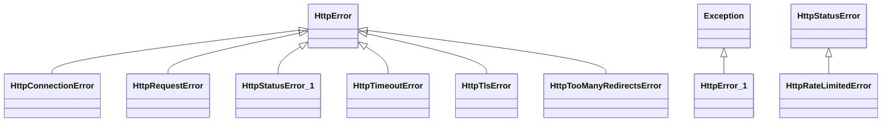

# kgfoundry_common.http.errors

HTTP client exception classes.

[View source on GitHub](https://github.com/paul-heyse/kgfoundry/blob/main/src/kgfoundry_common/http/errors.py)

## Hierarchy

- **Parent:** [kgfoundry_common.http](../http.md)

## Sections

- **Public API**

## Contents

### kgfoundry_common.http.errors.HttpConnectionError

::: kgfoundry_common.http.errors.HttpConnectionError

*Bases:* HttpError

### kgfoundry_common.http.errors.HttpError

::: kgfoundry_common.http.errors.HttpError

*Bases:* Exception

### kgfoundry_common.http.errors.HttpRateLimitedError

::: kgfoundry_common.http.errors.HttpRateLimitedError

*Bases:* HttpStatusError

### kgfoundry_common.http.errors.HttpRequestError

::: kgfoundry_common.http.errors.HttpRequestError

*Bases:* HttpError

### kgfoundry_common.http.errors.HttpStatusError

::: kgfoundry_common.http.errors.HttpStatusError

*Bases:* HttpError

### kgfoundry_common.http.errors.HttpTimeoutError

::: kgfoundry_common.http.errors.HttpTimeoutError

*Bases:* HttpError

### kgfoundry_common.http.errors.HttpTlsError

::: kgfoundry_common.http.errors.HttpTlsError

*Bases:* HttpError

### kgfoundry_common.http.errors.HttpTooManyRedirectsError

::: kgfoundry_common.http.errors.HttpTooManyRedirectsError

*Bases:* HttpError

## Relationships

**Imports:** `__future__.annotations`

## Autorefs Examples

- [kgfoundry_common.http.errors.HttpConnectionError][]
- [kgfoundry_common.http.errors.HttpError][]
- [kgfoundry_common.http.errors.HttpRateLimitedError][]

## Inheritance



## Neighborhood

```d2
direction: right
"kgfoundry_common.http.errors": "kgfoundry_common.http.errors" { link: "https://github.com/paul-heyse/kgfoundry/blob/main/src/kgfoundry_common/http/errors.py" }
"__future__.annotations": "__future__.annotations"
"kgfoundry_common.http.errors" -> "__future__.annotations"
"kgfoundry_common.http": "kgfoundry_common.http" { link: "https://github.com/paul-heyse/kgfoundry/blob/main/src/kgfoundry_common/http/__init__.py" }
"kgfoundry_common.http" -> "kgfoundry_common.http.errors" { style: dashed }
```

