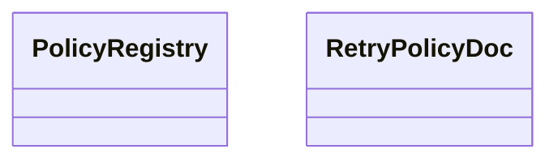

# kgfoundry_common.http.policy

[View source on GitHub](https://github.com/paul-heyse/kgfoundry/blob/main/src/kgfoundry_common/http/policy.py)

## Hierarchy

- **Parent:** [kgfoundry_common.http](../http.md)

## Sections

- **Public API**

## Contents

### kgfoundry_common.http.policy.PolicyRegistry

::: kgfoundry_common.http.policy.PolicyRegistry

### kgfoundry_common.http.policy.RetryPolicyDoc

::: kgfoundry_common.http.policy.RetryPolicyDoc

### kgfoundry_common.http.policy._parse_status_entry

::: kgfoundry_common.http.policy._parse_status_entry

### kgfoundry_common.http.policy.load_policy

::: kgfoundry_common.http.policy.load_policy

## Relationships

**Imports:** `__future__.annotations`, `dataclasses.dataclass`, `json`, `pathlib.Path`, `yaml`

## Autorefs Examples

- [kgfoundry_common.http.policy.PolicyRegistry][]
- [kgfoundry_common.http.policy.RetryPolicyDoc][]
- [kgfoundry_common.http.policy._parse_status_entry][]
- [kgfoundry_common.http.policy.load_policy][]

## Inheritance



## Neighborhood

```d2
direction: right
"kgfoundry_common.http.policy": "kgfoundry_common.http.policy" { link: "https://github.com/paul-heyse/kgfoundry/blob/main/src/kgfoundry_common/http/policy.py" }
"__future__.annotations": "__future__.annotations"
"kgfoundry_common.http.policy" -> "__future__.annotations"
"dataclasses.dataclass": "dataclasses.dataclass"
"kgfoundry_common.http.policy" -> "dataclasses.dataclass"
"json": "json"
"kgfoundry_common.http.policy" -> "json"
"pathlib.Path": "pathlib.Path"
"kgfoundry_common.http.policy" -> "pathlib.Path"
"yaml": "yaml"
"kgfoundry_common.http.policy" -> "yaml"
"kgfoundry_common.http": "kgfoundry_common.http" { link: "https://github.com/paul-heyse/kgfoundry/blob/main/src/kgfoundry_common/http/__init__.py" }
"kgfoundry_common.http" -> "kgfoundry_common.http.policy" { style: dashed }
```

