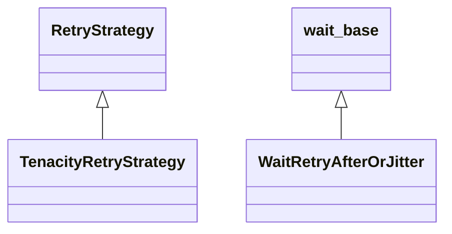

# kgfoundry_common.http.tenacity_retry

[View source on GitHub](https://github.com/paul-heyse/kgfoundry/blob/main/src/kgfoundry_common/http/tenacity_retry.py)

## Hierarchy

- **Parent:** [kgfoundry_common.http](../http.md)

## Sections

- **Public API**

## Contents

### kgfoundry_common.http.tenacity_retry.TenacityRetryStrategy

::: kgfoundry_common.http.tenacity_retry.TenacityRetryStrategy

*Bases:* RetryStrategy

### kgfoundry_common.http.tenacity_retry.WaitRetryAfterOrJitter

::: kgfoundry_common.http.tenacity_retry.WaitRetryAfterOrJitter

*Bases:* wait_base

### kgfoundry_common.http.tenacity_retry._parse_retry_after

::: kgfoundry_common.http.tenacity_retry._parse_retry_after

### kgfoundry_common.http.tenacity_retry._rand

::: kgfoundry_common.http.tenacity_retry._rand

### kgfoundry_common.http.tenacity_retry._should_retry_exception

::: kgfoundry_common.http.tenacity_retry._should_retry_exception

### kgfoundry_common.http.tenacity_retry._status_in_sets

::: kgfoundry_common.http.tenacity_retry._status_in_sets

## Relationships

**Imports:** `__future__.annotations`, `collections.abc.Callable`, `dataclasses.dataclass`, `kgfoundry_common.http.errors.HttpStatusError`, `kgfoundry_common.http.policy.RetryPolicyDoc`, `kgfoundry_common.http.types.RetryStrategy`, `tenacity.Retrying`, `tenacity.retry_if_exception`, `tenacity.stop_after_attempt`, `tenacity.stop_after_delay`, `tenacity.wait_base`

## Autorefs Examples

- [kgfoundry_common.http.tenacity_retry.TenacityRetryStrategy][]
- [kgfoundry_common.http.tenacity_retry.WaitRetryAfterOrJitter][]
- [kgfoundry_common.http.tenacity_retry._parse_retry_after][]
- [kgfoundry_common.http.tenacity_retry._rand][]
- [kgfoundry_common.http.tenacity_retry._should_retry_exception][]

## Inheritance



## Neighborhood

```d2
direction: right
"kgfoundry_common.http.tenacity_retry": "kgfoundry_common.http.tenacity_retry" { link: "https://github.com/paul-heyse/kgfoundry/blob/main/src/kgfoundry_common/http/tenacity_retry.py" }
"__future__.annotations": "__future__.annotations"
"kgfoundry_common.http.tenacity_retry" -> "__future__.annotations"
"collections.abc.Callable": "collections.abc.Callable"
"kgfoundry_common.http.tenacity_retry" -> "collections.abc.Callable"
"dataclasses.dataclass": "dataclasses.dataclass"
"kgfoundry_common.http.tenacity_retry" -> "dataclasses.dataclass"
"kgfoundry_common.http.errors.HttpStatusError": "kgfoundry_common.http.errors.HttpStatusError"
"kgfoundry_common.http.tenacity_retry" -> "kgfoundry_common.http.errors.HttpStatusError"
"kgfoundry_common.http.policy.RetryPolicyDoc": "kgfoundry_common.http.policy.RetryPolicyDoc"
"kgfoundry_common.http.tenacity_retry" -> "kgfoundry_common.http.policy.RetryPolicyDoc"
"kgfoundry_common.http.types.RetryStrategy": "kgfoundry_common.http.types.RetryStrategy"
"kgfoundry_common.http.tenacity_retry" -> "kgfoundry_common.http.types.RetryStrategy"
"tenacity.Retrying": "tenacity.Retrying"
"kgfoundry_common.http.tenacity_retry" -> "tenacity.Retrying"
"tenacity.retry_if_exception": "tenacity.retry_if_exception"
"kgfoundry_common.http.tenacity_retry" -> "tenacity.retry_if_exception"
"tenacity.stop_after_attempt": "tenacity.stop_after_attempt"
"kgfoundry_common.http.tenacity_retry" -> "tenacity.stop_after_attempt"
"tenacity.stop_after_delay": "tenacity.stop_after_delay"
"kgfoundry_common.http.tenacity_retry" -> "tenacity.stop_after_delay"
"tenacity.wait_base": "tenacity.wait_base"
"kgfoundry_common.http.tenacity_retry" -> "tenacity.wait_base"
"kgfoundry_common.http": "kgfoundry_common.http" { link: "https://github.com/paul-heyse/kgfoundry/blob/main/src/kgfoundry_common/http/__init__.py" }
"kgfoundry_common.http" -> "kgfoundry_common.http.tenacity_retry" { style: dashed }
```

