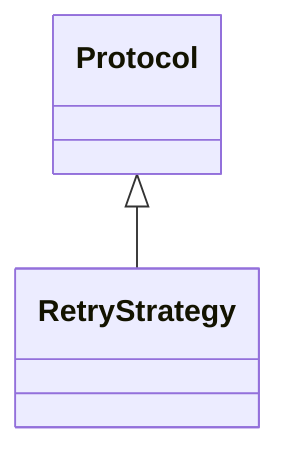

# kgfoundry_common.http.try

[View source on GitHub](https://github.com/paul-heyse/kgfoundry/blob/main/src/kgfoundry_common/http/try.py)

## Hierarchy

- **Parent:** [kgfoundry_common.http](../http.md)

## Sections

- **Public API**

## Contents

### kgfoundry_common.http.try.RetryStrategy

::: kgfoundry_common.http.try.RetryStrategy

*Bases:* Protocol

## Relationships

**Imports:** `collections.abc.Callable`, `typing.Protocol`, `typing.TypeVar`

## Autorefs Examples

- [kgfoundry_common.http.try.RetryStrategy][]

## Inheritance



## Neighborhood

```d2
direction: right
"kgfoundry_common.http.try": "kgfoundry_common.http.try" { link: "https://github.com/paul-heyse/kgfoundry/blob/main/src/kgfoundry_common/http/try.py" }
"collections.abc.Callable": "collections.abc.Callable"
"kgfoundry_common.http.try" -> "collections.abc.Callable"
"typing.Protocol": "typing.Protocol"
"kgfoundry_common.http.try" -> "typing.Protocol"
"typing.TypeVar": "typing.TypeVar"
"kgfoundry_common.http.try" -> "typing.TypeVar"
"kgfoundry_common.http": "kgfoundry_common.http" { link: "https://github.com/paul-heyse/kgfoundry/blob/main/src/kgfoundry_common/http/__init__.py" }
"kgfoundry_common.http" -> "kgfoundry_common.http.try" { style: dashed }
```

