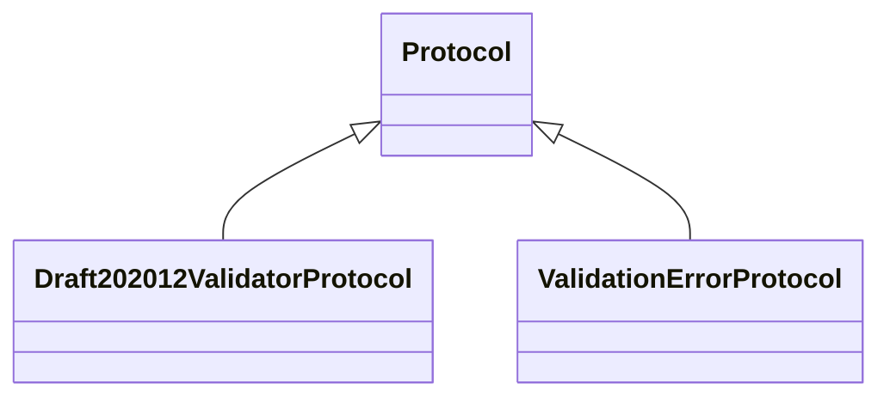

# kgfoundry_common.jsonschema_utils

Typed facades for jsonschema usage across the codebase.

[View source on GitHub](https://github.com/kgfoundry/kgfoundry/blob/main/src/kgfoundry_common/jsonschema_utils.py)

## Sections

- **Public API**

## Contents

### kgfoundry_common.jsonschema_utils.Draft202012ValidatorProtocol

::: kgfoundry_common.jsonschema_utils.Draft202012ValidatorProtocol

*Bases:* Protocol

### kgfoundry_common.jsonschema_utils.ValidationErrorProtocol

::: kgfoundry_common.jsonschema_utils.ValidationErrorProtocol

*Bases:* Protocol

### kgfoundry_common.jsonschema_utils.create_draft202012_validator

::: kgfoundry_common.jsonschema_utils.create_draft202012_validator

### kgfoundry_common.jsonschema_utils.validate

::: kgfoundry_common.jsonschema_utils.validate

## Relationships

**Imports:** `__future__.annotations`, `collections.abc.Iterable`, `collections.abc.Mapping`, `collections.abc.Sequence`, `jsonschema.exceptions.SchemaError`, `jsonschema.exceptions.ValidationError`, `jsonschema.validate`, `jsonschema.validators.Draft202012Validator`, `kgfoundry_common.navmap_loader.load_nav_metadata`, `typing.Protocol`, `typing.TYPE_CHECKING`, `typing.cast`

## Autorefs Examples

- [kgfoundry_common.jsonschema_utils.Draft202012ValidatorProtocol][]
- [kgfoundry_common.jsonschema_utils.ValidationErrorProtocol][]
- [kgfoundry_common.jsonschema_utils.create_draft202012_validator][]
- [kgfoundry_common.jsonschema_utils.validate][]

## Inheritance



## Neighborhood

```d2
direction: right
"kgfoundry_common.jsonschema_utils": "kgfoundry_common.jsonschema_utils" { link: "./kgfoundry_common/jsonschema_utils.md" }
"__future__.annotations": "__future__.annotations"
"kgfoundry_common.jsonschema_utils" -> "__future__.annotations"
"collections.abc.Iterable": "collections.abc.Iterable"
"kgfoundry_common.jsonschema_utils" -> "collections.abc.Iterable"
"collections.abc.Mapping": "collections.abc.Mapping"
"kgfoundry_common.jsonschema_utils" -> "collections.abc.Mapping"
"collections.abc.Sequence": "collections.abc.Sequence"
"kgfoundry_common.jsonschema_utils" -> "collections.abc.Sequence"
"jsonschema.exceptions.SchemaError": "jsonschema.exceptions.SchemaError"
"kgfoundry_common.jsonschema_utils" -> "jsonschema.exceptions.SchemaError"
"jsonschema.exceptions.ValidationError": "jsonschema.exceptions.ValidationError"
"kgfoundry_common.jsonschema_utils" -> "jsonschema.exceptions.ValidationError"
"jsonschema.validate": "jsonschema.validate"
"kgfoundry_common.jsonschema_utils" -> "jsonschema.validate"
"jsonschema.validators.Draft202012Validator": "jsonschema.validators.Draft202012Validator"
"kgfoundry_common.jsonschema_utils" -> "jsonschema.validators.Draft202012Validator"
"kgfoundry_common.navmap_loader.load_nav_metadata": "kgfoundry_common.navmap_loader.load_nav_metadata"
"kgfoundry_common.jsonschema_utils" -> "kgfoundry_common.navmap_loader.load_nav_metadata"
"typing.Protocol": "typing.Protocol"
"kgfoundry_common.jsonschema_utils" -> "typing.Protocol"
"typing.TYPE_CHECKING": "typing.TYPE_CHECKING"
"kgfoundry_common.jsonschema_utils" -> "typing.TYPE_CHECKING"
"typing.cast": "typing.cast"
"kgfoundry_common.jsonschema_utils" -> "typing.cast"
"kgfoundry_common.jsonschema_utils_code": "kgfoundry_common.jsonschema_utils code" { link: "https://github.com/kgfoundry/kgfoundry/blob/main/src/kgfoundry_common/jsonschema_utils.py" }
"kgfoundry_common.jsonschema_utils" -> "kgfoundry_common.jsonschema_utils_code" { style: dashed }
```

