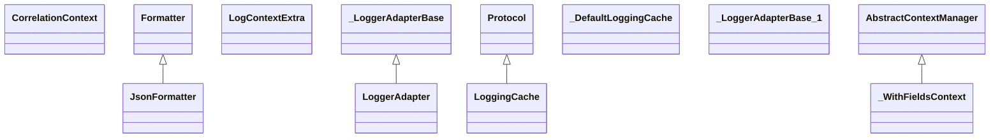

# kgfoundry_common.logging

Structured logging helpers with correlation IDs and observability

[View source on GitHub](https://github.com/paul-heyse/kgfoundry/blob/main/src/kgfoundry_common/logging.py)

## Hierarchy

- **Parent:** [kgfoundry_common](../kgfoundry_common.md)

## Sections

- **Public API**

## Contents

### kgfoundry_common.logging.CorrelationContext

::: kgfoundry_common.logging.CorrelationContext

### kgfoundry_common.logging.JsonFormatter

::: kgfoundry_common.logging.JsonFormatter

*Bases:* logging.Formatter

### kgfoundry_common.logging.LogContextExtra

::: kgfoundry_common.logging.LogContextExtra

### kgfoundry_common.logging.LoggerAdapter

::: kgfoundry_common.logging.LoggerAdapter

*Bases:* _LoggerAdapterBase

### kgfoundry_common.logging.LoggingCache

::: kgfoundry_common.logging.LoggingCache

*Bases:* Protocol

### kgfoundry_common.logging._DefaultLoggingCache

::: kgfoundry_common.logging._DefaultLoggingCache

### kgfoundry_common.logging._LoggerAdapterBase

::: kgfoundry_common.logging._LoggerAdapterBase

### kgfoundry_common.logging._WithFieldsContext

::: kgfoundry_common.logging._WithFieldsContext

*Bases:* AbstractContextManager

### kgfoundry_common.logging.get_correlation_id

::: kgfoundry_common.logging.get_correlation_id

### kgfoundry_common.logging.get_logger

::: kgfoundry_common.logging.get_logger

### kgfoundry_common.logging.get_logging_cache

::: kgfoundry_common.logging.get_logging_cache

### kgfoundry_common.logging.measure_duration

::: kgfoundry_common.logging.measure_duration

### kgfoundry_common.logging.set_correlation_id

::: kgfoundry_common.logging.set_correlation_id

### kgfoundry_common.logging.setup_logging

::: kgfoundry_common.logging.setup_logging

### kgfoundry_common.logging.with_fields

::: kgfoundry_common.logging.with_fields

## Relationships

**Imports:** `__future__.annotations`, `collections.abc.Mapping`, `contextlib.AbstractContextManager`, `contextvars`, `dataclasses.dataclass`, `dataclasses.replace`, `json`, `kgfoundry_common.navmap_loader.load_nav_metadata`, `kgfoundry_common.types.JsonValue`, `logging`, `sys`, `time`, `types.TracebackType`, `typing.Any`, `typing.Protocol`, `typing.Self`, `typing.TYPE_CHECKING`, `typing.cast`, `typing.runtime_checkable`

## Autorefs Examples

- [kgfoundry_common.logging.CorrelationContext][]
- [kgfoundry_common.logging.JsonFormatter][]
- [kgfoundry_common.logging.LogContextExtra][]
- [kgfoundry_common.logging.get_correlation_id][]
- [kgfoundry_common.logging.get_logger][]
- [kgfoundry_common.logging.get_logging_cache][]

## Inheritance



## Neighborhood

```d2
direction: right
"kgfoundry_common.logging": "kgfoundry_common.logging" { link: "https://github.com/paul-heyse/kgfoundry/blob/main/src/kgfoundry_common/logging.py" }
"__future__.annotations": "__future__.annotations"
"kgfoundry_common.logging" -> "__future__.annotations"
"collections.abc.Mapping": "collections.abc.Mapping"
"kgfoundry_common.logging" -> "collections.abc.Mapping"
"contextlib.AbstractContextManager": "contextlib.AbstractContextManager"
"kgfoundry_common.logging" -> "contextlib.AbstractContextManager"
"contextvars": "contextvars"
"kgfoundry_common.logging" -> "contextvars"
"dataclasses.dataclass": "dataclasses.dataclass"
"kgfoundry_common.logging" -> "dataclasses.dataclass"
"dataclasses.replace": "dataclasses.replace"
"kgfoundry_common.logging" -> "dataclasses.replace"
"json": "json"
"kgfoundry_common.logging" -> "json"
"kgfoundry_common.navmap_loader.load_nav_metadata": "kgfoundry_common.navmap_loader.load_nav_metadata"
"kgfoundry_common.logging" -> "kgfoundry_common.navmap_loader.load_nav_metadata"
"kgfoundry_common.types.JsonValue": "kgfoundry_common.types.JsonValue"
"kgfoundry_common.logging" -> "kgfoundry_common.types.JsonValue"
"logging": "logging"
"kgfoundry_common.logging" -> "logging"
"sys": "sys"
"kgfoundry_common.logging" -> "sys"
"time": "time"
"kgfoundry_common.logging" -> "time"
"types.TracebackType": "types.TracebackType"
"kgfoundry_common.logging" -> "types.TracebackType"
"typing.Any": "typing.Any"
"kgfoundry_common.logging" -> "typing.Any"
"typing.Protocol": "typing.Protocol"
"kgfoundry_common.logging" -> "typing.Protocol"
"typing.Self": "typing.Self"
"kgfoundry_common.logging" -> "typing.Self"
"typing.TYPE_CHECKING": "typing.TYPE_CHECKING"
"kgfoundry_common.logging" -> "typing.TYPE_CHECKING"
"typing.cast": "typing.cast"
"kgfoundry_common.logging" -> "typing.cast"
"typing.runtime_checkable": "typing.runtime_checkable"
"kgfoundry_common.logging" -> "typing.runtime_checkable"
"kgfoundry_common": "kgfoundry_common" { link: "https://github.com/paul-heyse/kgfoundry/blob/main/src/kgfoundry_common/__init__.py" }
"kgfoundry_common" -> "kgfoundry_common.logging" { style: dashed }
```

