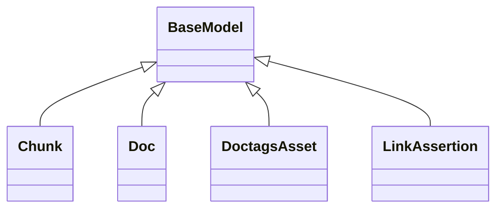

# kgfoundry_common.models

Typed models shared across kgfoundry services

[View source on GitHub](https://github.com/paul-heyse/kgfoundry/blob/main/src/kgfoundry_common/models.py)

## Hierarchy

- **Parent:** [kgfoundry_common](../kgfoundry_common.md)

## Sections

- **Public API**

## Contents

### kgfoundry_common.models.Chunk

::: kgfoundry_common.models.Chunk

*Bases:* BaseModel

### kgfoundry_common.models.Doc

::: kgfoundry_common.models.Doc

*Bases:* BaseModel

### kgfoundry_common.models.DoctagsAsset

::: kgfoundry_common.models.DoctagsAsset

*Bases:* BaseModel

### kgfoundry_common.models.LinkAssertion

::: kgfoundry_common.models.LinkAssertion

*Bases:* BaseModel

## Relationships

**Imports:** `__future__.annotations`, `kgfoundry_common.navmap_loader.load_nav_metadata`, `kgfoundry_common.pydantic.BaseModel`, `kgfoundry_common.typing.gate_import`, `pydantic.ConfigDict`, `pydantic.Field`, `typing.ClassVar`, `typing.Literal`, `typing.TYPE_CHECKING`

## Autorefs Examples

- [kgfoundry_common.models.Chunk][]
- [kgfoundry_common.models.Doc][]
- [kgfoundry_common.models.DoctagsAsset][]

## Inheritance



## Neighborhood

```d2
direction: right
"kgfoundry_common.models": "kgfoundry_common.models" { link: "https://github.com/paul-heyse/kgfoundry/blob/main/src/kgfoundry_common/models.py" }
"__future__.annotations": "__future__.annotations"
"kgfoundry_common.models" -> "__future__.annotations"
"kgfoundry_common.navmap_loader.load_nav_metadata": "kgfoundry_common.navmap_loader.load_nav_metadata"
"kgfoundry_common.models" -> "kgfoundry_common.navmap_loader.load_nav_metadata"
"kgfoundry_common.pydantic.BaseModel": "kgfoundry_common.pydantic.BaseModel"
"kgfoundry_common.models" -> "kgfoundry_common.pydantic.BaseModel"
"kgfoundry_common.typing.gate_import": "kgfoundry_common.typing.gate_import"
"kgfoundry_common.models" -> "kgfoundry_common.typing.gate_import"
"pydantic.ConfigDict": "pydantic.ConfigDict"
"kgfoundry_common.models" -> "pydantic.ConfigDict"
"pydantic.Field": "pydantic.Field"
"kgfoundry_common.models" -> "pydantic.Field"
"typing.ClassVar": "typing.ClassVar"
"kgfoundry_common.models" -> "typing.ClassVar"
"typing.Literal": "typing.Literal"
"kgfoundry_common.models" -> "typing.Literal"
"typing.TYPE_CHECKING": "typing.TYPE_CHECKING"
"kgfoundry_common.models" -> "typing.TYPE_CHECKING"
"kgfoundry_common": "kgfoundry_common" { link: "https://github.com/paul-heyse/kgfoundry/blob/main/src/kgfoundry_common/__init__.py" }
"kgfoundry_common" -> "kgfoundry_common.models" { style: dashed }
```

