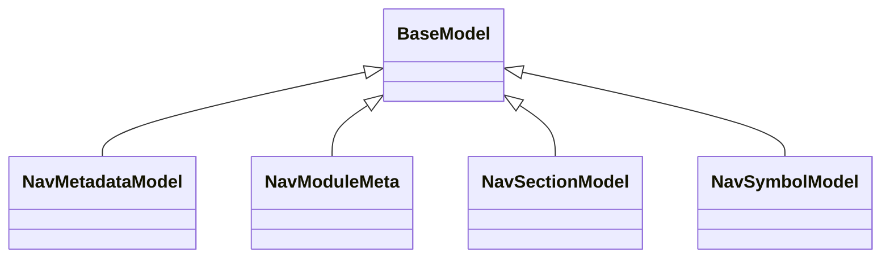

# kgfoundry_common.navmap_loader

Shared utilities and data structures used across KgFoundry services and tools.

[View source on GitHub](https://github.com/paul-heyse/kgfoundry/blob/main/src/kgfoundry_common/navmap_loader.py)

## Hierarchy

- **Parent:** [kgfoundry_common](../kgfoundry_common.md)

## Sections

- **Public API**

## Contents

### kgfoundry_common.navmap_loader.NavMetadataModel

::: kgfoundry_common.navmap_loader.NavMetadataModel

*Bases:* BaseModel

### kgfoundry_common.navmap_loader.NavModuleMeta

::: kgfoundry_common.navmap_loader.NavModuleMeta

*Bases:* BaseModel

### kgfoundry_common.navmap_loader.NavSectionModel

::: kgfoundry_common.navmap_loader.NavSectionModel

*Bases:* BaseModel

### kgfoundry_common.navmap_loader.NavSymbolModel

::: kgfoundry_common.navmap_loader.NavSymbolModel

*Bases:* BaseModel

### kgfoundry_common.navmap_loader._augment_operation_candidates

::: kgfoundry_common.navmap_loader._augment_operation_candidates

### kgfoundry_common.navmap_loader._build_symbol_metadata

::: kgfoundry_common.navmap_loader._build_symbol_metadata

### kgfoundry_common.navmap_loader._cached_cli_tooling_metadata

::: kgfoundry_common.navmap_loader._cached_cli_tooling_metadata

### kgfoundry_common.navmap_loader._candidate_modules

::: kgfoundry_common.navmap_loader._candidate_modules

### kgfoundry_common.navmap_loader._candidate_sidecars

::: kgfoundry_common.navmap_loader._candidate_sidecars

### kgfoundry_common.navmap_loader._cli_module_meta

::: kgfoundry_common.navmap_loader._cli_module_meta

### kgfoundry_common.navmap_loader._cli_nav_metadata

::: kgfoundry_common.navmap_loader._cli_nav_metadata

### kgfoundry_common.navmap_loader._default_nav_payload

::: kgfoundry_common.navmap_loader._default_nav_payload

### kgfoundry_common.navmap_loader._first_non_empty

::: kgfoundry_common.navmap_loader._first_non_empty

### kgfoundry_common.navmap_loader._first_non_empty_sequence

::: kgfoundry_common.navmap_loader._first_non_empty_sequence

### kgfoundry_common.navmap_loader._load_cli_tooling_metadata

::: kgfoundry_common.navmap_loader._load_cli_tooling_metadata

### kgfoundry_common.navmap_loader._load_runtime_nav

::: kgfoundry_common.navmap_loader._load_runtime_nav

### kgfoundry_common.navmap_loader._load_sidecar_data

::: kgfoundry_common.navmap_loader._load_sidecar_data

### kgfoundry_common.navmap_loader._operation_overrides_for_interface

::: kgfoundry_common.navmap_loader._operation_overrides_for_interface

### kgfoundry_common.navmap_loader._registry_operation_candidates

::: kgfoundry_common.navmap_loader._registry_operation_candidates

### kgfoundry_common.navmap_loader._registry_operations_for_interface

::: kgfoundry_common.navmap_loader._registry_operations_for_interface

### kgfoundry_common.navmap_loader._resolve_interface_for_package

::: kgfoundry_common.navmap_loader._resolve_interface_for_package

### kgfoundry_common.navmap_loader._section_symbols

::: kgfoundry_common.navmap_loader._section_symbols

### kgfoundry_common.navmap_loader._sections_from_cli

::: kgfoundry_common.navmap_loader._sections_from_cli

### kgfoundry_common.navmap_loader._sidecar_nav_metadata

::: kgfoundry_common.navmap_loader._sidecar_nav_metadata

### kgfoundry_common.navmap_loader._slugify

::: kgfoundry_common.navmap_loader._slugify

### kgfoundry_common.navmap_loader._symbols_from_cli

::: kgfoundry_common.navmap_loader._symbols_from_cli

### kgfoundry_common.navmap_loader._to_nav_metadata

::: kgfoundry_common.navmap_loader._to_nav_metadata

### kgfoundry_common.navmap_loader.clear_navmap_caches

::: kgfoundry_common.navmap_loader.clear_navmap_caches

### kgfoundry_common.navmap_loader.load_nav_metadata

::: kgfoundry_common.navmap_loader.load_nav_metadata

## Relationships

**Imports:** `__future__.annotations`, `collections.abc.Callable`, `collections.abc.Mapping`, `collections.abc.Sequence`, `contextlib.suppress`, `copy`, `functools.cache`, `importlib`, `importlib.import_module`, `json`, `pathlib.Path`, `pydantic.BaseModel`, `pydantic.ConfigDict`, `pydantic.Field`, `pydantic.main.TupleGenerator`, `pydantic.model_validator`, `sys`, `tools.AugmentMetadataModel`, `tools.OperationOverrideModel`, `tools.RegistryInterfaceModel`, `tools.RegistryOperationModel`, `tools.ToolingMetadataModel`, `typing.Any`, `typing.TYPE_CHECKING`, `typing.cast`

## Autorefs Examples

- [kgfoundry_common.navmap_loader.NavMetadataModel][]
- [kgfoundry_common.navmap_loader.NavModuleMeta][]
- [kgfoundry_common.navmap_loader.NavSectionModel][]
- [kgfoundry_common.navmap_loader._augment_operation_candidates][]
- [kgfoundry_common.navmap_loader._build_symbol_metadata][]
- [kgfoundry_common.navmap_loader._cached_cli_tooling_metadata][]

## Inheritance



## Neighborhood

```d2
direction: right
"kgfoundry_common.navmap_loader": "kgfoundry_common.navmap_loader" { link: "https://github.com/paul-heyse/kgfoundry/blob/main/src/kgfoundry_common/navmap_loader.py" }
"__future__.annotations": "__future__.annotations"
"kgfoundry_common.navmap_loader" -> "__future__.annotations"
"collections.abc.Callable": "collections.abc.Callable"
"kgfoundry_common.navmap_loader" -> "collections.abc.Callable"
"collections.abc.Mapping": "collections.abc.Mapping"
"kgfoundry_common.navmap_loader" -> "collections.abc.Mapping"
"collections.abc.Sequence": "collections.abc.Sequence"
"kgfoundry_common.navmap_loader" -> "collections.abc.Sequence"
"contextlib.suppress": "contextlib.suppress"
"kgfoundry_common.navmap_loader" -> "contextlib.suppress"
"copy": "copy"
"kgfoundry_common.navmap_loader" -> "copy"
"functools.cache": "functools.cache"
"kgfoundry_common.navmap_loader" -> "functools.cache"
"importlib": "importlib"
"kgfoundry_common.navmap_loader" -> "importlib"
"importlib.import_module": "importlib.import_module"
"kgfoundry_common.navmap_loader" -> "importlib.import_module"
"json": "json"
"kgfoundry_common.navmap_loader" -> "json"
"pathlib.Path": "pathlib.Path"
"kgfoundry_common.navmap_loader" -> "pathlib.Path"
"pydantic.BaseModel": "pydantic.BaseModel"
"kgfoundry_common.navmap_loader" -> "pydantic.BaseModel"
"pydantic.ConfigDict": "pydantic.ConfigDict"
"kgfoundry_common.navmap_loader" -> "pydantic.ConfigDict"
"pydantic.Field": "pydantic.Field"
"kgfoundry_common.navmap_loader" -> "pydantic.Field"
"pydantic.main.TupleGenerator": "pydantic.main.TupleGenerator"
"kgfoundry_common.navmap_loader" -> "pydantic.main.TupleGenerator"
"pydantic.model_validator": "pydantic.model_validator"
"kgfoundry_common.navmap_loader" -> "pydantic.model_validator"
"sys": "sys"
"kgfoundry_common.navmap_loader" -> "sys"
"tools.AugmentMetadataModel": "tools.AugmentMetadataModel"
"kgfoundry_common.navmap_loader" -> "tools.AugmentMetadataModel"
"tools.OperationOverrideModel": "tools.OperationOverrideModel"
"kgfoundry_common.navmap_loader" -> "tools.OperationOverrideModel"
"tools.RegistryInterfaceModel": "tools.RegistryInterfaceModel"
"kgfoundry_common.navmap_loader" -> "tools.RegistryInterfaceModel"
"tools.RegistryOperationModel": "tools.RegistryOperationModel"
"kgfoundry_common.navmap_loader" -> "tools.RegistryOperationModel"
"tools.ToolingMetadataModel": "tools.ToolingMetadataModel"
"kgfoundry_common.navmap_loader" -> "tools.ToolingMetadataModel"
"typing.Any": "typing.Any"
"kgfoundry_common.navmap_loader" -> "typing.Any"
"typing.TYPE_CHECKING": "typing.TYPE_CHECKING"
"kgfoundry_common.navmap_loader" -> "typing.TYPE_CHECKING"
"typing.cast": "typing.cast"
"kgfoundry_common.navmap_loader" -> "typing.cast"
"kgfoundry_common": "kgfoundry_common" { link: "https://github.com/paul-heyse/kgfoundry/blob/main/src/kgfoundry_common/__init__.py" }
"kgfoundry_common" -> "kgfoundry_common.navmap_loader" { style: dashed }
```

