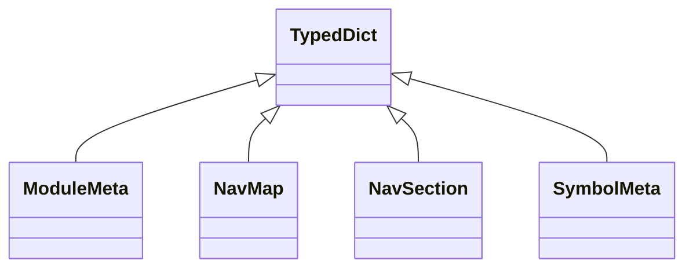

# kgfoundry_common.navmap_types

Shared navigation metadata structures used across kgfoundry.

[View source on GitHub](https://github.com/paul-heyse/kgfoundry/blob/main/src/kgfoundry_common/navmap_types.py)

## Hierarchy

- **Parent:** [kgfoundry_common](../kgfoundry_common.md)

## Sections

- **Public API**

## Contents

### kgfoundry_common.navmap_types.ModuleMeta

::: kgfoundry_common.navmap_types.ModuleMeta

*Bases:* TypedDict

### kgfoundry_common.navmap_types.NavMap

::: kgfoundry_common.navmap_types.NavMap

*Bases:* TypedDict

### kgfoundry_common.navmap_types.NavSection

::: kgfoundry_common.navmap_types.NavSection

*Bases:* TypedDict

### kgfoundry_common.navmap_types.SymbolMeta

::: kgfoundry_common.navmap_types.SymbolMeta

*Bases:* TypedDict

## Relationships

**Imports:** `__future__.annotations`, `kgfoundry_common.navmap_loader.load_nav_metadata`, `typing.Literal`, `typing.NotRequired`, `typing.TypedDict`

## Autorefs Examples

- [kgfoundry_common.navmap_types.ModuleMeta][]
- [kgfoundry_common.navmap_types.NavMap][]
- [kgfoundry_common.navmap_types.NavSection][]

## Inheritance



## Neighborhood

```d2
direction: right
"kgfoundry_common.navmap_types": "kgfoundry_common.navmap_types" { link: "https://github.com/paul-heyse/kgfoundry/blob/main/src/kgfoundry_common/navmap_types.py" }
"__future__.annotations": "__future__.annotations"
"kgfoundry_common.navmap_types" -> "__future__.annotations"
"kgfoundry_common.navmap_loader.load_nav_metadata": "kgfoundry_common.navmap_loader.load_nav_metadata"
"kgfoundry_common.navmap_types" -> "kgfoundry_common.navmap_loader.load_nav_metadata"
"typing.Literal": "typing.Literal"
"kgfoundry_common.navmap_types" -> "typing.Literal"
"typing.NotRequired": "typing.NotRequired"
"kgfoundry_common.navmap_types" -> "typing.NotRequired"
"typing.TypedDict": "typing.TypedDict"
"kgfoundry_common.navmap_types" -> "typing.TypedDict"
"kgfoundry_common": "kgfoundry_common" { link: "https://github.com/paul-heyse/kgfoundry/blob/main/src/kgfoundry_common/__init__.py" }
"kgfoundry_common" -> "kgfoundry_common.navmap_types" { style: dashed }
```

