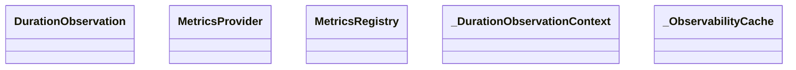

# kgfoundry_common.observability

Prometheus metrics and OpenTelemetry tracing helpers

[View source on GitHub](https://github.com/paul-heyse/kgfoundry/blob/main/src/kgfoundry_common/observability.py)

## Hierarchy

- **Parent:** [kgfoundry_common](../kgfoundry_common.md)

## Sections

- **Public API**

## Contents

### kgfoundry_common.observability.DurationObservation

::: kgfoundry_common.observability.DurationObservation

### kgfoundry_common.observability.MetricsProvider

::: kgfoundry_common.observability.MetricsProvider

### kgfoundry_common.observability.MetricsRegistry

::: kgfoundry_common.observability.MetricsRegistry

### kgfoundry_common.observability._DurationObservationContext

::: kgfoundry_common.observability._DurationObservationContext

### kgfoundry_common.observability._ObservabilityCache

::: kgfoundry_common.observability._ObservabilityCache

### kgfoundry_common.observability._finalise_observation

::: kgfoundry_common.observability._finalise_observation

### kgfoundry_common.observability.get_metrics_registry

::: kgfoundry_common.observability.get_metrics_registry

### kgfoundry_common.observability.observe_duration

::: kgfoundry_common.observability.observe_duration

### kgfoundry_common.observability.record_operation

::: kgfoundry_common.observability.record_operation

### kgfoundry_common.observability.start_span

::: kgfoundry_common.observability.start_span

## Relationships

**Imports:** `__future__.annotations`, `collections.abc.Iterator`, `collections.abc.Mapping`, `contextlib.contextmanager`, `dataclasses.dataclass`, `dataclasses.field`, `kgfoundry_common.logging.get_logger`, `kgfoundry_common.logging.with_fields`, `kgfoundry_common.navmap_loader.load_nav_metadata`, `kgfoundry_common.opentelemetry_types.StatusCodeProtocol`, `kgfoundry_common.opentelemetry_types.TraceRuntime`, `kgfoundry_common.opentelemetry_types.load_trace_runtime`, `kgfoundry_common.prometheus.CollectorRegistry`, `kgfoundry_common.prometheus.CounterLike`, `kgfoundry_common.prometheus.HistogramLike`, `kgfoundry_common.prometheus.build_counter`, `kgfoundry_common.prometheus.build_histogram`, `kgfoundry_common.prometheus.get_default_registry`, `time`, `types`, `typing.Literal`, `typing.TYPE_CHECKING`, `typing.cast`

## Autorefs Examples

- [kgfoundry_common.observability.DurationObservation][]
- [kgfoundry_common.observability.MetricsProvider][]
- [kgfoundry_common.observability.MetricsRegistry][]
- [kgfoundry_common.observability._finalise_observation][]
- [kgfoundry_common.observability.get_metrics_registry][]
- [kgfoundry_common.observability.observe_duration][]

## Inheritance



## Neighborhood

```d2
direction: right
"kgfoundry_common.observability": "kgfoundry_common.observability" { link: "https://github.com/paul-heyse/kgfoundry/blob/main/src/kgfoundry_common/observability.py" }
"__future__.annotations": "__future__.annotations"
"kgfoundry_common.observability" -> "__future__.annotations"
"collections.abc.Iterator": "collections.abc.Iterator"
"kgfoundry_common.observability" -> "collections.abc.Iterator"
"collections.abc.Mapping": "collections.abc.Mapping"
"kgfoundry_common.observability" -> "collections.abc.Mapping"
"contextlib.contextmanager": "contextlib.contextmanager"
"kgfoundry_common.observability" -> "contextlib.contextmanager"
"dataclasses.dataclass": "dataclasses.dataclass"
"kgfoundry_common.observability" -> "dataclasses.dataclass"
"dataclasses.field": "dataclasses.field"
"kgfoundry_common.observability" -> "dataclasses.field"
"kgfoundry_common.logging.get_logger": "kgfoundry_common.logging.get_logger"
"kgfoundry_common.observability" -> "kgfoundry_common.logging.get_logger"
"kgfoundry_common.logging.with_fields": "kgfoundry_common.logging.with_fields"
"kgfoundry_common.observability" -> "kgfoundry_common.logging.with_fields"
"kgfoundry_common.navmap_loader.load_nav_metadata": "kgfoundry_common.navmap_loader.load_nav_metadata"
"kgfoundry_common.observability" -> "kgfoundry_common.navmap_loader.load_nav_metadata"
"kgfoundry_common.opentelemetry_types.StatusCodeProtocol": "kgfoundry_common.opentelemetry_types.StatusCodeProtocol"
"kgfoundry_common.observability" -> "kgfoundry_common.opentelemetry_types.StatusCodeProtocol"
"kgfoundry_common.opentelemetry_types.TraceRuntime": "kgfoundry_common.opentelemetry_types.TraceRuntime"
"kgfoundry_common.observability" -> "kgfoundry_common.opentelemetry_types.TraceRuntime"
"kgfoundry_common.opentelemetry_types.load_trace_runtime": "kgfoundry_common.opentelemetry_types.load_trace_runtime"
"kgfoundry_common.observability" -> "kgfoundry_common.opentelemetry_types.load_trace_runtime"
"kgfoundry_common.prometheus.CollectorRegistry": "kgfoundry_common.prometheus.CollectorRegistry"
"kgfoundry_common.observability" -> "kgfoundry_common.prometheus.CollectorRegistry"
"kgfoundry_common.prometheus.CounterLike": "kgfoundry_common.prometheus.CounterLike"
"kgfoundry_common.observability" -> "kgfoundry_common.prometheus.CounterLike"
"kgfoundry_common.prometheus.HistogramLike": "kgfoundry_common.prometheus.HistogramLike"
"kgfoundry_common.observability" -> "kgfoundry_common.prometheus.HistogramLike"
"kgfoundry_common.prometheus.build_counter": "kgfoundry_common.prometheus.build_counter"
"kgfoundry_common.observability" -> "kgfoundry_common.prometheus.build_counter"
"kgfoundry_common.prometheus.build_histogram": "kgfoundry_common.prometheus.build_histogram"
"kgfoundry_common.observability" -> "kgfoundry_common.prometheus.build_histogram"
"kgfoundry_common.prometheus.get_default_registry": "kgfoundry_common.prometheus.get_default_registry"
"kgfoundry_common.observability" -> "kgfoundry_common.prometheus.get_default_registry"
"time": "time"
"kgfoundry_common.observability" -> "time"
"types": "types"
"kgfoundry_common.observability" -> "types"
"typing.Literal": "typing.Literal"
"kgfoundry_common.observability" -> "typing.Literal"
"typing.TYPE_CHECKING": "typing.TYPE_CHECKING"
"kgfoundry_common.observability" -> "typing.TYPE_CHECKING"
"typing.cast": "typing.cast"
"kgfoundry_common.observability" -> "typing.cast"
"kgfoundry_common": "kgfoundry_common" { link: "https://github.com/paul-heyse/kgfoundry/blob/main/src/kgfoundry_common/__init__.py" }
"kgfoundry_common" -> "kgfoundry_common.observability" { style: dashed }
```

