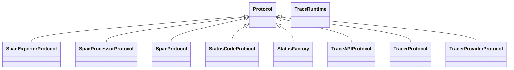

# kgfoundry_common.opentelemetry_types

Shared utilities and data structures used across KgFoundry services and tools.

## Sections

- **Public API**

## Contents

### kgfoundry_common.opentelemetry_types.SpanExporterProtocol

::: kgfoundry_common.opentelemetry_types.SpanExporterProtocol

*Bases:* Protocol

### kgfoundry_common.opentelemetry_types.SpanProcessorProtocol

::: kgfoundry_common.opentelemetry_types.SpanProcessorProtocol

*Bases:* Protocol

### kgfoundry_common.opentelemetry_types.SpanProtocol

::: kgfoundry_common.opentelemetry_types.SpanProtocol

*Bases:* Protocol

### kgfoundry_common.opentelemetry_types.StatusCodeProtocol

::: kgfoundry_common.opentelemetry_types.StatusCodeProtocol

*Bases:* Protocol

### kgfoundry_common.opentelemetry_types.StatusFactory

::: kgfoundry_common.opentelemetry_types.StatusFactory

*Bases:* Protocol

### kgfoundry_common.opentelemetry_types.TraceAPIProtocol

::: kgfoundry_common.opentelemetry_types.TraceAPIProtocol

*Bases:* Protocol

### kgfoundry_common.opentelemetry_types.TraceRuntime

::: kgfoundry_common.opentelemetry_types.TraceRuntime

### kgfoundry_common.opentelemetry_types.TracerProtocol

::: kgfoundry_common.opentelemetry_types.TracerProtocol

*Bases:* Protocol

### kgfoundry_common.opentelemetry_types.TracerProviderProtocol

::: kgfoundry_common.opentelemetry_types.TracerProviderProtocol

*Bases:* Protocol

### kgfoundry_common.opentelemetry_types._safe_getattr

::: kgfoundry_common.opentelemetry_types._safe_getattr

### kgfoundry_common.opentelemetry_types.load_in_memory_span_exporter_cls

::: kgfoundry_common.opentelemetry_types.load_in_memory_span_exporter_cls

### kgfoundry_common.opentelemetry_types.load_trace_runtime

::: kgfoundry_common.opentelemetry_types.load_trace_runtime

### kgfoundry_common.opentelemetry_types.load_tracer_provider_cls

::: kgfoundry_common.opentelemetry_types.load_tracer_provider_cls

## Relationships

**Imports:** `__future__.annotations`, `collections.abc.Callable`, `collections.abc.Mapping`, `collections.abc.Sequence`, `contextlib.AbstractContextManager`, `dataclasses.dataclass`, `importlib.import_module`, `typing.Protocol`, `typing.TYPE_CHECKING`, `typing.cast`

## Autorefs Examples

- [kgfoundry_common.opentelemetry_types.SpanExporterProtocol][]
- [kgfoundry_common.opentelemetry_types.SpanProcessorProtocol][]
- [kgfoundry_common.opentelemetry_types.SpanProtocol][]
- [kgfoundry_common.opentelemetry_types._safe_getattr][]
- [kgfoundry_common.opentelemetry_types.load_in_memory_span_exporter_cls][]
- [kgfoundry_common.opentelemetry_types.load_trace_runtime][]

## Inheritance



## Neighborhood

```d2
direction: right
"kgfoundry_common.opentelemetry_types": "kgfoundry_common.opentelemetry_types" { link: "opentelemetry_types.md" }
"__future__.annotations": "__future__.annotations"
"kgfoundry_common.opentelemetry_types" -> "__future__.annotations"
"collections.abc.Callable": "collections.abc.Callable"
"kgfoundry_common.opentelemetry_types" -> "collections.abc.Callable"
"collections.abc.Mapping": "collections.abc.Mapping"
"kgfoundry_common.opentelemetry_types" -> "collections.abc.Mapping"
"collections.abc.Sequence": "collections.abc.Sequence"
"kgfoundry_common.opentelemetry_types" -> "collections.abc.Sequence"
"contextlib.AbstractContextManager": "contextlib.AbstractContextManager"
"kgfoundry_common.opentelemetry_types" -> "contextlib.AbstractContextManager"
"dataclasses.dataclass": "dataclasses.dataclass"
"kgfoundry_common.opentelemetry_types" -> "dataclasses.dataclass"
"importlib.import_module": "importlib.import_module"
"kgfoundry_common.opentelemetry_types" -> "importlib.import_module"
"typing.Protocol": "typing.Protocol"
"kgfoundry_common.opentelemetry_types" -> "typing.Protocol"
"typing.TYPE_CHECKING": "typing.TYPE_CHECKING"
"kgfoundry_common.opentelemetry_types" -> "typing.TYPE_CHECKING"
"typing.cast": "typing.cast"
"kgfoundry_common.opentelemetry_types" -> "typing.cast"
```

