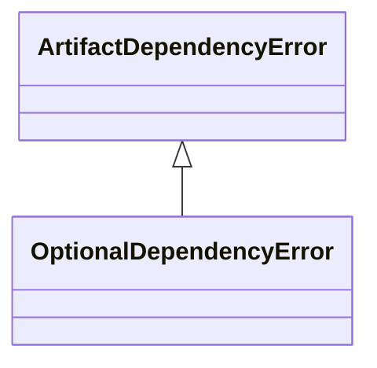

# kgfoundry_common.optional_deps

Guarded optional dependency imports with Problem Details and observability.

[View source on GitHub](https://github.com/kgfoundry/kgfoundry/blob/main/src/kgfoundry_common/optional_deps.py)

## Sections

- **Public API**

## Contents

### kgfoundry_common.optional_deps.OptionalDependencyError

::: kgfoundry_common.optional_deps.OptionalDependencyError

*Bases:* ArtifactDependencyError

### kgfoundry_common.optional_deps._make_remediation_guidance

::: kgfoundry_common.optional_deps._make_remediation_guidance

### kgfoundry_common.optional_deps.safe_import_autoapi

::: kgfoundry_common.optional_deps.safe_import_autoapi

### kgfoundry_common.optional_deps.safe_import_griffe

::: kgfoundry_common.optional_deps.safe_import_griffe

### kgfoundry_common.optional_deps.safe_import_sphinx

::: kgfoundry_common.optional_deps.safe_import_sphinx

## Relationships

**Imports:** `__future__.annotations`, `collections.abc.Mapping`, `importlib`, `kgfoundry_common.errors.ArtifactDependencyError`, `kgfoundry_common.navmap_loader.load_nav_metadata`, `kgfoundry_common.problem_details.build_problem_details`, `kgfoundry_common.types.JsonValue`, `logging`, `typing.TYPE_CHECKING`, `typing.TypeVar`, `typing.cast`, `uuid`

## Autorefs Examples

- [kgfoundry_common.optional_deps.OptionalDependencyError][]
- [kgfoundry_common.optional_deps._make_remediation_guidance][]
- [kgfoundry_common.optional_deps.safe_import_autoapi][]
- [kgfoundry_common.optional_deps.safe_import_griffe][]

## Inheritance



## Neighborhood

```d2
direction: right
"kgfoundry_common.optional_deps": "kgfoundry_common.optional_deps" { link: "./kgfoundry_common/optional_deps.md" }
"__future__.annotations": "__future__.annotations"
"kgfoundry_common.optional_deps" -> "__future__.annotations"
"collections.abc.Mapping": "collections.abc.Mapping"
"kgfoundry_common.optional_deps" -> "collections.abc.Mapping"
"importlib": "importlib"
"kgfoundry_common.optional_deps" -> "importlib"
"kgfoundry_common.errors.ArtifactDependencyError": "kgfoundry_common.errors.ArtifactDependencyError"
"kgfoundry_common.optional_deps" -> "kgfoundry_common.errors.ArtifactDependencyError"
"kgfoundry_common.navmap_loader.load_nav_metadata": "kgfoundry_common.navmap_loader.load_nav_metadata"
"kgfoundry_common.optional_deps" -> "kgfoundry_common.navmap_loader.load_nav_metadata"
"kgfoundry_common.problem_details.build_problem_details": "kgfoundry_common.problem_details.build_problem_details"
"kgfoundry_common.optional_deps" -> "kgfoundry_common.problem_details.build_problem_details"
"kgfoundry_common.types.JsonValue": "kgfoundry_common.types.JsonValue"
"kgfoundry_common.optional_deps" -> "kgfoundry_common.types.JsonValue"
"logging": "logging"
"kgfoundry_common.optional_deps" -> "logging"
"typing.TYPE_CHECKING": "typing.TYPE_CHECKING"
"kgfoundry_common.optional_deps" -> "typing.TYPE_CHECKING"
"typing.TypeVar": "typing.TypeVar"
"kgfoundry_common.optional_deps" -> "typing.TypeVar"
"typing.cast": "typing.cast"
"kgfoundry_common.optional_deps" -> "typing.cast"
"uuid": "uuid"
"kgfoundry_common.optional_deps" -> "uuid"
"kgfoundry_common.optional_deps_code": "kgfoundry_common.optional_deps code" { link: "https://github.com/kgfoundry/kgfoundry/blob/main/src/kgfoundry_common/optional_deps.py" }
"kgfoundry_common.optional_deps" -> "kgfoundry_common.optional_deps_code" { style: dashed }
```

