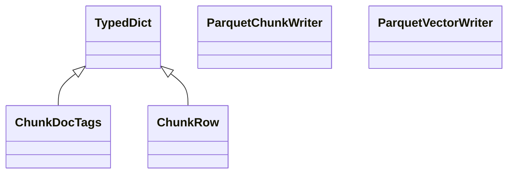

# kgfoundry_common.parquet_io

Utilities for writing embedding vectors and chunks to Parquet

[View source on GitHub](https://github.com/paul-heyse/kgfoundry/blob/main/src/kgfoundry_common/parquet_io.py)

## Hierarchy

- **Parent:** [kgfoundry_common](../kgfoundry_common.md)

## Sections

- **Public API**

## Contents

### kgfoundry_common.parquet_io.ChunkDocTags

::: kgfoundry_common.parquet_io.ChunkDocTags

*Bases:* TypedDict

### kgfoundry_common.parquet_io.ChunkRow

::: kgfoundry_common.parquet_io.ChunkRow

*Bases:* TypedDict

### kgfoundry_common.parquet_io.ParquetChunkWriter

::: kgfoundry_common.parquet_io.ParquetChunkWriter

### kgfoundry_common.parquet_io.ParquetVectorWriter

::: kgfoundry_common.parquet_io.ParquetVectorWriter

### kgfoundry_common.parquet_io.read_table

::: kgfoundry_common.parquet_io.read_table

### kgfoundry_common.parquet_io.read_table_to_dataframe

::: kgfoundry_common.parquet_io.read_table_to_dataframe

### kgfoundry_common.parquet_io.validate_table_schema

::: kgfoundry_common.parquet_io.validate_table_schema

## Relationships

**Imports:** `__future__.annotations`, `collections.abc.Iterable`, `datetime`, `kgfoundry_common.errors.DeserializationError`, `kgfoundry_common.navmap_loader.load_nav_metadata`, `kgfoundry_common.typing.gate_import`, `pandas.DataFrame`, `pathlib.Path`, `pyarrow`, `pyarrow.parquet`, `typing.Any`, `typing.NotRequired`, `typing.TYPE_CHECKING`, `typing.TypedDict`

## Autorefs Examples

- [kgfoundry_common.parquet_io.ChunkDocTags][]
- [kgfoundry_common.parquet_io.ChunkRow][]
- [kgfoundry_common.parquet_io.ParquetChunkWriter][]
- [kgfoundry_common.parquet_io.read_table][]
- [kgfoundry_common.parquet_io.read_table_to_dataframe][]
- [kgfoundry_common.parquet_io.validate_table_schema][]

## Inheritance



## Neighborhood

```d2
direction: right
"kgfoundry_common.parquet_io": "kgfoundry_common.parquet_io" { link: "https://github.com/paul-heyse/kgfoundry/blob/main/src/kgfoundry_common/parquet_io.py" }
"__future__.annotations": "__future__.annotations"
"kgfoundry_common.parquet_io" -> "__future__.annotations"
"collections.abc.Iterable": "collections.abc.Iterable"
"kgfoundry_common.parquet_io" -> "collections.abc.Iterable"
"datetime": "datetime"
"kgfoundry_common.parquet_io" -> "datetime"
"kgfoundry_common.errors.DeserializationError": "kgfoundry_common.errors.DeserializationError"
"kgfoundry_common.parquet_io" -> "kgfoundry_common.errors.DeserializationError"
"kgfoundry_common.navmap_loader.load_nav_metadata": "kgfoundry_common.navmap_loader.load_nav_metadata"
"kgfoundry_common.parquet_io" -> "kgfoundry_common.navmap_loader.load_nav_metadata"
"kgfoundry_common.typing.gate_import": "kgfoundry_common.typing.gate_import"
"kgfoundry_common.parquet_io" -> "kgfoundry_common.typing.gate_import"
"pandas.DataFrame": "pandas.DataFrame"
"kgfoundry_common.parquet_io" -> "pandas.DataFrame"
"pathlib.Path": "pathlib.Path"
"kgfoundry_common.parquet_io" -> "pathlib.Path"
"pyarrow": "pyarrow"
"kgfoundry_common.parquet_io" -> "pyarrow"
"pyarrow.parquet": "pyarrow.parquet"
"kgfoundry_common.parquet_io" -> "pyarrow.parquet"
"typing.Any": "typing.Any"
"kgfoundry_common.parquet_io" -> "typing.Any"
"typing.NotRequired": "typing.NotRequired"
"kgfoundry_common.parquet_io" -> "typing.NotRequired"
"typing.TYPE_CHECKING": "typing.TYPE_CHECKING"
"kgfoundry_common.parquet_io" -> "typing.TYPE_CHECKING"
"typing.TypedDict": "typing.TypedDict"
"kgfoundry_common.parquet_io" -> "typing.TypedDict"
"kgfoundry_common": "kgfoundry_common" { link: "https://github.com/paul-heyse/kgfoundry/blob/main/src/kgfoundry_common/__init__.py" }
"kgfoundry_common" -> "kgfoundry_common.parquet_io" { style: dashed }
```

