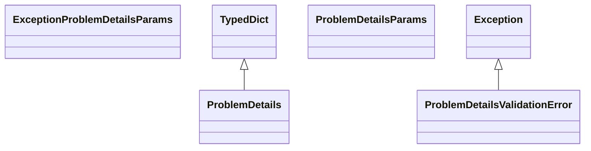

# kgfoundry_common.problem_details

RFC 9457 Problem Details helpers with schema validation.

[View source on GitHub](https://github.com/kgfoundry/kgfoundry/blob/main/src/kgfoundry_common/problem_details.py)

## Sections

- **Public API**

## Contents

### kgfoundry_common.problem_details.ExceptionProblemDetailsParams

::: kgfoundry_common.problem_details.ExceptionProblemDetailsParams

### kgfoundry_common.problem_details.ProblemDetails

::: kgfoundry_common.problem_details.ProblemDetails

*Bases:* TypedDict

### kgfoundry_common.problem_details.ProblemDetailsParams

::: kgfoundry_common.problem_details.ProblemDetailsParams

### kgfoundry_common.problem_details.ProblemDetailsValidationError

::: kgfoundry_common.problem_details.ProblemDetailsValidationError

*Bases:* Exception

### kgfoundry_common.problem_details._coerce_exception_params

::: kgfoundry_common.problem_details._coerce_exception_params

### kgfoundry_common.problem_details._coerce_problem_details_params

::: kgfoundry_common.problem_details._coerce_problem_details_params

### kgfoundry_common.problem_details._ensure_exception

::: kgfoundry_common.problem_details._ensure_exception

### kgfoundry_common.problem_details._ensure_int

::: kgfoundry_common.problem_details._ensure_int

### kgfoundry_common.problem_details._first_arg

::: kgfoundry_common.problem_details._first_arg

### kgfoundry_common.problem_details._load_schema

::: kgfoundry_common.problem_details._load_schema

### kgfoundry_common.problem_details._load_schema_impl

::: kgfoundry_common.problem_details._load_schema_impl

### kgfoundry_common.problem_details._type_error

::: kgfoundry_common.problem_details._type_error

### kgfoundry_common.problem_details.build_configuration_problem

::: kgfoundry_common.problem_details.build_configuration_problem

### kgfoundry_common.problem_details.build_problem_details

::: kgfoundry_common.problem_details.build_problem_details

### kgfoundry_common.problem_details.problem_from_exception

::: kgfoundry_common.problem_details.problem_from_exception

### kgfoundry_common.problem_details.render_problem

::: kgfoundry_common.problem_details.render_problem

### kgfoundry_common.problem_details.validate_problem_details

::: kgfoundry_common.problem_details.validate_problem_details

## Relationships

**Imports:** `__future__.annotations`, `collections.abc.Mapping`, `dataclasses.dataclass`, `json`, `kgfoundry_common.fs.read_text`, `kgfoundry_common.jsonschema_utils.Draft202012Validator`, `kgfoundry_common.jsonschema_utils.SchemaError`, `kgfoundry_common.jsonschema_utils.ValidationError`, `kgfoundry_common.jsonschema_utils.ValidationErrorProtocol`, `kgfoundry_common.jsonschema_utils.validate`, `kgfoundry_common.logging.get_logger`, `kgfoundry_common.navmap_loader.load_nav_metadata`, `kgfoundry_common.types.JsonPrimitive`, `kgfoundry_common.types.JsonValue`, `pathlib.Path`, `typing.NoReturn`, `typing.TYPE_CHECKING`, `typing.TypedDict`, `typing.cast`, `typing.overload`

## Autorefs Examples

- [kgfoundry_common.problem_details.ExceptionProblemDetailsParams][]
- [kgfoundry_common.problem_details.ProblemDetails][]
- [kgfoundry_common.problem_details.ProblemDetailsParams][]
- [kgfoundry_common.problem_details._coerce_exception_params][]
- [kgfoundry_common.problem_details._coerce_problem_details_params][]
- [kgfoundry_common.problem_details._ensure_exception][]

## Inheritance



## Neighborhood

```d2
direction: right
"kgfoundry_common.problem_details": "kgfoundry_common.problem_details" { link: "./kgfoundry_common/problem_details.md" }
"__future__.annotations": "__future__.annotations"
"kgfoundry_common.problem_details" -> "__future__.annotations"
"collections.abc.Mapping": "collections.abc.Mapping"
"kgfoundry_common.problem_details" -> "collections.abc.Mapping"
"dataclasses.dataclass": "dataclasses.dataclass"
"kgfoundry_common.problem_details" -> "dataclasses.dataclass"
"json": "json"
"kgfoundry_common.problem_details" -> "json"
"kgfoundry_common.fs.read_text": "kgfoundry_common.fs.read_text"
"kgfoundry_common.problem_details" -> "kgfoundry_common.fs.read_text"
"kgfoundry_common.jsonschema_utils.Draft202012Validator": "kgfoundry_common.jsonschema_utils.Draft202012Validator"
"kgfoundry_common.problem_details" -> "kgfoundry_common.jsonschema_utils.Draft202012Validator"
"kgfoundry_common.jsonschema_utils.SchemaError": "kgfoundry_common.jsonschema_utils.SchemaError"
"kgfoundry_common.problem_details" -> "kgfoundry_common.jsonschema_utils.SchemaError"
"kgfoundry_common.jsonschema_utils.ValidationError": "kgfoundry_common.jsonschema_utils.ValidationError"
"kgfoundry_common.problem_details" -> "kgfoundry_common.jsonschema_utils.ValidationError"
"kgfoundry_common.jsonschema_utils.ValidationErrorProtocol": "kgfoundry_common.jsonschema_utils.ValidationErrorProtocol"
"kgfoundry_common.problem_details" -> "kgfoundry_common.jsonschema_utils.ValidationErrorProtocol"
"kgfoundry_common.jsonschema_utils.validate": "kgfoundry_common.jsonschema_utils.validate"
"kgfoundry_common.problem_details" -> "kgfoundry_common.jsonschema_utils.validate"
"kgfoundry_common.logging.get_logger": "kgfoundry_common.logging.get_logger"
"kgfoundry_common.problem_details" -> "kgfoundry_common.logging.get_logger"
"kgfoundry_common.navmap_loader.load_nav_metadata": "kgfoundry_common.navmap_loader.load_nav_metadata"
"kgfoundry_common.problem_details" -> "kgfoundry_common.navmap_loader.load_nav_metadata"
"kgfoundry_common.types.JsonPrimitive": "kgfoundry_common.types.JsonPrimitive"
"kgfoundry_common.problem_details" -> "kgfoundry_common.types.JsonPrimitive"
"kgfoundry_common.types.JsonValue": "kgfoundry_common.types.JsonValue"
"kgfoundry_common.problem_details" -> "kgfoundry_common.types.JsonValue"
"pathlib.Path": "pathlib.Path"
"kgfoundry_common.problem_details" -> "pathlib.Path"
"typing.NoReturn": "typing.NoReturn"
"kgfoundry_common.problem_details" -> "typing.NoReturn"
"typing.TYPE_CHECKING": "typing.TYPE_CHECKING"
"kgfoundry_common.problem_details" -> "typing.TYPE_CHECKING"
"typing.TypedDict": "typing.TypedDict"
"kgfoundry_common.problem_details" -> "typing.TypedDict"
"typing.cast": "typing.cast"
"kgfoundry_common.problem_details" -> "typing.cast"
"typing.overload": "typing.overload"
"kgfoundry_common.problem_details" -> "typing.overload"
"kgfoundry_common.problem_details_code": "kgfoundry_common.problem_details code" { link: "https://github.com/kgfoundry/kgfoundry/blob/main/src/kgfoundry_common/problem_details.py" }
"kgfoundry_common.problem_details" -> "kgfoundry_common.problem_details_code" { style: dashed }
```

