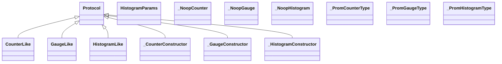

# kgfoundry_common.prometheus

Typed Prometheus helpers with graceful fallbacks.

## Sections

- **Public API**

## Contents

### kgfoundry_common.prometheus.CounterLike

::: kgfoundry_common.prometheus.CounterLike

*Bases:* Protocol

### kgfoundry_common.prometheus.GaugeLike

::: kgfoundry_common.prometheus.GaugeLike

*Bases:* Protocol

### kgfoundry_common.prometheus.HistogramLike

::: kgfoundry_common.prometheus.HistogramLike

*Bases:* Protocol

### kgfoundry_common.prometheus.HistogramParams

::: kgfoundry_common.prometheus.HistogramParams

### kgfoundry_common.prometheus._CounterConstructor

::: kgfoundry_common.prometheus._CounterConstructor

*Bases:* Protocol

### kgfoundry_common.prometheus._GaugeConstructor

::: kgfoundry_common.prometheus._GaugeConstructor

*Bases:* Protocol

### kgfoundry_common.prometheus._HistogramConstructor

::: kgfoundry_common.prometheus._HistogramConstructor

*Bases:* Protocol

### kgfoundry_common.prometheus._NoopCounter

::: kgfoundry_common.prometheus._NoopCounter

### kgfoundry_common.prometheus._NoopGauge

::: kgfoundry_common.prometheus._NoopGauge

### kgfoundry_common.prometheus._NoopHistogram

::: kgfoundry_common.prometheus._NoopHistogram

### kgfoundry_common.prometheus._PromCounterType

::: kgfoundry_common.prometheus._PromCounterType

### kgfoundry_common.prometheus._PromGaugeType

::: kgfoundry_common.prometheus._PromGaugeType

### kgfoundry_common.prometheus._PromHistogramType

::: kgfoundry_common.prometheus._PromHistogramType

### kgfoundry_common.prometheus._coerce_histogram_params

::: kgfoundry_common.prometheus._coerce_histogram_params

### kgfoundry_common.prometheus._existing_collector

::: kgfoundry_common.prometheus._existing_collector

### kgfoundry_common.prometheus._histogram_type_error

::: kgfoundry_common.prometheus._histogram_type_error

### kgfoundry_common.prometheus._labels_or_default

::: kgfoundry_common.prometheus._labels_or_default

### kgfoundry_common.prometheus.build_counter

::: kgfoundry_common.prometheus.build_counter

### kgfoundry_common.prometheus.build_gauge

::: kgfoundry_common.prometheus.build_gauge

### kgfoundry_common.prometheus.build_histogram

::: kgfoundry_common.prometheus.build_histogram

### kgfoundry_common.prometheus.get_default_registry

::: kgfoundry_common.prometheus.get_default_registry

### kgfoundry_common.prometheus.prometheus_version

::: kgfoundry_common.prometheus.prometheus_version

## Relationships

**Imports:** `__future__.annotations`, `collections.abc.Sequence`, `dataclasses.dataclass`, `kgfoundry_common.navmap_loader.load_nav_metadata`, `kgfoundry_common.sequence_guards.first_or_error`, `prometheus_client`, `prometheus_client.Counter`, `prometheus_client.Gauge`, `prometheus_client.Histogram`, `prometheus_client.REGISTRY`, `prometheus_client.registry.CollectorRegistry`, `typing.NoReturn`, `typing.Protocol`, `typing.TYPE_CHECKING`, `typing.cast`, `typing.overload`

## Autorefs Examples

- [kgfoundry_common.prometheus.CounterLike][]
- [kgfoundry_common.prometheus.GaugeLike][]
- [kgfoundry_common.prometheus.HistogramLike][]
- [kgfoundry_common.prometheus._coerce_histogram_params][]
- [kgfoundry_common.prometheus._existing_collector][]
- [kgfoundry_common.prometheus._histogram_type_error][]

## Inheritance



## Neighborhood

```d2
direction: right
"kgfoundry_common.prometheus": "kgfoundry_common.prometheus" { link: "prometheus.md" }
"__future__.annotations": "__future__.annotations"
"kgfoundry_common.prometheus" -> "__future__.annotations"
"collections.abc.Sequence": "collections.abc.Sequence"
"kgfoundry_common.prometheus" -> "collections.abc.Sequence"
"dataclasses.dataclass": "dataclasses.dataclass"
"kgfoundry_common.prometheus" -> "dataclasses.dataclass"
"kgfoundry_common.navmap_loader.load_nav_metadata": "kgfoundry_common.navmap_loader.load_nav_metadata"
"kgfoundry_common.prometheus" -> "kgfoundry_common.navmap_loader.load_nav_metadata"
"kgfoundry_common.sequence_guards.first_or_error": "kgfoundry_common.sequence_guards.first_or_error"
"kgfoundry_common.prometheus" -> "kgfoundry_common.sequence_guards.first_or_error"
"prometheus_client": "prometheus_client"
"kgfoundry_common.prometheus" -> "prometheus_client"
"prometheus_client.Counter": "prometheus_client.Counter"
"kgfoundry_common.prometheus" -> "prometheus_client.Counter"
"prometheus_client.Gauge": "prometheus_client.Gauge"
"kgfoundry_common.prometheus" -> "prometheus_client.Gauge"
"prometheus_client.Histogram": "prometheus_client.Histogram"
"kgfoundry_common.prometheus" -> "prometheus_client.Histogram"
"prometheus_client.REGISTRY": "prometheus_client.REGISTRY"
"kgfoundry_common.prometheus" -> "prometheus_client.REGISTRY"
"prometheus_client.registry.CollectorRegistry": "prometheus_client.registry.CollectorRegistry"
"kgfoundry_common.prometheus" -> "prometheus_client.registry.CollectorRegistry"
"typing.NoReturn": "typing.NoReturn"
"kgfoundry_common.prometheus" -> "typing.NoReturn"
"typing.Protocol": "typing.Protocol"
"kgfoundry_common.prometheus" -> "typing.Protocol"
"typing.TYPE_CHECKING": "typing.TYPE_CHECKING"
"kgfoundry_common.prometheus" -> "typing.TYPE_CHECKING"
"typing.cast": "typing.cast"
"kgfoundry_common.prometheus" -> "typing.cast"
"typing.overload": "typing.overload"
"kgfoundry_common.prometheus" -> "typing.overload"
```

