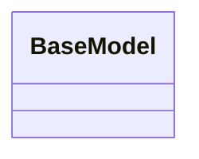

# kgfoundry_common.pydantic

Shared utilities and data structures used across KgFoundry services and tools.

[View source on GitHub](https://github.com/paul-heyse/kgfoundry/blob/main/src/kgfoundry_common/pydantic.py)

## Hierarchy

- **Parent:** [kgfoundry_common](../kgfoundry_common.md)

## Sections

- **Public API**

## Contents

### kgfoundry_common.pydantic.BaseModel

::: kgfoundry_common.pydantic.BaseModel

## Relationships

**Imports:** `__future__.annotations`, `pydantic.BaseModel`, `typing.ClassVar`, `typing.Self`, `typing.TYPE_CHECKING`, `typing.cast`

## Autorefs Examples

- [kgfoundry_common.pydantic.BaseModel][]

## Inheritance



## Neighborhood

```d2
direction: right
"kgfoundry_common.pydantic": "kgfoundry_common.pydantic" { link: "https://github.com/paul-heyse/kgfoundry/blob/main/src/kgfoundry_common/pydantic.py" }
"__future__.annotations": "__future__.annotations"
"kgfoundry_common.pydantic" -> "__future__.annotations"
"pydantic.BaseModel": "pydantic.BaseModel"
"kgfoundry_common.pydantic" -> "pydantic.BaseModel"
"typing.ClassVar": "typing.ClassVar"
"kgfoundry_common.pydantic" -> "typing.ClassVar"
"typing.Self": "typing.Self"
"kgfoundry_common.pydantic" -> "typing.Self"
"typing.TYPE_CHECKING": "typing.TYPE_CHECKING"
"kgfoundry_common.pydantic" -> "typing.TYPE_CHECKING"
"typing.cast": "typing.cast"
"kgfoundry_common.pydantic" -> "typing.cast"
"kgfoundry_common": "kgfoundry_common" { link: "https://github.com/paul-heyse/kgfoundry/blob/main/src/kgfoundry_common/__init__.py" }
"kgfoundry_common" -> "kgfoundry_common.pydantic" { style: dashed }
```

