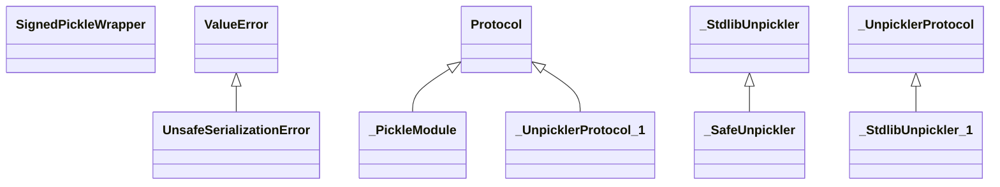

# kgfoundry_common.safe_pickle_v2

Secure pickle serialization with HMAC signing and class allow-list.

[View source on GitHub](https://github.com/paul-heyse/kgfoundry/blob/main/src/kgfoundry_common/safe_pickle_v2.py)

## Hierarchy

- **Parent:** [kgfoundry_common](../kgfoundry_common.md)

## Sections

- **Public API**

## Contents

### kgfoundry_common.safe_pickle_v2.SignedPickleWrapper

::: kgfoundry_common.safe_pickle_v2.SignedPickleWrapper

### kgfoundry_common.safe_pickle_v2.UnsafeSerializationError

::: kgfoundry_common.safe_pickle_v2.UnsafeSerializationError

*Bases:* ValueError

### kgfoundry_common.safe_pickle_v2._PickleModule

::: kgfoundry_common.safe_pickle_v2._PickleModule

*Bases:* Protocol

### kgfoundry_common.safe_pickle_v2._SafeUnpickler

::: kgfoundry_common.safe_pickle_v2._SafeUnpickler

*Bases:* _StdlibUnpickler

### kgfoundry_common.safe_pickle_v2._StdlibUnpickler

::: kgfoundry_common.safe_pickle_v2._StdlibUnpickler

*Bases:* _UnpicklerProtocol

### kgfoundry_common.safe_pickle_v2._UnpicklerProtocol

::: kgfoundry_common.safe_pickle_v2._UnpicklerProtocol

*Bases:* Protocol

### kgfoundry_common.safe_pickle_v2._load_cloudpickle_dumps

::: kgfoundry_common.safe_pickle_v2._load_cloudpickle_dumps

### kgfoundry_common.safe_pickle_v2._load_stdlib_pickle

::: kgfoundry_common.safe_pickle_v2._load_stdlib_pickle

### kgfoundry_common.safe_pickle_v2._load_with_allow_list

::: kgfoundry_common.safe_pickle_v2._load_with_allow_list

### kgfoundry_common.safe_pickle_v2._validate_object

::: kgfoundry_common.safe_pickle_v2._validate_object

### kgfoundry_common.safe_pickle_v2.create_unsigned_pickle_payload

::: kgfoundry_common.safe_pickle_v2.create_unsigned_pickle_payload

### kgfoundry_common.safe_pickle_v2.load_unsigned_legacy

::: kgfoundry_common.safe_pickle_v2.load_unsigned_legacy

## Relationships

**Imports:** `__future__.annotations`, `collections.abc.Callable`, `hashlib`, `hmac`, `importlib.import_module`, `io`, `kgfoundry_common.logging.get_logger`, `kgfoundry_common.navmap_loader.load_nav_metadata`, `typing.BinaryIO`, `typing.Protocol`, `typing.TYPE_CHECKING`, `typing.cast`

## Autorefs Examples

- [kgfoundry_common.safe_pickle_v2.SignedPickleWrapper][]
- [kgfoundry_common.safe_pickle_v2.UnsafeSerializationError][]
- [kgfoundry_common.safe_pickle_v2._PickleModule][]
- [kgfoundry_common.safe_pickle_v2._load_cloudpickle_dumps][]
- [kgfoundry_common.safe_pickle_v2._load_stdlib_pickle][]
- [kgfoundry_common.safe_pickle_v2._load_with_allow_list][]

## Inheritance



## Neighborhood

```d2
direction: right
"kgfoundry_common.safe_pickle_v2": "kgfoundry_common.safe_pickle_v2" { link: "https://github.com/paul-heyse/kgfoundry/blob/main/src/kgfoundry_common/safe_pickle_v2.py" }
"__future__.annotations": "__future__.annotations"
"kgfoundry_common.safe_pickle_v2" -> "__future__.annotations"
"collections.abc.Callable": "collections.abc.Callable"
"kgfoundry_common.safe_pickle_v2" -> "collections.abc.Callable"
"hashlib": "hashlib"
"kgfoundry_common.safe_pickle_v2" -> "hashlib"
"hmac": "hmac"
"kgfoundry_common.safe_pickle_v2" -> "hmac"
"importlib.import_module": "importlib.import_module"
"kgfoundry_common.safe_pickle_v2" -> "importlib.import_module"
"io": "io"
"kgfoundry_common.safe_pickle_v2" -> "io"
"kgfoundry_common.logging.get_logger": "kgfoundry_common.logging.get_logger"
"kgfoundry_common.safe_pickle_v2" -> "kgfoundry_common.logging.get_logger"
"kgfoundry_common.navmap_loader.load_nav_metadata": "kgfoundry_common.navmap_loader.load_nav_metadata"
"kgfoundry_common.safe_pickle_v2" -> "kgfoundry_common.navmap_loader.load_nav_metadata"
"typing.BinaryIO": "typing.BinaryIO"
"kgfoundry_common.safe_pickle_v2" -> "typing.BinaryIO"
"typing.Protocol": "typing.Protocol"
"kgfoundry_common.safe_pickle_v2" -> "typing.Protocol"
"typing.TYPE_CHECKING": "typing.TYPE_CHECKING"
"kgfoundry_common.safe_pickle_v2" -> "typing.TYPE_CHECKING"
"typing.cast": "typing.cast"
"kgfoundry_common.safe_pickle_v2" -> "typing.cast"
"kgfoundry_common": "kgfoundry_common" { link: "https://github.com/paul-heyse/kgfoundry/blob/main/src/kgfoundry_common/__init__.py" }
"kgfoundry_common" -> "kgfoundry_common.safe_pickle_v2" { style: dashed }
```

