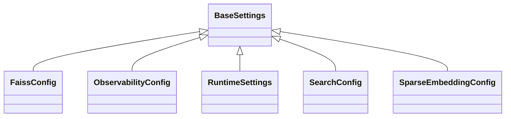

# kgfoundry_common.settings

Typed runtime configuration with fail-fast validation

[View source on GitHub](https://github.com/kgfoundry/kgfoundry/blob/main/src/kgfoundry_common/settings.py)

## Sections

- **Public API**

## Contents

### kgfoundry_common.settings.FaissConfig

::: kgfoundry_common.settings.FaissConfig

*Bases:* BaseSettings

### kgfoundry_common.settings.ObservabilityConfig

::: kgfoundry_common.settings.ObservabilityConfig

*Bases:* BaseSettings

### kgfoundry_common.settings.RuntimeSettings

::: kgfoundry_common.settings.RuntimeSettings

*Bases:* BaseSettings

### kgfoundry_common.settings.SearchConfig

::: kgfoundry_common.settings.SearchConfig

*Bases:* BaseSettings

### kgfoundry_common.settings.SparseEmbeddingConfig

::: kgfoundry_common.settings.SparseEmbeddingConfig

*Bases:* BaseSettings

### kgfoundry_common.settings.load_settings

::: kgfoundry_common.settings.load_settings

## Relationships

**Imports:** `__future__.annotations`, `kgfoundry_common.errors.SettingsError`, `kgfoundry_common.logging.get_logger`, `kgfoundry_common.navmap_loader.load_nav_metadata`, `pydantic.Field`, `pydantic_settings.BaseSettings`, `pydantic_settings.SettingsConfigDict`, `typing.Any`, `typing.ClassVar`, `typing.cast`

## Autorefs Examples

- [kgfoundry_common.settings.FaissConfig][]
- [kgfoundry_common.settings.ObservabilityConfig][]
- [kgfoundry_common.settings.RuntimeSettings][]
- [kgfoundry_common.settings.load_settings][]

## Inheritance



## Neighborhood

```d2
direction: right
"kgfoundry_common.settings": "kgfoundry_common.settings" { link: "./kgfoundry_common/settings.md" }
"__future__.annotations": "__future__.annotations"
"kgfoundry_common.settings" -> "__future__.annotations"
"kgfoundry_common.errors.SettingsError": "kgfoundry_common.errors.SettingsError"
"kgfoundry_common.settings" -> "kgfoundry_common.errors.SettingsError"
"kgfoundry_common.logging.get_logger": "kgfoundry_common.logging.get_logger"
"kgfoundry_common.settings" -> "kgfoundry_common.logging.get_logger"
"kgfoundry_common.navmap_loader.load_nav_metadata": "kgfoundry_common.navmap_loader.load_nav_metadata"
"kgfoundry_common.settings" -> "kgfoundry_common.navmap_loader.load_nav_metadata"
"pydantic.Field": "pydantic.Field"
"kgfoundry_common.settings" -> "pydantic.Field"
"pydantic_settings.BaseSettings": "pydantic_settings.BaseSettings"
"kgfoundry_common.settings" -> "pydantic_settings.BaseSettings"
"pydantic_settings.SettingsConfigDict": "pydantic_settings.SettingsConfigDict"
"kgfoundry_common.settings" -> "pydantic_settings.SettingsConfigDict"
"typing.Any": "typing.Any"
"kgfoundry_common.settings" -> "typing.Any"
"typing.ClassVar": "typing.ClassVar"
"kgfoundry_common.settings" -> "typing.ClassVar"
"typing.cast": "typing.cast"
"kgfoundry_common.settings" -> "typing.cast"
"kgfoundry_common.settings_code": "kgfoundry_common.settings code" { link: "https://github.com/kgfoundry/kgfoundry/blob/main/src/kgfoundry_common/settings.py" }
"kgfoundry_common.settings" -> "kgfoundry_common.settings_code" { style: dashed }
```

