# kgfoundry_common.subprocess_utils

Subprocess execution with timeouts, path sanitization, and error handling.

## Sections

- **Public API**

## Contents

### kgfoundry_common.subprocess_utils.SubprocessError

::: kgfoundry_common.subprocess_utils.SubprocessError

*Bases:* RuntimeError

### kgfoundry_common.subprocess_utils.SubprocessTimeoutError

::: kgfoundry_common.subprocess_utils.SubprocessTimeoutError

*Bases:* TimeoutError

### kgfoundry_common.subprocess_utils._AllowListPolicyProtocol

::: kgfoundry_common.subprocess_utils._AllowListPolicyProtocol

*Bases:* Protocol

### kgfoundry_common.subprocess_utils._EnvironmentPolicyProtocol

::: kgfoundry_common.subprocess_utils._EnvironmentPolicyProtocol

*Bases:* Protocol

### kgfoundry_common.subprocess_utils._GetProcessRunnerCallable

::: kgfoundry_common.subprocess_utils._GetProcessRunnerCallable

*Bases:* Protocol

### kgfoundry_common.subprocess_utils._PopenFactory

::: kgfoundry_common.subprocess_utils._PopenFactory

*Bases:* Protocol

### kgfoundry_common.subprocess_utils._ProcessRunnerProtocol

::: kgfoundry_common.subprocess_utils._ProcessRunnerProtocol

*Bases:* Protocol

### kgfoundry_common.subprocess_utils._RunToolCallable

::: kgfoundry_common.subprocess_utils._RunToolCallable

*Bases:* Protocol

### kgfoundry_common.subprocess_utils._TextProcess

::: kgfoundry_common.subprocess_utils._TextProcess

*Bases:* Protocol

### kgfoundry_common.subprocess_utils._ToolExecutionErrorConstructor

::: kgfoundry_common.subprocess_utils._ToolExecutionErrorConstructor

*Bases:* Protocol

### kgfoundry_common.subprocess_utils._ToolExecutionErrorSurface

::: kgfoundry_common.subprocess_utils._ToolExecutionErrorSurface

*Bases:* Protocol

### kgfoundry_common.subprocess_utils._ToolRunResultProtocol

::: kgfoundry_common.subprocess_utils._ToolRunResultProtocol

*Bases:* Protocol

### kgfoundry_common.subprocess_utils._ToolsSurface

::: kgfoundry_common.subprocess_utils._ToolsSurface

*Bases:* Protocol

### kgfoundry_common.subprocess_utils._is_timeout_error

::: kgfoundry_common.subprocess_utils._is_timeout_error

### kgfoundry_common.subprocess_utils._load_tools_surface

::: kgfoundry_common.subprocess_utils._load_tools_surface

### kgfoundry_common.subprocess_utils._raise_tool_execution_error

::: kgfoundry_common.subprocess_utils._raise_tool_execution_error

### kgfoundry_common.subprocess_utils.run_subprocess

::: kgfoundry_common.subprocess_utils.run_subprocess

### kgfoundry_common.subprocess_utils.spawn_text_process

::: kgfoundry_common.subprocess_utils.spawn_text_process

## Relationships

**Imports:** `__future__.annotations`, `collections.abc.Mapping`, `collections.abc.Sequence`, `importlib.import_module`, `io`, `kgfoundry_common.navmap_loader.load_nav_metadata`, `logging`, `pathlib.Path`, `typing.Final`, `typing.NoReturn`, `typing.Protocol`, `typing.TYPE_CHECKING`, `typing.cast`

## Autorefs Examples

- [kgfoundry_common.subprocess_utils.SubprocessError][]
- [kgfoundry_common.subprocess_utils.SubprocessTimeoutError][]
- [kgfoundry_common.subprocess_utils._AllowListPolicyProtocol][]
- [kgfoundry_common.subprocess_utils._is_timeout_error][]
- [kgfoundry_common.subprocess_utils._load_tools_surface][]
- [kgfoundry_common.subprocess_utils._raise_tool_execution_error][]

## Inheritance

```mermaid
classDiagram
    class SubprocessError
    class RuntimeError
    RuntimeError <|-- SubprocessError
    class SubprocessTimeoutError
    class TimeoutError
    TimeoutError <|-- SubprocessTimeoutError
    class _AllowListPolicyProtocol
    class Protocol
    Protocol <|-- _AllowListPolicyProtocol
    class _EnvironmentPolicyProtocol
    Protocol <|-- _EnvironmentPolicyProtocol
    class _GetProcessRunnerCallable
    Protocol <|-- _GetProcessRunnerCallable
    class _PopenFactory
    Protocol <|-- _PopenFactory
    class _ProcessRunnerProtocol
    Protocol <|-- _ProcessRunnerProtocol
    class _RunToolCallable
    Protocol <|-- _RunToolCallable
    class _TextProcess
    Protocol <|-- _TextProcess
    class _ToolExecutionErrorConstructor
    Protocol <|-- _ToolExecutionErrorConstructor
    class _ToolExecutionErrorSurface
    Protocol <|-- _ToolExecutionErrorSurface
    class _ToolRunResultProtocol
    Protocol <|-- _ToolRunResultProtocol
    class _ToolsSurface
    Protocol <|-- _ToolsSurface
```



## Neighborhood

```d2
direction: right
"kgfoundry_common.subprocess_utils": "kgfoundry_common.subprocess_utils" { link: "subprocess_utils.md" }
"__future__.annotations": "__future__.annotations"
"kgfoundry_common.subprocess_utils" -> "__future__.annotations"
"collections.abc.Mapping": "collections.abc.Mapping"
"kgfoundry_common.subprocess_utils" -> "collections.abc.Mapping"
"collections.abc.Sequence": "collections.abc.Sequence"
"kgfoundry_common.subprocess_utils" -> "collections.abc.Sequence"
"importlib.import_module": "importlib.import_module"
"kgfoundry_common.subprocess_utils" -> "importlib.import_module"
"io": "io"
"kgfoundry_common.subprocess_utils" -> "io"
"kgfoundry_common.navmap_loader.load_nav_metadata": "kgfoundry_common.navmap_loader.load_nav_metadata"
"kgfoundry_common.subprocess_utils" -> "kgfoundry_common.navmap_loader.load_nav_metadata"
"logging": "logging"
"kgfoundry_common.subprocess_utils" -> "logging"
"pathlib.Path": "pathlib.Path"
"kgfoundry_common.subprocess_utils" -> "pathlib.Path"
"typing.Final": "typing.Final"
"kgfoundry_common.subprocess_utils" -> "typing.Final"
"typing.NoReturn": "typing.NoReturn"
"kgfoundry_common.subprocess_utils" -> "typing.NoReturn"
"typing.Protocol": "typing.Protocol"
"kgfoundry_common.subprocess_utils" -> "typing.Protocol"
"typing.TYPE_CHECKING": "typing.TYPE_CHECKING"
"kgfoundry_common.subprocess_utils" -> "typing.TYPE_CHECKING"
"typing.cast": "typing.cast"
"kgfoundry_common.subprocess_utils" -> "typing.cast"
```

