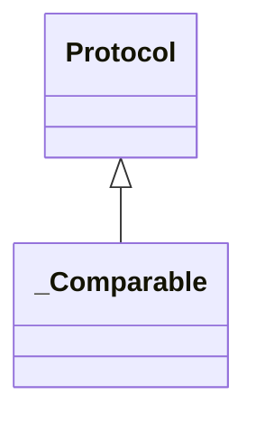

# kgfoundry_common.typing

Canonical typing façade for kgfoundry.

## Sections

- **Public API**

## Contents

### kgfoundry_common.typing._Comparable

::: kgfoundry_common.typing._Comparable

*Bases:* Protocol

### kgfoundry_common.typing._protocol_stub

::: kgfoundry_common.typing._protocol_stub

### kgfoundry_common.typing._version_gte

::: kgfoundry_common.typing._version_gte

### kgfoundry_common.typing.gate_import

::: kgfoundry_common.typing.gate_import

### kgfoundry_common.typing.resolve_faiss

::: kgfoundry_common.typing.resolve_faiss

### kgfoundry_common.typing.resolve_fastapi

::: kgfoundry_common.typing.resolve_fastapi

### kgfoundry_common.typing.resolve_numpy

::: kgfoundry_common.typing.resolve_numpy

### kgfoundry_common.typing.safe_get_type

::: kgfoundry_common.typing.safe_get_type

## Relationships

**Imports:** `__future__.annotations`, `collections.abc.Callable`, `kgfoundry_common.navmap_loader.load_nav_metadata`, `packaging.version.parse`, `typing.NoReturn`, `typing.Protocol`, `typing.TYPE_CHECKING`, `typing.cast`, `warnings`

## Autorefs Examples

- [kgfoundry_common.typing._Comparable][]
- [kgfoundry_common.typing._protocol_stub][]
- [kgfoundry_common.typing._version_gte][]
- [kgfoundry_common.typing.gate_import][]

## Inheritance



## Neighborhood

```d2
direction: right
"kgfoundry_common.typing": "kgfoundry_common.typing" { link: "typing.md" }
"__future__.annotations": "__future__.annotations"
"kgfoundry_common.typing" -> "__future__.annotations"
"collections.abc.Callable": "collections.abc.Callable"
"kgfoundry_common.typing" -> "collections.abc.Callable"
"kgfoundry_common.navmap_loader.load_nav_metadata": "kgfoundry_common.navmap_loader.load_nav_metadata"
"kgfoundry_common.typing" -> "kgfoundry_common.navmap_loader.load_nav_metadata"
"packaging.version.parse": "packaging.version.parse"
"kgfoundry_common.typing" -> "packaging.version.parse"
"typing.NoReturn": "typing.NoReturn"
"kgfoundry_common.typing" -> "typing.NoReturn"
"typing.Protocol": "typing.Protocol"
"kgfoundry_common.typing" -> "typing.Protocol"
"typing.TYPE_CHECKING": "typing.TYPE_CHECKING"
"kgfoundry_common.typing" -> "typing.TYPE_CHECKING"
"typing.cast": "typing.cast"
"kgfoundry_common.typing" -> "typing.cast"
"warnings": "warnings"
"kgfoundry_common.typing" -> "warnings"
```

