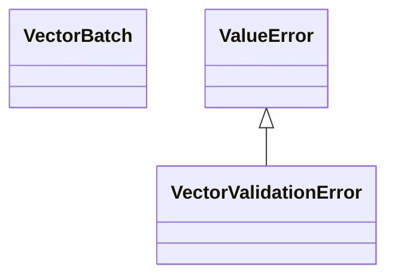

# kgfoundry_common.vector_types

Typed vector contracts and validation helpers for vector ingestion.

[View source on GitHub](https://github.com/kgfoundry/kgfoundry/blob/main/src/kgfoundry_common/vector_types.py)

## Sections

- **Public API**

## Contents

### kgfoundry_common.vector_types.VectorBatch

::: kgfoundry_common.vector_types.VectorBatch

### kgfoundry_common.vector_types.VectorValidationError

::: kgfoundry_common.vector_types.VectorValidationError

*Bases:* ValueError

### kgfoundry_common.vector_types._coerce_vector_row

::: kgfoundry_common.vector_types._coerce_vector_row

### kgfoundry_common.vector_types.assert_vector_matrix

::: kgfoundry_common.vector_types.assert_vector_matrix

### kgfoundry_common.vector_types.coerce_vector_batch

::: kgfoundry_common.vector_types.coerce_vector_batch

### kgfoundry_common.vector_types.validate_vector_batch

::: kgfoundry_common.vector_types.validate_vector_batch

## Relationships

**Imports:** `__future__.annotations`, `collections.abc.Iterable`, `collections.abc.Mapping`, `collections.abc.Sequence`, `dataclasses.dataclass`, `kgfoundry_common.navmap_loader.load_nav_metadata`, `numpy`, `numpy.typing`, `typing.Final`, `typing.NewType`, `typing.TYPE_CHECKING`, `typing.cast`

## Autorefs Examples

- [kgfoundry_common.vector_types.VectorBatch][]
- [kgfoundry_common.vector_types.VectorValidationError][]
- [kgfoundry_common.vector_types._coerce_vector_row][]
- [kgfoundry_common.vector_types.assert_vector_matrix][]
- [kgfoundry_common.vector_types.coerce_vector_batch][]

## Inheritance



## Neighborhood

```d2
direction: right
"kgfoundry_common.vector_types": "kgfoundry_common.vector_types" { link: "./kgfoundry_common/vector_types.md" }
"__future__.annotations": "__future__.annotations"
"kgfoundry_common.vector_types" -> "__future__.annotations"
"collections.abc.Iterable": "collections.abc.Iterable"
"kgfoundry_common.vector_types" -> "collections.abc.Iterable"
"collections.abc.Mapping": "collections.abc.Mapping"
"kgfoundry_common.vector_types" -> "collections.abc.Mapping"
"collections.abc.Sequence": "collections.abc.Sequence"
"kgfoundry_common.vector_types" -> "collections.abc.Sequence"
"dataclasses.dataclass": "dataclasses.dataclass"
"kgfoundry_common.vector_types" -> "dataclasses.dataclass"
"kgfoundry_common.navmap_loader.load_nav_metadata": "kgfoundry_common.navmap_loader.load_nav_metadata"
"kgfoundry_common.vector_types" -> "kgfoundry_common.navmap_loader.load_nav_metadata"
"numpy": "numpy"
"kgfoundry_common.vector_types" -> "numpy"
"numpy.typing": "numpy.typing"
"kgfoundry_common.vector_types" -> "numpy.typing"
"typing.Final": "typing.Final"
"kgfoundry_common.vector_types" -> "typing.Final"
"typing.NewType": "typing.NewType"
"kgfoundry_common.vector_types" -> "typing.NewType"
"typing.TYPE_CHECKING": "typing.TYPE_CHECKING"
"kgfoundry_common.vector_types" -> "typing.TYPE_CHECKING"
"typing.cast": "typing.cast"
"kgfoundry_common.vector_types" -> "typing.cast"
"kgfoundry_common.vector_types_code": "kgfoundry_common.vector_types code" { link: "https://github.com/kgfoundry/kgfoundry/blob/main/src/kgfoundry_common/vector_types.py" }
"kgfoundry_common.vector_types" -> "kgfoundry_common.vector_types_code" { style: dashed }
```

