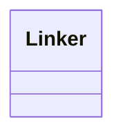

# linking.linker

Linking orchestrations and scoring helpers

[View source on GitHub](https://github.com/paul-heyse/kgfoundry/blob/main/src/linking/linker.py)

## Hierarchy

- **Parent:** [linking](../linking.md)

## Sections

- **Public API**

## Contents

### linking.linker.Linker

::: linking.linker.Linker

## Relationships

**Imports:** `__future__.annotations`, `kgfoundry_common.navmap_loader.load_nav_metadata`

## Autorefs Examples

- [linking.linker.Linker][]

## Inheritance



## Neighborhood

```d2
direction: right
"linking.linker": "linking.linker" { link: "https://github.com/paul-heyse/kgfoundry/blob/main/src/linking/linker.py" }
"__future__.annotations": "__future__.annotations"
"linking.linker" -> "__future__.annotations"
"kgfoundry_common.navmap_loader.load_nav_metadata": "kgfoundry_common.navmap_loader.load_nav_metadata"
"linking.linker" -> "kgfoundry_common.navmap_loader.load_nav_metadata"
"linking": "linking" { link: "https://github.com/paul-heyse/kgfoundry/blob/main/src/linking/__init__.py" }
"linking" -> "linking.linker" { style: dashed }
```

