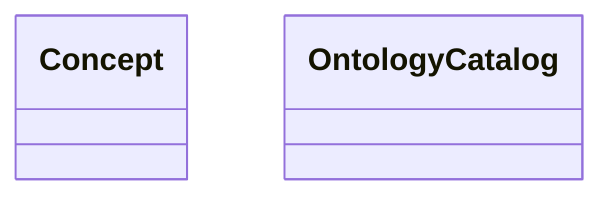

# ontology.catalog

Utility catalogue for lightweight ontology lookups.

## Sections

- **Public API**

## Contents

### ontology.catalog.Concept

::: ontology.catalog.Concept

### ontology.catalog.OntologyCatalog

::: ontology.catalog.OntologyCatalog

## Relationships

**Imports:** `__future__.annotations`, `dataclasses.dataclass`, `kgfoundry_common.navmap_loader.load_nav_metadata`, `kgfoundry_common.problem_details.JsonValue`, `typing.TYPE_CHECKING`

## Autorefs Examples

- [ontology.catalog.Concept][]
- [ontology.catalog.OntologyCatalog][]

## Inheritance



## Neighborhood

```d2
direction: right
"ontology.catalog": "ontology.catalog" { link: "catalog.md" }
"__future__.annotations": "__future__.annotations"
"ontology.catalog" -> "__future__.annotations"
"dataclasses.dataclass": "dataclasses.dataclass"
"ontology.catalog" -> "dataclasses.dataclass"
"kgfoundry_common.navmap_loader.load_nav_metadata": "kgfoundry_common.navmap_loader.load_nav_metadata"
"ontology.catalog" -> "kgfoundry_common.navmap_loader.load_nav_metadata"
"kgfoundry_common.problem_details.JsonValue": "kgfoundry_common.problem_details.JsonValue"
"ontology.catalog" -> "kgfoundry_common.problem_details.JsonValue"
"typing.TYPE_CHECKING": "typing.TYPE_CHECKING"
"ontology.catalog" -> "typing.TYPE_CHECKING"
```

