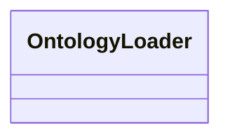

# ontology.loader

Ontology ingest and caching helpers

[View source on GitHub](https://github.com/paul-heyse/kgfoundry/blob/main/src/ontology/loader.py)

## Hierarchy

- **Parent:** [ontology](../ontology.md)

## Sections

- **Public API**

## Contents

### ontology.loader.OntologyLoader

::: ontology.loader.OntologyLoader

## Relationships

**Imports:** `__future__.annotations`, `kgfoundry_common.navmap_loader.load_nav_metadata`

## Autorefs Examples

- [ontology.loader.OntologyLoader][]

## Inheritance



## Neighborhood

```d2
direction: right
"ontology.loader": "ontology.loader" { link: "https://github.com/paul-heyse/kgfoundry/blob/main/src/ontology/loader.py" }
"__future__.annotations": "__future__.annotations"
"ontology.loader" -> "__future__.annotations"
"kgfoundry_common.navmap_loader.load_nav_metadata": "kgfoundry_common.navmap_loader.load_nav_metadata"
"ontology.loader" -> "kgfoundry_common.navmap_loader.load_nav_metadata"
"ontology": "ontology" { link: "https://github.com/paul-heyse/kgfoundry/blob/main/src/ontology/__init__.py" }
"ontology" -> "ontology.loader" { style: dashed }
```

