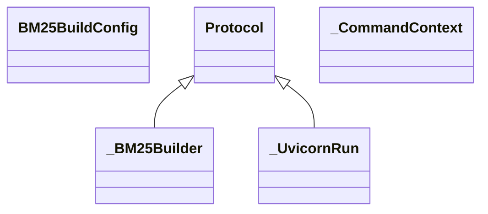

# orchestration.cli

Typer-powered orchestration command suite covering indexing flows, API bootstrapping,
and end-to-end demonstrations. Each command maps to a generated OpenAPI operation
consumed by the MkDocs suite.

[View source on GitHub](https://github.com/kgfoundry/kgfoundry/blob/main/src/orchestration/cli.py)

## Sections

- **Public API**

## Contents

### orchestration.cli.BM25BuildConfig

::: orchestration.cli.BM25BuildConfig

### orchestration.cli._BM25Builder

::: orchestration.cli._BM25Builder

*Bases:* Protocol

### orchestration.cli._CommandContext

::: orchestration.cli._CommandContext

### orchestration.cli._UvicornRun

::: orchestration.cli._UvicornRun

*Bases:* Protocol

### orchestration.cli._build_bm25_index

::: orchestration.cli._build_bm25_index

### orchestration.cli._build_cli_problem

::: orchestration.cli._build_cli_problem

### orchestration.cli._coerce_extension_value

::: orchestration.cli._coerce_extension_value

### orchestration.cli._emit_envelope

::: orchestration.cli._emit_envelope

### orchestration.cli._envelope_path

::: orchestration.cli._envelope_path

### orchestration.cli._error_sort_key

::: orchestration.cli._error_sort_key

### orchestration.cli._error_status_from_http

::: orchestration.cli._error_status_from_http

### orchestration.cli._extract_bm25_document

::: orchestration.cli._extract_bm25_document

### orchestration.cli._finish_success

::: orchestration.cli._finish_success

### orchestration.cli._get_bm25_index_path

::: orchestration.cli._get_bm25_index_path

### orchestration.cli._handle_failure

::: orchestration.cli._handle_failure

### orchestration.cli._instantiate_bm25_builder

::: orchestration.cli._instantiate_bm25_builder

### orchestration.cli._load_bm25_documents

::: orchestration.cli._load_bm25_documents

### orchestration.cli._prepare_index_directory

::: orchestration.cli._prepare_index_directory

### orchestration.cli._problem_type_for

::: orchestration.cli._problem_type_for

### orchestration.cli._resolve_cli_help

::: orchestration.cli._resolve_cli_help

### orchestration.cli._run_e2e_flow

::: orchestration.cli._run_e2e_flow

### orchestration.cli._run_status_from_error

::: orchestration.cli._run_status_from_error

### orchestration.cli._start_command

::: orchestration.cli._start_command

### orchestration.cli._validate_vector_payload

::: orchestration.cli._validate_vector_payload

### orchestration.cli._vector_batch_validator

::: orchestration.cli._vector_batch_validator

### orchestration.cli.api

::: orchestration.cli.api

### orchestration.cli.e2e

::: orchestration.cli.e2e

### orchestration.cli.index_bm25

::: orchestration.cli.index_bm25

### orchestration.cli.index_faiss

::: orchestration.cli.index_faiss

### orchestration.cli.load_vector_batch_from_json

::: orchestration.cli.load_vector_batch_from_json

### orchestration.cli.run_index_faiss

::: orchestration.cli.run_index_faiss

## Related API operations

[`cli.api`](../../api/openapi-cli.md) (orchestration-cli · CLI Spec), [`cli.e2e`](../../api/openapi-cli.md) (orchestration-cli · CLI Spec), [`cli.index_bm25`](../../api/openapi-cli.md) (orchestration-cli · CLI Spec), [`cli.index_faiss`](../../api/openapi-cli.md) (orchestration-cli · CLI Spec)

## Relationships

**Imports:** `__future__.annotations`, `collections.abc.Callable`, `collections.abc.Iterable`, `collections.abc.Mapping`, `collections.abc.Sequence`, `contextlib`, `dataclasses.dataclass`, `importlib`, `json`, `kgfoundry.embeddings_sparse.bm25.get_bm25`, `kgfoundry_common.errors.ConfigurationError`, `kgfoundry_common.errors.IndexBuildError`, `kgfoundry_common.jsonschema_utils.Draft202012ValidatorProtocol`, `kgfoundry_common.jsonschema_utils.ValidationErrorProtocol`, `kgfoundry_common.jsonschema_utils.create_draft202012_validator`, `kgfoundry_common.schema_helpers.load_schema`, `kgfoundry_common.vector_types.VectorBatch`, `kgfoundry_common.vector_types.VectorValidationError`, `kgfoundry_common.vector_types.coerce_vector_batch`, [orchestration.cli_context](cli_context.md), `orchestration.config.IndexCliConfig`, `orchestration.flows.e2e_flow`, [orchestration.safe_pickle](safe_pickle.md), `pathlib.Path`, `time`, `tools.CliEnvelope`, `tools.CliEnvelopeBuilder`, `tools.CliErrorStatus`, `tools.CliStatus`, `tools.JsonValue`, `tools.ProblemDetailsDict`, `tools.ProblemDetailsParams`, `tools._shared.logging.LoggerAdapter`, `tools.build_problem_details`, `tools.get_logger`, `tools.render_cli_envelope`, `tools.with_fields`, `typer`, `typing.Annotated`, `typing.Protocol`, `typing.TYPE_CHECKING`, `typing.cast`, `uuid.uuid4`

## Autorefs Examples

- [orchestration.cli.BM25BuildConfig][]
- [orchestration.cli._BM25Builder][]
- [orchestration.cli._CommandContext][]
- [orchestration.cli._build_bm25_index][]
- [orchestration.cli._build_cli_problem][]
- [orchestration.cli._coerce_extension_value][]

## Inheritance



## Neighborhood

```d2
direction: right
"orchestration.cli": "orchestration.cli" { link: "./orchestration/cli.md" }
"__future__.annotations": "__future__.annotations"
"orchestration.cli" -> "__future__.annotations"
"collections.abc.Callable": "collections.abc.Callable"
"orchestration.cli" -> "collections.abc.Callable"
"collections.abc.Iterable": "collections.abc.Iterable"
"orchestration.cli" -> "collections.abc.Iterable"
"collections.abc.Mapping": "collections.abc.Mapping"
"orchestration.cli" -> "collections.abc.Mapping"
"collections.abc.Sequence": "collections.abc.Sequence"
"orchestration.cli" -> "collections.abc.Sequence"
"contextlib": "contextlib"
"orchestration.cli" -> "contextlib"
"dataclasses.dataclass": "dataclasses.dataclass"
"orchestration.cli" -> "dataclasses.dataclass"
"importlib": "importlib"
"orchestration.cli" -> "importlib"
"json": "json"
"orchestration.cli" -> "json"
"kgfoundry.embeddings_sparse.bm25.get_bm25": "kgfoundry.embeddings_sparse.bm25.get_bm25"
"orchestration.cli" -> "kgfoundry.embeddings_sparse.bm25.get_bm25"
"kgfoundry_common.errors.ConfigurationError": "kgfoundry_common.errors.ConfigurationError"
"orchestration.cli" -> "kgfoundry_common.errors.ConfigurationError"
"kgfoundry_common.errors.IndexBuildError": "kgfoundry_common.errors.IndexBuildError"
"orchestration.cli" -> "kgfoundry_common.errors.IndexBuildError"
"kgfoundry_common.jsonschema_utils.Draft202012ValidatorProtocol": "kgfoundry_common.jsonschema_utils.Draft202012ValidatorProtocol"
"orchestration.cli" -> "kgfoundry_common.jsonschema_utils.Draft202012ValidatorProtocol"
"kgfoundry_common.jsonschema_utils.ValidationErrorProtocol": "kgfoundry_common.jsonschema_utils.ValidationErrorProtocol"
"orchestration.cli" -> "kgfoundry_common.jsonschema_utils.ValidationErrorProtocol"
"kgfoundry_common.jsonschema_utils.create_draft202012_validator": "kgfoundry_common.jsonschema_utils.create_draft202012_validator"
"orchestration.cli" -> "kgfoundry_common.jsonschema_utils.create_draft202012_validator"
"kgfoundry_common.schema_helpers.load_schema": "kgfoundry_common.schema_helpers.load_schema"
"orchestration.cli" -> "kgfoundry_common.schema_helpers.load_schema"
"kgfoundry_common.vector_types.VectorBatch": "kgfoundry_common.vector_types.VectorBatch"
"orchestration.cli" -> "kgfoundry_common.vector_types.VectorBatch"
"kgfoundry_common.vector_types.VectorValidationError": "kgfoundry_common.vector_types.VectorValidationError"
"orchestration.cli" -> "kgfoundry_common.vector_types.VectorValidationError"
"kgfoundry_common.vector_types.coerce_vector_batch": "kgfoundry_common.vector_types.coerce_vector_batch"
"orchestration.cli" -> "kgfoundry_common.vector_types.coerce_vector_batch"
"orchestration.cli_context": "orchestration.cli_context" { link: "./orchestration/cli_context.md" }
"orchestration.cli" -> "orchestration.cli_context"
"orchestration.config.IndexCliConfig": "orchestration.config.IndexCliConfig"
"orchestration.cli" -> "orchestration.config.IndexCliConfig"
"orchestration.flows.e2e_flow": "orchestration.flows.e2e_flow"
"orchestration.cli" -> "orchestration.flows.e2e_flow"
"orchestration.safe_pickle": "orchestration.safe_pickle" { link: "./orchestration/safe_pickle.md" }
"orchestration.cli" -> "orchestration.safe_pickle"
"pathlib.Path": "pathlib.Path"
"orchestration.cli" -> "pathlib.Path"
"time": "time"
"orchestration.cli" -> "time"
"tools.CliEnvelope": "tools.CliEnvelope"
"orchestration.cli" -> "tools.CliEnvelope"
"tools.CliEnvelopeBuilder": "tools.CliEnvelopeBuilder"
"orchestration.cli" -> "tools.CliEnvelopeBuilder"
"tools.CliErrorStatus": "tools.CliErrorStatus"
"orchestration.cli" -> "tools.CliErrorStatus"
"tools.CliStatus": "tools.CliStatus"
"orchestration.cli" -> "tools.CliStatus"
"tools.JsonValue": "tools.JsonValue"
"orchestration.cli" -> "tools.JsonValue"
"tools.ProblemDetailsDict": "tools.ProblemDetailsDict"
"orchestration.cli" -> "tools.ProblemDetailsDict"
"tools.ProblemDetailsParams": "tools.ProblemDetailsParams"
"orchestration.cli" -> "tools.ProblemDetailsParams"
"tools._shared.logging.LoggerAdapter": "tools._shared.logging.LoggerAdapter"
"orchestration.cli" -> "tools._shared.logging.LoggerAdapter"
"tools.build_problem_details": "tools.build_problem_details"
"orchestration.cli" -> "tools.build_problem_details"
"tools.get_logger": "tools.get_logger"
"orchestration.cli" -> "tools.get_logger"
"tools.render_cli_envelope": "tools.render_cli_envelope"
"orchestration.cli" -> "tools.render_cli_envelope"
"tools.with_fields": "tools.with_fields"
"orchestration.cli" -> "tools.with_fields"
"typer": "typer"
"orchestration.cli" -> "typer"
"typing.Annotated": "typing.Annotated"
"orchestration.cli" -> "typing.Annotated"
"typing.Protocol": "typing.Protocol"
"orchestration.cli" -> "typing.Protocol"
"typing.TYPE_CHECKING": "typing.TYPE_CHECKING"
"orchestration.cli" -> "typing.TYPE_CHECKING"
"typing.cast": "typing.cast"
"orchestration.cli" -> "typing.cast"
"uuid.uuid4": "uuid.uuid4"
"orchestration.cli" -> "uuid.uuid4"
"orchestration.cli_code": "orchestration.cli code" { link: "https://github.com/kgfoundry/kgfoundry/blob/main/src/orchestration/cli.py" }
"orchestration.cli" -> "orchestration.cli_code" { style: dashed }
```

