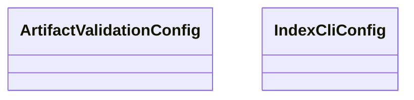

# orchestration.config

Typer-powered orchestration command suite covering indexing flows, API bootstrapping,
and end-to-end demonstrations. Each command maps to a generated OpenAPI operation
consumed by the MkDocs suite.

[View source on GitHub](https://github.com/kgfoundry/kgfoundry/blob/main/src/orchestration/config.py)

## Sections

- **Public API**

## Contents

### orchestration.config.ArtifactValidationConfig

::: orchestration.config.ArtifactValidationConfig

### orchestration.config.IndexCliConfig

::: orchestration.config.IndexCliConfig

## Relationships

**Imports:** `__future__.annotations`, `dataclasses.dataclass`, `kgfoundry_common.navmap_loader.load_nav_metadata`

## Autorefs Examples

- [orchestration.config.ArtifactValidationConfig][]
- [orchestration.config.IndexCliConfig][]

## Inheritance



## Neighborhood

```d2
direction: right
"orchestration.config": "orchestration.config" { link: "./orchestration/config.md" }
"__future__.annotations": "__future__.annotations"
"orchestration.config" -> "__future__.annotations"
"dataclasses.dataclass": "dataclasses.dataclass"
"orchestration.config" -> "dataclasses.dataclass"
"kgfoundry_common.navmap_loader.load_nav_metadata": "kgfoundry_common.navmap_loader.load_nav_metadata"
"orchestration.config" -> "kgfoundry_common.navmap_loader.load_nav_metadata"
"orchestration.config_code": "orchestration.config code" { link: "https://github.com/kgfoundry/kgfoundry/blob/main/src/orchestration/config.py" }
"orchestration.config" -> "orchestration.config_code" { style: dashed }
```

