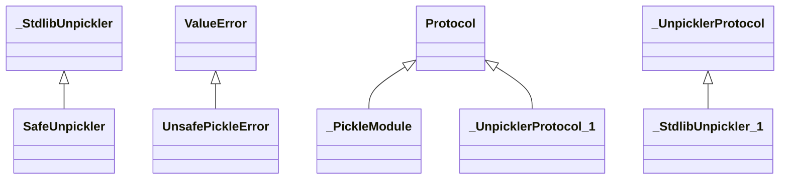

# orchestration.safe_pickle

Typer-powered orchestration command suite covering indexing flows, API bootstrapping,
and end-to-end demonstrations. Each command maps to a generated OpenAPI operation
consumed by the MkDocs suite.

## Sections

- **Public API**

## Contents

### orchestration.safe_pickle.SafeUnpickler

::: orchestration.safe_pickle.SafeUnpickler

*Bases:* _StdlibUnpickler

### orchestration.safe_pickle.UnsafePickleError

::: orchestration.safe_pickle.UnsafePickleError

*Bases:* ValueError

### orchestration.safe_pickle._PickleModule

::: orchestration.safe_pickle._PickleModule

*Bases:* Protocol

### orchestration.safe_pickle._StdlibUnpickler

::: orchestration.safe_pickle._StdlibUnpickler

*Bases:* _UnpicklerProtocol

### orchestration.safe_pickle._UnpicklerProtocol

::: orchestration.safe_pickle._UnpicklerProtocol

*Bases:* Protocol

### orchestration.safe_pickle._load_stdlib_pickle

::: orchestration.safe_pickle._load_stdlib_pickle

### orchestration.safe_pickle._validate_object

::: orchestration.safe_pickle._validate_object

### orchestration.safe_pickle.dump

::: orchestration.safe_pickle.dump

### orchestration.safe_pickle.load

::: orchestration.safe_pickle.load

## Relationships

**Imports:** `__future__.annotations`, `importlib.import_module`, `logging`, `typing.BinaryIO`, `typing.Protocol`, `typing.TYPE_CHECKING`, `typing.cast`

**Imported by:** [orchestration.cli](cli.md)

## Autorefs Examples

- [orchestration.safe_pickle.SafeUnpickler][]
- [orchestration.safe_pickle.UnsafePickleError][]
- [orchestration.safe_pickle._PickleModule][]
- [orchestration.safe_pickle._load_stdlib_pickle][]
- [orchestration.safe_pickle._validate_object][]
- [orchestration.safe_pickle.dump][]

## Inheritance



## Neighborhood

```d2
direction: right
"orchestration.safe_pickle": "orchestration.safe_pickle" { link: "safe_pickle.md" }
"__future__.annotations": "__future__.annotations"
"orchestration.safe_pickle" -> "__future__.annotations"
"importlib.import_module": "importlib.import_module"
"orchestration.safe_pickle" -> "importlib.import_module"
"logging": "logging"
"orchestration.safe_pickle" -> "logging"
"typing.BinaryIO": "typing.BinaryIO"
"orchestration.safe_pickle" -> "typing.BinaryIO"
"typing.Protocol": "typing.Protocol"
"orchestration.safe_pickle" -> "typing.Protocol"
"typing.TYPE_CHECKING": "typing.TYPE_CHECKING"
"orchestration.safe_pickle" -> "typing.TYPE_CHECKING"
"typing.cast": "typing.cast"
"orchestration.safe_pickle" -> "typing.cast"
"orchestration.cli": "orchestration.cli" { link: "cli.md" }
"orchestration.cli" -> "orchestration.safe_pickle"
```

