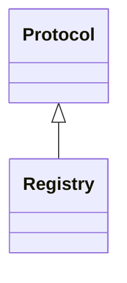

# registry.api

Protocol defining the registry interface

[View source on GitHub](https://github.com/kgfoundry/kgfoundry/blob/main/src/registry/api.py)

## Sections

- **Public API**

## Contents

### registry.api.Registry

::: registry.api.Registry

*Bases:* Protocol

## Relationships

**Imports:** `__future__.annotations`, `collections.abc.Mapping`, `kgfoundry_common.models.Doc`, `kgfoundry_common.models.DoctagsAsset`, `kgfoundry_common.navmap_loader.load_nav_metadata`, `typing.Protocol`, `typing.TYPE_CHECKING`

## Autorefs Examples

- [registry.api.Registry][]

## Inheritance



## Neighborhood

```d2
direction: right
"registry.api": "registry.api" { link: "./registry/api.md" }
"__future__.annotations": "__future__.annotations"
"registry.api" -> "__future__.annotations"
"collections.abc.Mapping": "collections.abc.Mapping"
"registry.api" -> "collections.abc.Mapping"
"kgfoundry_common.models.Doc": "kgfoundry_common.models.Doc"
"registry.api" -> "kgfoundry_common.models.Doc"
"kgfoundry_common.models.DoctagsAsset": "kgfoundry_common.models.DoctagsAsset"
"registry.api" -> "kgfoundry_common.models.DoctagsAsset"
"kgfoundry_common.navmap_loader.load_nav_metadata": "kgfoundry_common.navmap_loader.load_nav_metadata"
"registry.api" -> "kgfoundry_common.navmap_loader.load_nav_metadata"
"typing.Protocol": "typing.Protocol"
"registry.api" -> "typing.Protocol"
"typing.TYPE_CHECKING": "typing.TYPE_CHECKING"
"registry.api" -> "typing.TYPE_CHECKING"
"registry.api_code": "registry.api code" { link: "https://github.com/kgfoundry/kgfoundry/blob/main/src/registry/api.py" }
"registry.api" -> "registry.api_code" { style: dashed }
```

