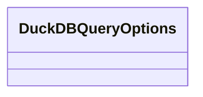

# registry.duckdb_helpers

Typed DuckDB helper utilities for parameterized queries and logging.

[View source on GitHub](https://github.com/paul-heyse/kgfoundry/blob/main/src/registry/duckdb_helpers.py)

## Hierarchy

- **Parent:** [registry](../registry.md)

## Sections

- **Public API**

## Contents

### registry.duckdb_helpers.DuckDBQueryOptions

::: registry.duckdb_helpers.DuckDBQueryOptions

### registry.duckdb_helpers._coerce_options

::: registry.duckdb_helpers._coerce_options

### registry.duckdb_helpers._duckdb_module

::: registry.duckdb_helpers._duckdb_module

### registry.duckdb_helpers._ensure_parameterized

::: registry.duckdb_helpers._ensure_parameterized

### registry.duckdb_helpers._format_params

::: registry.duckdb_helpers._format_params

### registry.duckdb_helpers._format_sql

::: registry.duckdb_helpers._format_sql

### registry.duckdb_helpers._set_timeout

::: registry.duckdb_helpers._set_timeout

### registry.duckdb_helpers._truncate_value

::: registry.duckdb_helpers._truncate_value

### registry.duckdb_helpers.connect

::: registry.duckdb_helpers.connect

### registry.duckdb_helpers.execute

::: registry.duckdb_helpers.execute

### registry.duckdb_helpers.fetch_all

::: registry.duckdb_helpers.fetch_all

### registry.duckdb_helpers.fetch_one

::: registry.duckdb_helpers.fetch_one

### registry.duckdb_helpers.validate_identifier

::: registry.duckdb_helpers.validate_identifier

## Relationships

**Imports:** `__future__.annotations`, `collections.abc.Iterable`, `collections.abc.Mapping`, `collections.abc.Sequence`, `dataclasses.dataclass`, `dataclasses.replace`, `duckdb.DuckDBPyConnection`, `functools.lru_cache`, `kgfoundry_common.errors.RegistryError`, `kgfoundry_common.logging.get_logger`, `kgfoundry_common.logging.with_fields`, `kgfoundry_common.navmap_loader.load_nav_metadata`, `kgfoundry_common.observability.MetricsProvider`, `kgfoundry_common.observability.observe_duration`, `kgfoundry_common.typing.gate_import`, `pathlib.Path`, `time`, `types.ModuleType`, `typing.Final`, `typing.TYPE_CHECKING`, `typing.cast`

**Imported by:** [registry.duckdb_registry](duckdb_registry.md), [registry.helper](helper.md), [registry.migrate](migrate.md)

## Autorefs Examples

- [registry.duckdb_helpers.DuckDBQueryOptions][]
- [registry.duckdb_helpers._coerce_options][]
- [registry.duckdb_helpers._duckdb_module][]
- [registry.duckdb_helpers._ensure_parameterized][]

## Inheritance



## Neighborhood

```d2
direction: right
"registry.duckdb_helpers": "registry.duckdb_helpers" { link: "https://github.com/paul-heyse/kgfoundry/blob/main/src/registry/duckdb_helpers.py" }
"__future__.annotations": "__future__.annotations"
"registry.duckdb_helpers" -> "__future__.annotations"
"collections.abc.Iterable": "collections.abc.Iterable"
"registry.duckdb_helpers" -> "collections.abc.Iterable"
"collections.abc.Mapping": "collections.abc.Mapping"
"registry.duckdb_helpers" -> "collections.abc.Mapping"
"collections.abc.Sequence": "collections.abc.Sequence"
"registry.duckdb_helpers" -> "collections.abc.Sequence"
"dataclasses.dataclass": "dataclasses.dataclass"
"registry.duckdb_helpers" -> "dataclasses.dataclass"
"dataclasses.replace": "dataclasses.replace"
"registry.duckdb_helpers" -> "dataclasses.replace"
"duckdb.DuckDBPyConnection": "duckdb.DuckDBPyConnection"
"registry.duckdb_helpers" -> "duckdb.DuckDBPyConnection"
"functools.lru_cache": "functools.lru_cache"
"registry.duckdb_helpers" -> "functools.lru_cache"
"kgfoundry_common.errors.RegistryError": "kgfoundry_common.errors.RegistryError"
"registry.duckdb_helpers" -> "kgfoundry_common.errors.RegistryError"
"kgfoundry_common.logging.get_logger": "kgfoundry_common.logging.get_logger"
"registry.duckdb_helpers" -> "kgfoundry_common.logging.get_logger"
"kgfoundry_common.logging.with_fields": "kgfoundry_common.logging.with_fields"
"registry.duckdb_helpers" -> "kgfoundry_common.logging.with_fields"
"kgfoundry_common.navmap_loader.load_nav_metadata": "kgfoundry_common.navmap_loader.load_nav_metadata"
"registry.duckdb_helpers" -> "kgfoundry_common.navmap_loader.load_nav_metadata"
"kgfoundry_common.observability.MetricsProvider": "kgfoundry_common.observability.MetricsProvider"
"registry.duckdb_helpers" -> "kgfoundry_common.observability.MetricsProvider"
"kgfoundry_common.observability.observe_duration": "kgfoundry_common.observability.observe_duration"
"registry.duckdb_helpers" -> "kgfoundry_common.observability.observe_duration"
"kgfoundry_common.typing.gate_import": "kgfoundry_common.typing.gate_import"
"registry.duckdb_helpers" -> "kgfoundry_common.typing.gate_import"
"pathlib.Path": "pathlib.Path"
"registry.duckdb_helpers" -> "pathlib.Path"
"time": "time"
"registry.duckdb_helpers" -> "time"
"types.ModuleType": "types.ModuleType"
"registry.duckdb_helpers" -> "types.ModuleType"
"typing.Final": "typing.Final"
"registry.duckdb_helpers" -> "typing.Final"
"typing.TYPE_CHECKING": "typing.TYPE_CHECKING"
"registry.duckdb_helpers" -> "typing.TYPE_CHECKING"
"typing.cast": "typing.cast"
"registry.duckdb_helpers" -> "typing.cast"
"registry.duckdb_registry": "registry.duckdb_registry" { link: "https://github.com/paul-heyse/kgfoundry/blob/main/src/registry/duckdb_registry.py" }
"registry.duckdb_registry" -> "registry.duckdb_helpers"
"registry.helper": "registry.helper" { link: "https://github.com/paul-heyse/kgfoundry/blob/main/src/registry/helper.py" }
"registry.helper" -> "registry.duckdb_helpers"
"registry.migrate": "registry.migrate" { link: "https://github.com/paul-heyse/kgfoundry/blob/main/src/registry/migrate.py" }
"registry.migrate" -> "registry.duckdb_helpers"
"registry": "registry" { link: "https://github.com/paul-heyse/kgfoundry/blob/main/src/registry/__init__.py" }
"registry" -> "registry.duckdb_helpers" { style: dashed }
```

