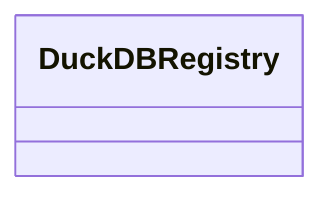

# registry.duckdb_registry

Minimal registry wrapper storing pipeline artefacts in DuckDB.

[View source on GitHub](https://github.com/kgfoundry/kgfoundry/blob/main/src/registry/duckdb_registry.py)

## Sections

- **Public API**

## Contents

### registry.duckdb_registry.DuckDBRegistry

::: registry.duckdb_registry.DuckDBRegistry

### registry.duckdb_registry._execute_with_operation

::: registry.duckdb_registry._execute_with_operation

## Relationships

**Imports:** `__future__.annotations`, `collections.abc.Mapping`, `duckdb`, `json`, `kgfoundry_common.models.Doc`, `kgfoundry_common.models.DoctagsAsset`, `kgfoundry_common.navmap_loader.load_nav_metadata`, [registry.duckdb_helpers](duckdb_helpers.md), `registry.duckdb_helpers.DuckDBQueryOptions`, `typing.TYPE_CHECKING`, `uuid`

## Autorefs Examples

- [registry.duckdb_registry.DuckDBRegistry][]
- [registry.duckdb_registry._execute_with_operation][]

## Inheritance



## Neighborhood

```d2
direction: right
"registry.duckdb_registry": "registry.duckdb_registry" { link: "./registry/duckdb_registry.md" }
"__future__.annotations": "__future__.annotations"
"registry.duckdb_registry" -> "__future__.annotations"
"collections.abc.Mapping": "collections.abc.Mapping"
"registry.duckdb_registry" -> "collections.abc.Mapping"
"duckdb": "duckdb"
"registry.duckdb_registry" -> "duckdb"
"json": "json"
"registry.duckdb_registry" -> "json"
"kgfoundry_common.models.Doc": "kgfoundry_common.models.Doc"
"registry.duckdb_registry" -> "kgfoundry_common.models.Doc"
"kgfoundry_common.models.DoctagsAsset": "kgfoundry_common.models.DoctagsAsset"
"registry.duckdb_registry" -> "kgfoundry_common.models.DoctagsAsset"
"kgfoundry_common.navmap_loader.load_nav_metadata": "kgfoundry_common.navmap_loader.load_nav_metadata"
"registry.duckdb_registry" -> "kgfoundry_common.navmap_loader.load_nav_metadata"
"registry.duckdb_helpers": "registry.duckdb_helpers" { link: "./registry/duckdb_helpers.md" }
"registry.duckdb_registry" -> "registry.duckdb_helpers"
"registry.duckdb_helpers.DuckDBQueryOptions": "registry.duckdb_helpers.DuckDBQueryOptions"
"registry.duckdb_registry" -> "registry.duckdb_helpers.DuckDBQueryOptions"
"typing.TYPE_CHECKING": "typing.TYPE_CHECKING"
"registry.duckdb_registry" -> "typing.TYPE_CHECKING"
"uuid": "uuid"
"registry.duckdb_registry" -> "uuid"
"registry.duckdb_registry_code": "registry.duckdb_registry code" { link: "https://github.com/kgfoundry/kgfoundry/blob/main/src/registry/duckdb_registry.py" }
"registry.duckdb_registry" -> "registry.duckdb_registry_code" { style: dashed }
```

