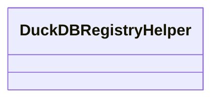

# registry.helper

Helper utilities that simplify writing records into the DuckDB registry.

## Sections

- **Public API**

## Contents

### registry.helper.DuckDBRegistryHelper

::: registry.helper.DuckDBRegistryHelper

### registry.helper._execute_with_operation

::: registry.helper._execute_with_operation

## Relationships

**Imports:** `__future__.annotations`, `collections.abc.Mapping`, `contextlib.closing`, `duckdb.DuckDBPyConnection`, `json`, `kgfoundry_common.models.Doc`, `kgfoundry_common.models.DoctagsAsset`, `kgfoundry_common.navmap_loader.load_nav_metadata`, [registry.duckdb_helpers](duckdb_helpers.md), `registry.duckdb_helpers.DuckDBQueryOptions`, `typing.TYPE_CHECKING`, `uuid`

## Autorefs Examples

- [registry.helper.DuckDBRegistryHelper][]
- [registry.helper._execute_with_operation][]

## Inheritance



## Neighborhood

```d2
direction: right
"registry.helper": "registry.helper" { link: "helper.md" }
"__future__.annotations": "__future__.annotations"
"registry.helper" -> "__future__.annotations"
"collections.abc.Mapping": "collections.abc.Mapping"
"registry.helper" -> "collections.abc.Mapping"
"contextlib.closing": "contextlib.closing"
"registry.helper" -> "contextlib.closing"
"duckdb.DuckDBPyConnection": "duckdb.DuckDBPyConnection"
"registry.helper" -> "duckdb.DuckDBPyConnection"
"json": "json"
"registry.helper" -> "json"
"kgfoundry_common.models.Doc": "kgfoundry_common.models.Doc"
"registry.helper" -> "kgfoundry_common.models.Doc"
"kgfoundry_common.models.DoctagsAsset": "kgfoundry_common.models.DoctagsAsset"
"registry.helper" -> "kgfoundry_common.models.DoctagsAsset"
"kgfoundry_common.navmap_loader.load_nav_metadata": "kgfoundry_common.navmap_loader.load_nav_metadata"
"registry.helper" -> "kgfoundry_common.navmap_loader.load_nav_metadata"
"registry.duckdb_helpers": "registry.duckdb_helpers" { link: "duckdb_helpers.md" }
"registry.helper" -> "registry.duckdb_helpers"
"registry.duckdb_helpers.DuckDBQueryOptions": "registry.duckdb_helpers.DuckDBQueryOptions"
"registry.helper" -> "registry.duckdb_helpers.DuckDBQueryOptions"
"typing.TYPE_CHECKING": "typing.TYPE_CHECKING"
"registry.helper" -> "typing.TYPE_CHECKING"
"uuid": "uuid"
"registry.helper" -> "uuid"
```

