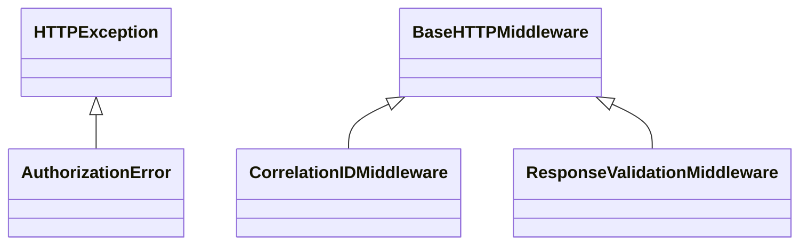

# search_api.app

FastAPI service exposing search endpoints, aggregation helpers, and Problem Details responses.

[View source on GitHub](https://github.com/paul-heyse/kgfoundry/blob/main/src/search_api/app.py)

## Hierarchy

- **Parent:** [search_api](../search_api.md)

## Sections

- **Public API**

## Contents

### search_api.app.AuthorizationError

::: search_api.app.AuthorizationError

*Bases:* HTTPException

### search_api.app.CorrelationIDMiddleware

::: search_api.app.CorrelationIDMiddleware

*Bases:* BaseHTTPMiddleware

### search_api.app.ResponseValidationMiddleware

::: search_api.app.ResponseValidationMiddleware

*Bases:* BaseHTTPMiddleware

### search_api.app._validate_authorization_header

::: search_api.app._validate_authorization_header

### search_api.app.auth

::: search_api.app.auth

### search_api.app.graph_concepts

::: search_api.app.graph_concepts

### search_api.app.healthz

::: search_api.app.healthz

### search_api.app.search

::: search_api.app.search

## Relationships

**Imports:** `__future__.annotations`, `asyncio`, `collections.abc.Awaitable`, `collections.abc.Callable`, `collections.abc.Mapping`, `fastapi.FastAPI`, `fastapi.HTTPException`, `fastapi.Header`, `json`, `kgfoundry.embeddings_sparse.bm25.LuceneBM25`, `kgfoundry.embeddings_sparse.bm25.PurePythonBM25`, `kgfoundry.embeddings_sparse.bm25.get_bm25`, `kgfoundry.embeddings_sparse.splade.get_splade`, `kgfoundry.kg_builder.mock_kg.MockKG`, `kgfoundry_common.errors.DeserializationError`, `kgfoundry_common.errors.SerializationError`, `kgfoundry_common.errors.SettingsError`, `kgfoundry_common.errors.VectorSearchError`, `kgfoundry_common.errors.http.register_problem_details_handler`, `kgfoundry_common.jsonschema_utils.ValidationError`, `kgfoundry_common.jsonschema_utils.ValidationErrorProtocol`, `kgfoundry_common.jsonschema_utils.validate`, `kgfoundry_common.logging.get_logger`, `kgfoundry_common.logging.set_correlation_id`, `kgfoundry_common.logging.with_fields`, `kgfoundry_common.navmap_loader.load_nav_metadata`, `kgfoundry_common.observability.MetricsProvider`, `kgfoundry_common.observability.observe_duration`, `kgfoundry_common.problem_details.JsonValue`, `kgfoundry_common.schema_helpers.load_schema`, `kgfoundry_common.settings.FaissConfig`, `kgfoundry_common.settings.ObservabilityConfig`, `kgfoundry_common.settings.RuntimeSettings`, `kgfoundry_common.settings.SearchConfig`, `kgfoundry_common.settings.SparseEmbeddingConfig`, `kgfoundry_common.typing.gate_import`, `pathlib.Path`, `search_api.fastapi_helpers.DEFAULT_TIMEOUT_SECONDS`, `search_api.fastapi_helpers.typed_dependency`, `search_api.fastapi_helpers.typed_middleware`, `search_api.fusion.rrf_fuse`, `search_api.schemas.SearchRequest`, `search_api.schemas.SearchResponse`, `search_api.schemas.SearchResult`, `search_api.service.apply_kg_boosts`, `starlette.middleware.base.BaseHTTPMiddleware`, `starlette.requests.Request`, `starlette.responses.JSONResponse`, `starlette.responses.Response`, `starlette.types.ASGIApp`, `typing.Annotated`, `typing.Final`, `typing.TYPE_CHECKING`, `typing.cast`, `uuid`

**Imported by:** [search_api](../search_api.md)

## Autorefs Examples

- [search_api.app.AuthorizationError][]
- [search_api.app.CorrelationIDMiddleware][]
- [search_api.app.ResponseValidationMiddleware][]
- [search_api.app._validate_authorization_header][]
- [search_api.app.auth][]
- [search_api.app.graph_concepts][]

## Inheritance



## Neighborhood

```d2
direction: right
"search_api.app": "search_api.app" { link: "https://github.com/paul-heyse/kgfoundry/blob/main/src/search_api/app.py" }
"__future__.annotations": "__future__.annotations"
"search_api.app" -> "__future__.annotations"
"asyncio": "asyncio"
"search_api.app" -> "asyncio"
"collections.abc.Awaitable": "collections.abc.Awaitable"
"search_api.app" -> "collections.abc.Awaitable"
"collections.abc.Callable": "collections.abc.Callable"
"search_api.app" -> "collections.abc.Callable"
"collections.abc.Mapping": "collections.abc.Mapping"
"search_api.app" -> "collections.abc.Mapping"
"fastapi.FastAPI": "fastapi.FastAPI"
"search_api.app" -> "fastapi.FastAPI"
"fastapi.HTTPException": "fastapi.HTTPException"
"search_api.app" -> "fastapi.HTTPException"
"fastapi.Header": "fastapi.Header"
"search_api.app" -> "fastapi.Header"
"json": "json"
"search_api.app" -> "json"
"kgfoundry.embeddings_sparse.bm25.LuceneBM25": "kgfoundry.embeddings_sparse.bm25.LuceneBM25"
"search_api.app" -> "kgfoundry.embeddings_sparse.bm25.LuceneBM25"
"kgfoundry.embeddings_sparse.bm25.PurePythonBM25": "kgfoundry.embeddings_sparse.bm25.PurePythonBM25"
"search_api.app" -> "kgfoundry.embeddings_sparse.bm25.PurePythonBM25"
"kgfoundry.embeddings_sparse.bm25.get_bm25": "kgfoundry.embeddings_sparse.bm25.get_bm25"
"search_api.app" -> "kgfoundry.embeddings_sparse.bm25.get_bm25"
"kgfoundry.embeddings_sparse.splade.get_splade": "kgfoundry.embeddings_sparse.splade.get_splade"
"search_api.app" -> "kgfoundry.embeddings_sparse.splade.get_splade"
"kgfoundry.kg_builder.mock_kg.MockKG": "kgfoundry.kg_builder.mock_kg.MockKG"
"search_api.app" -> "kgfoundry.kg_builder.mock_kg.MockKG"
"kgfoundry_common.errors.DeserializationError": "kgfoundry_common.errors.DeserializationError"
"search_api.app" -> "kgfoundry_common.errors.DeserializationError"
"kgfoundry_common.errors.SerializationError": "kgfoundry_common.errors.SerializationError"
"search_api.app" -> "kgfoundry_common.errors.SerializationError"
"kgfoundry_common.errors.SettingsError": "kgfoundry_common.errors.SettingsError"
"search_api.app" -> "kgfoundry_common.errors.SettingsError"
"kgfoundry_common.errors.VectorSearchError": "kgfoundry_common.errors.VectorSearchError"
"search_api.app" -> "kgfoundry_common.errors.VectorSearchError"
"kgfoundry_common.errors.http.register_problem_details_handler": "kgfoundry_common.errors.http.register_problem_details_handler"
"search_api.app" -> "kgfoundry_common.errors.http.register_problem_details_handler"
"kgfoundry_common.jsonschema_utils.ValidationError": "kgfoundry_common.jsonschema_utils.ValidationError"
"search_api.app" -> "kgfoundry_common.jsonschema_utils.ValidationError"
"kgfoundry_common.jsonschema_utils.ValidationErrorProtocol": "kgfoundry_common.jsonschema_utils.ValidationErrorProtocol"
"search_api.app" -> "kgfoundry_common.jsonschema_utils.ValidationErrorProtocol"
"kgfoundry_common.jsonschema_utils.validate": "kgfoundry_common.jsonschema_utils.validate"
"search_api.app" -> "kgfoundry_common.jsonschema_utils.validate"
"kgfoundry_common.logging.get_logger": "kgfoundry_common.logging.get_logger"
"search_api.app" -> "kgfoundry_common.logging.get_logger"
"kgfoundry_common.logging.set_correlation_id": "kgfoundry_common.logging.set_correlation_id"
"search_api.app" -> "kgfoundry_common.logging.set_correlation_id"
"kgfoundry_common.logging.with_fields": "kgfoundry_common.logging.with_fields"
"search_api.app" -> "kgfoundry_common.logging.with_fields"
"kgfoundry_common.navmap_loader.load_nav_metadata": "kgfoundry_common.navmap_loader.load_nav_metadata"
"search_api.app" -> "kgfoundry_common.navmap_loader.load_nav_metadata"
"kgfoundry_common.observability.MetricsProvider": "kgfoundry_common.observability.MetricsProvider"
"search_api.app" -> "kgfoundry_common.observability.MetricsProvider"
"kgfoundry_common.observability.observe_duration": "kgfoundry_common.observability.observe_duration"
"search_api.app" -> "kgfoundry_common.observability.observe_duration"
"kgfoundry_common.problem_details.JsonValue": "kgfoundry_common.problem_details.JsonValue"
"search_api.app" -> "kgfoundry_common.problem_details.JsonValue"
"kgfoundry_common.schema_helpers.load_schema": "kgfoundry_common.schema_helpers.load_schema"
"search_api.app" -> "kgfoundry_common.schema_helpers.load_schema"
"kgfoundry_common.settings.FaissConfig": "kgfoundry_common.settings.FaissConfig"
"search_api.app" -> "kgfoundry_common.settings.FaissConfig"
"kgfoundry_common.settings.ObservabilityConfig": "kgfoundry_common.settings.ObservabilityConfig"
"search_api.app" -> "kgfoundry_common.settings.ObservabilityConfig"
"kgfoundry_common.settings.RuntimeSettings": "kgfoundry_common.settings.RuntimeSettings"
"search_api.app" -> "kgfoundry_common.settings.RuntimeSettings"
"kgfoundry_common.settings.SearchConfig": "kgfoundry_common.settings.SearchConfig"
"search_api.app" -> "kgfoundry_common.settings.SearchConfig"
"kgfoundry_common.settings.SparseEmbeddingConfig": "kgfoundry_common.settings.SparseEmbeddingConfig"
"search_api.app" -> "kgfoundry_common.settings.SparseEmbeddingConfig"
"kgfoundry_common.typing.gate_import": "kgfoundry_common.typing.gate_import"
"search_api.app" -> "kgfoundry_common.typing.gate_import"
"pathlib.Path": "pathlib.Path"
"search_api.app" -> "pathlib.Path"
"search_api.fastapi_helpers.DEFAULT_TIMEOUT_SECONDS": "search_api.fastapi_helpers.DEFAULT_TIMEOUT_SECONDS"
"search_api.app" -> "search_api.fastapi_helpers.DEFAULT_TIMEOUT_SECONDS"
"search_api.fastapi_helpers.typed_dependency": "search_api.fastapi_helpers.typed_dependency"
"search_api.app" -> "search_api.fastapi_helpers.typed_dependency"
"search_api.fastapi_helpers.typed_middleware": "search_api.fastapi_helpers.typed_middleware"
"search_api.app" -> "search_api.fastapi_helpers.typed_middleware"
"search_api.fusion.rrf_fuse": "search_api.fusion.rrf_fuse"
"search_api.app" -> "search_api.fusion.rrf_fuse"
"search_api.schemas.SearchRequest": "search_api.schemas.SearchRequest"
"search_api.app" -> "search_api.schemas.SearchRequest"
"search_api.schemas.SearchResponse": "search_api.schemas.SearchResponse"
"search_api.app" -> "search_api.schemas.SearchResponse"
"search_api.schemas.SearchResult": "search_api.schemas.SearchResult"
"search_api.app" -> "search_api.schemas.SearchResult"
"search_api.service.apply_kg_boosts": "search_api.service.apply_kg_boosts"
"search_api.app" -> "search_api.service.apply_kg_boosts"
"starlette.middleware.base.BaseHTTPMiddleware": "starlette.middleware.base.BaseHTTPMiddleware"
"search_api.app" -> "starlette.middleware.base.BaseHTTPMiddleware"
"starlette.requests.Request": "starlette.requests.Request"
"search_api.app" -> "starlette.requests.Request"
"starlette.responses.JSONResponse": "starlette.responses.JSONResponse"
"search_api.app" -> "starlette.responses.JSONResponse"
"starlette.responses.Response": "starlette.responses.Response"
"search_api.app" -> "starlette.responses.Response"
"starlette.types.ASGIApp": "starlette.types.ASGIApp"
"search_api.app" -> "starlette.types.ASGIApp"
"typing.Annotated": "typing.Annotated"
"search_api.app" -> "typing.Annotated"
"typing.Final": "typing.Final"
"search_api.app" -> "typing.Final"
"typing.TYPE_CHECKING": "typing.TYPE_CHECKING"
"search_api.app" -> "typing.TYPE_CHECKING"
"typing.cast": "typing.cast"
"search_api.app" -> "typing.cast"
"uuid": "uuid"
"search_api.app" -> "uuid"
"search_api": "search_api" { link: "https://github.com/paul-heyse/kgfoundry/blob/main/src/search_api/__init__.py" }
"search_api" -> "search_api.app"
"search_api" -> "search_api.app" { style: dashed }
```

