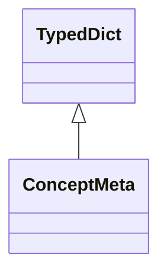

# search_api.kg_mock

FastAPI service exposing search endpoints, aggregation helpers, and Problem Details responses.

[View source on GitHub](https://github.com/paul-heyse/kgfoundry/blob/main/src/search_api/kg_mock.py)

## Hierarchy

- **Parent:** [search_api](../search_api.md)

## Sections

- **Public API**

## Contents

### search_api.kg_mock.ConceptMeta

::: search_api.kg_mock.ConceptMeta

*Bases:* TypedDict

### search_api.kg_mock.detect_query_concepts

::: search_api.kg_mock.detect_query_concepts

### search_api.kg_mock.kg_boost

::: search_api.kg_mock.kg_boost

### search_api.kg_mock.linked_concepts_for_text

::: search_api.kg_mock.linked_concepts_for_text

## Relationships

**Imports:** `__future__.annotations`, `kgfoundry_common.navmap_loader.load_nav_metadata`, `typing.Final`, `typing.TypedDict`

**Imported by:** [search_api](../search_api.md)

## Autorefs Examples

- [search_api.kg_mock.ConceptMeta][]
- [search_api.kg_mock.detect_query_concepts][]
- [search_api.kg_mock.kg_boost][]
- [search_api.kg_mock.linked_concepts_for_text][]

## Inheritance



## Neighborhood

```d2
direction: right
"search_api.kg_mock": "search_api.kg_mock" { link: "https://github.com/paul-heyse/kgfoundry/blob/main/src/search_api/kg_mock.py" }
"__future__.annotations": "__future__.annotations"
"search_api.kg_mock" -> "__future__.annotations"
"kgfoundry_common.navmap_loader.load_nav_metadata": "kgfoundry_common.navmap_loader.load_nav_metadata"
"search_api.kg_mock" -> "kgfoundry_common.navmap_loader.load_nav_metadata"
"typing.Final": "typing.Final"
"search_api.kg_mock" -> "typing.Final"
"typing.TypedDict": "typing.TypedDict"
"search_api.kg_mock" -> "typing.TypedDict"
"search_api": "search_api" { link: "https://github.com/paul-heyse/kgfoundry/blob/main/src/search_api/__init__.py" }
"search_api" -> "search_api.kg_mock"
"search_api" -> "search_api.kg_mock" { style: dashed }
```

