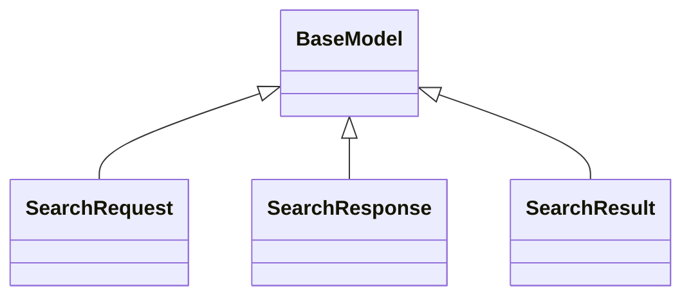

# search_api.schemas

FastAPI service exposing search endpoints, aggregation helpers, and Problem Details responses.

## Sections

- **Public API**

## Contents

### search_api.schemas.SearchRequest

::: search_api.schemas.SearchRequest

*Bases:* BaseModel

### search_api.schemas.SearchResponse

::: search_api.schemas.SearchResponse

*Bases:* BaseModel

### search_api.schemas.SearchResult

::: search_api.schemas.SearchResult

*Bases:* BaseModel

## Relationships

**Imports:** `__future__.annotations`, `importlib`, `kgfoundry_common.navmap_loader.load_nav_metadata`, `kgfoundry_common.pydantic.BaseModel`, `kgfoundry_common.types.JsonValue`, `pydantic.ConfigDict`, `pydantic.Field`, `typing.ClassVar`, `typing.TYPE_CHECKING`

**Imported by:** [search_api](../search_api.md)

## Autorefs Examples

- [search_api.schemas.SearchRequest][]
- [search_api.schemas.SearchResponse][]
- [search_api.schemas.SearchResult][]

## Inheritance



## Neighborhood

```d2
direction: right
"search_api.schemas": "search_api.schemas" { link: "schemas.md" }
"__future__.annotations": "__future__.annotations"
"search_api.schemas" -> "__future__.annotations"
"importlib": "importlib"
"search_api.schemas" -> "importlib"
"kgfoundry_common.navmap_loader.load_nav_metadata": "kgfoundry_common.navmap_loader.load_nav_metadata"
"search_api.schemas" -> "kgfoundry_common.navmap_loader.load_nav_metadata"
"kgfoundry_common.pydantic.BaseModel": "kgfoundry_common.pydantic.BaseModel"
"search_api.schemas" -> "kgfoundry_common.pydantic.BaseModel"
"kgfoundry_common.types.JsonValue": "kgfoundry_common.types.JsonValue"
"search_api.schemas" -> "kgfoundry_common.types.JsonValue"
"pydantic.ConfigDict": "pydantic.ConfigDict"
"search_api.schemas" -> "pydantic.ConfigDict"
"pydantic.Field": "pydantic.Field"
"search_api.schemas" -> "pydantic.Field"
"typing.ClassVar": "typing.ClassVar"
"search_api.schemas" -> "typing.ClassVar"
"typing.TYPE_CHECKING": "typing.TYPE_CHECKING"
"search_api.schemas" -> "typing.TYPE_CHECKING"
"search_api": "search_api" { link: "../search_api.md" }
"search_api" -> "search_api.schemas"
```

